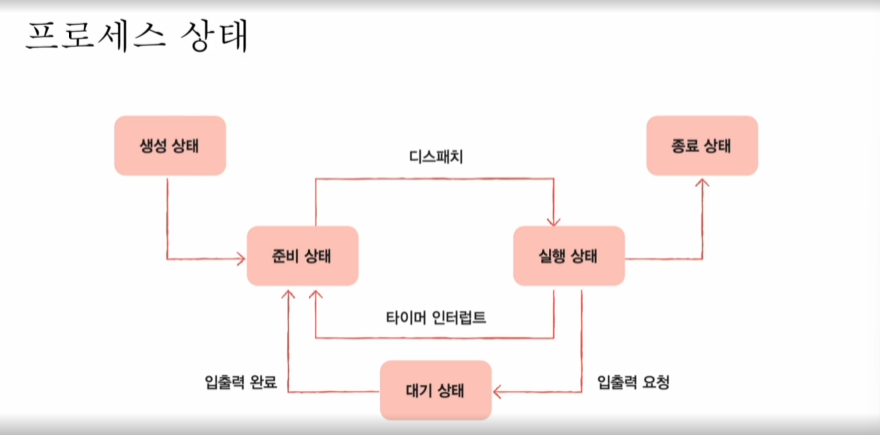
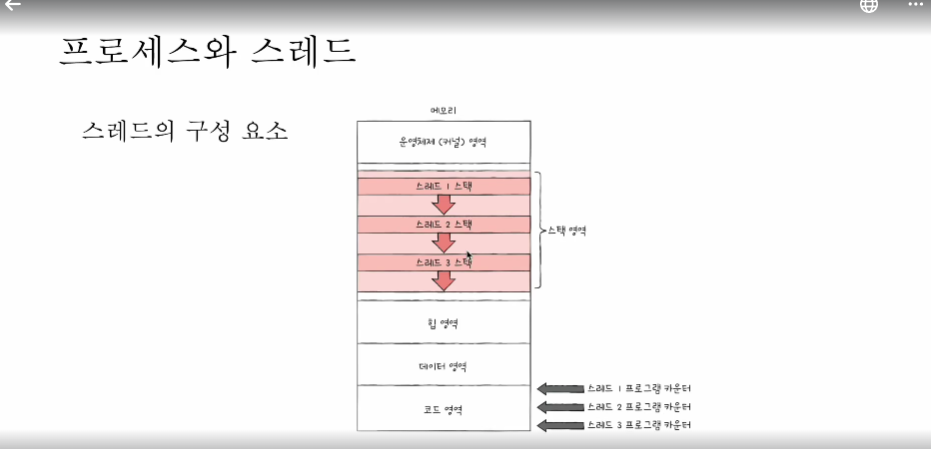

 프로세스 

## 프로세스란?
- 실행중인 프로그램
  - 하드디스크에 적재된 메모리 덩어리일 뿐인 프로그램을, 메모리에 올려 실행 상태가 되면 프로세스라고 칭한다.

- `포그라운드 프로세스` / `백그라운드 프로세스`가 있다.
  - 포그라운드 프로세스 : 사용자가 보는 앞에서 실행되는 프로세스
  - 백그라운드 프로세스 : 사용자가 보지 못하는 곳에서 실행되는 프로세스 (`데몬`, `서비스`)

## 1.커널 영역에 담기는 정보

## 프로세스 제어 블록 (PCB)
- 여러 프로세스를 제어하기 위한 자료구조
- 커널 영역에서 생성하고 관리된다.
- 프로세스 생성시 커널 영역에 생성되고, 종료시 폐기 된다.

### PCB 대표정보
- 프로세스 ID (PID)
- 레지스터 값
  - 프로세스는 자신의 실행 상태가 오면, 이전까지 사용한 레지스터 중간 값을 모두 복원 -> 실행 재개
  - 프로그램 카운터 , 스택 포인터 등
- 프로세스 상태
  - 입출력 장치를 사용하기 위해 기다리는 상태, CPU 대기 상태 , CPU 이용 상태 등
- CPU 스케줄링 정보
- 메모리 정보
  - 프로세스가 어느 주소에 저장되어 있는지에 대한 정보
  - 페이지 테이블 정보
- 사용한 파일 정보
  - 사용중인(열려 있는) 파일 정보
- 입출력 장치 정보
  - 할당된 입출력 장치 정보

## 문맥 교환 (Context Switch)

### CPU 실행 주체가 프로세스A -> 프로세스B 로 넘어갈 때 발생하는 일
- 기존에 실행중인 `프로세스A` 는 지금까지의 중간 정보를 PCB에 백업
  - 레지스터 값, 메모리 정보, 열었던 파일, 사용한 입출력 장치 등
  - 이러한 중간 정보를 **문맥(Context)** 라고 표현

- 다음 실행 될 `프로세스B` 는 문맥을 PCB에서 복구
  - 이전에 PCB에 백업했던 B 문맥 정보를 복구하여 실행 재개

- 이러한 멀티 프로세스간 원활한 실행을 백업 / 복구 하는 과정을 문맥 교환이라고 칭한다.

---

## 2. 사용자 영역에 담기는 영역

### 프로세스의 메모리 영역
- 코드(텍스트) 영역
- 데이터 영역 (+BSS 영역)
- 힙 영역
- 스택 영역

### 코드(텍스트) 영역
- 실행 할 수 있는 코드, 기계어로 이루어진 명령어 저장
- 고정 크기 (정적 할당 영역)
- 데이터가 아닌 CPU가 실행할 명령어가 담기기에, 쓰기가 금지된 영역 (read-only)

### 데이터 영역
- 지역 변수처럼 잠깐 썼다가 없앨 데이터가 아닌, 프로그램 실행되는 동안, 유지 할 데이터가 저장되는 영역
- 고정 크기(정적 할당 영역)
- ex) 전역 변수 / static 변수

### 힙 영역
- 프로그램을 만드는 프로그래머가 직접 할당할 수 있는 저장 영역
- 가변 크기(동적 할당 영역)
- 낮은 주소 => 높은 주소 순으로 할당

### 스택 영역
- 데이터가 일시적으로 저장되는 영역
- (데이터 영역 데이터와 달리) 잠깐 쓰다가 없어질 값들이 저장되는 공간
- 가변 크기(동적 할당 영역)
- 높은 주소 => 낮은 주소 순으로 할당
- ex) 매개 변수, 지역 변수

 

 프로세스 상태와 계층구조 

## 프로세스 상태
- 프로세스는 모두 `상태` 를 가지고 있다.
- 프로세스 상태는 모두 PCB 에 기록된다.
- 작업 관리자 > 세부 정보 > 상태 탭에서 확인 가능하다.

## 프로세스 상태의 종류

### 생성 상태
- 이제 막 메모리에 적재되어, PCB를 할당 받은 상태
- 준비가 완료 되었다면 준비 상태로 전환

### 준비 상태
- 당장이라도 CPU를 할당 받아 실행할 수 있지만
- 자신의 차례가 아니기 때문에 기다리는 상태
- 자신의 차례가 된다면 실행 상태로 전환(=디스패치)

### 실행 상태
- CPU를 할당 받아 실행 중인 상태
- 할당된 시간을 모두 사용 시(타이머 인터럽트 발생 시) 준비 상태로 전환
- 실행 도중 입출력장치를 사용하면, 입출력 작업이 끝날 때까지(=입출력 완료 인터럽트를 전달 받기) 대기 상태로 전환

### 대기 상태
- 프로세스가 실행 도중 입출력장치를 사용하는 경우의 상태
- 입출력 작업은 CPU에 비해 느리기에 이 경우 대기 상태로 접어듬
- 입출력 작업이 끝나면, 준비 상태로 전환

### 종료 상태
- 프로세스가 종료된 상태
- PCB, 프로세스의 메모리 영역을 정리

## 프로세스 계층 구조
- 프로세스 실행 도중(시스템 호출을 통해) 다른 프로세스 생성 가능
- 부모 프로세스와 자식 프로세스는 각자 다른 PID를 가짐 (별개의 프로세스 이기 때문)
- 일부 운영체제에서는 자식 프로세스의 PCB 에 부모 프로세스 PID(PPID) 를 명시하기도 한다.

- ex) 최초 프로세스(systemd) => login 프로세스 => bash 프로세스 => vim 프로세스 등

### 부모 프로세스
- 새 프로세스를 생성한 프로세스

### 자식 프로세스
- 부모 프로세스에 의해 생성된 프로세스
- 자식또한 본인의 자식 프로세스를 생성 가능하다.

## 프로세스 생성 기법
- 부모 프로세스는 자식 프로세스를 어떻게 만들어내고,
- 자식 프로세스는 어떻게 자신만의 코드를 실행할까?

### 부모 프로세스에서 자식 프로세스 생성 방법
- 1.복제
  - `fork` 시스템 호출 => 자신의 복사본을 자식 프로세스로 생성
  - 같은 참조값(내용) 을 가지는 동일한 프로세스가 생성된다고 생각.
- 2.옷 갈아입기
  - `exec` 시스템 호출 => 자신의 메모리 공간을 다른 프로그램으로 교체
  - 코드 / 데이터 영역은 실행할 프로그램 내용으로 바뀌고, 나머지(힙 / 스택) 영역은 초기화 된다.

 

 스레드 

## 스레드란?
- 스레드(thread)는 프로세스를 구성하느 실행 흐름의 단위이다.
- 하나의 프로세스는 하나 이상의 스레드를 가질 수 있다.
- ex) 웹브라우저 프로세스 : 화면 출력 스레드 / 검색 스레드 / 입력 스레드 / 음악 스레드

### 단일 스레드 프로세스
- 실행 흐름이 하나인 프로세스

### 멀티 스레드 프로세스
- 실행 흐름이 여러 개인 프로세스
- 프로세스를 이루는 여러 명령어 동시 실행 가능

## 스레드의 구성 요소
- 스레드 ID
- 프로그램 카운터를 비롯한 레지스터 값
- 스택 영역
- ..등 실행에 필요한 최소한의 값

## 스레드의 특징
- 프로세스의 각 스레드들은 프로세스의 **자원을 공유**하며 실행된다.

## 단일 스레드 멀티 프로세스 vs 단일 프로세스 멀티 스레드 어떤 차이가 있을까?
가정 : 실행을 하면, "hello OS" 문자열을 출력하는 프로그램이 있다고 하자.

- 결과 : 결과는 동일하다.(동일할 수 있다.)
- 메모리 측면 : 메모리에 적재되는 프로세의 양의 차이점이 있다. (개별적 PCB의 개수)
- 실행 측면 : 멀티스레드는 자원이 공유되기 때문에, 협력과 통신에는 유리하지만 **동시성 문제**가 발생할 수 있다.
  - 참고 : 프로세스 간에도 자원을 주고받을 수 있다. (프로세스 간 통신 : IPC)

