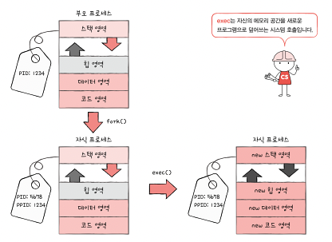
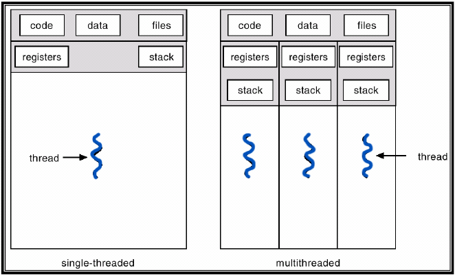
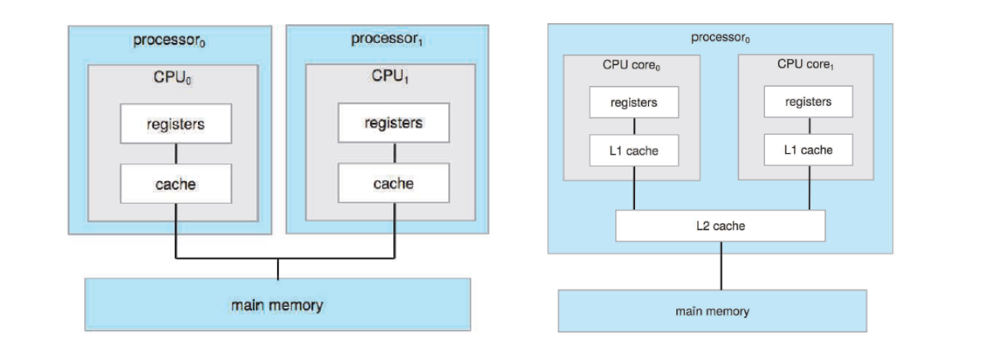

# Chapter 10 프로세스와 스레드
## 10-1) 프로세스 개요
프로그램이 실행되기 전에는 보조기억장치에 있는 데이터 덩어리지만, 메모리에 적재하고 실행하는 순간 프로세스가 된다.

- 포그라운드 프로세스 - 사용자가 직접 제어하여 직접 볼 수 있는 프로세스
- 백그라운드 프로세스 - 사용자가 직접 제어하지 않고 나도 모르게 뒤에서 실행되는 프로세스

### 프로세스 제어 블록
CPU 자원은 한정되어 있기 때문에 프로세스를 돌아가며 한정된 시간만큼 CPU를 사용한다.
이때 운영체제는 프로세스의 상태를 기록해두어야 하는데, 이 정보를 담고 있는 자료구조를 프로세스 제어 블록(PCB)이라고 하며 커널 영역에 저장된다.

PCB에 담기는 정보는 다음과 같다.
- 프로세스 ID(PID): 프로세스를 구분하는 고유한 값
- 레지스터 값: CPU 레지스터에 저장된 값
- 프로세스 상태: 실행 중, 준비, 대기 등
- 스케줄링 정보: 우선순위, CPU 사용 시간 등
- 메모리 관리 정보: 메모리 할당 정보 등
- 입출력 상태 정보: 입출력 장치와의 연결 정보 등

### 컨텍스트 스위칭
컨텍스트는 프로세스가 실행을 하기 위해 기억해야 할 정보(프로그램 카운터, 레지스터 값, 메모리 맵)로 PCB에 기록된다

컨텍스트 스위칭은 기존에 실행도던 프로세스의 컨텍스트를 PCB에 백업하고, 새로운 프로세스를 실행하기 위해 해당 프로세스의 컨텍스틀르 PCB에 서 복원하는 과정이다.
이것이 빠르게 일어나면서 프로세스가 동시에 실행되는 것처럼 보인다.

### 프로세스의 메모리 영역
PCB는 커널 영역에 저장된다.
반면 사용자 영역에서 프로세스들은 코드 영역, 데이터영역, 힙 영역, 스택 영역을 가진다.

- 코드 영역: 데이터가 아닌 CPU가 실행할 기계어로 이루어진 명령어가 담겨있기 때문에 읽기 전용이다.
- 데이터 영역: 프로그램이 실행되는 동안 계속 유지되는 영역 ex) 전역 변수
- 힙 영역: 프로그래머가 직접 할당할 수 있는 공간
- 스택 영역: 데이터를 일시적으로 저장하는 공간 ex) 지역 변수, 함수 매개변수

## 10-2) 프로세스 상태와 계층 구조
### 프로세스의 상태
프로세스는 실행되는 동안 여러 상태를 거치게 된다.

- 생성(New): 프로세스가 생성되는 상태
- 준비(Ready): 프로세스가 실행되기 위해 준비된 상태
- 실행(Running): 프로세스가 CPU를 할당받아 실행 중인 상태
- 대기(Waiting): 프로세스가 입출력 작업이나 다른 이벤트를 기다리는 상태
- 종료(Terminated): 프로세스가 실행을 마치고 종료된 상태

###  프로세스 계층 구조
운영체제는 프로세스가 프로세스를 낳는 계층적인 구조로 프로세스를 관리한다

- PPID (Parent PID) : 부모 프로세스의 PID
- pstree : 프로세스 계층 구조를 보여주는 명령어

### 프로세스 생성 기법?
- fork() : 부모 프로세스를 복제하여 자식 프로세스를 생성하는 기법으로 부모 프로세스의 자원이 자식 프로세스에 상속
- exec() : 자신의 메모리 공간을 새로운 프로그램으로 덮어쓰는 기법

## 10-3) 스레드
스레드는 프로세스의 실행 단위로, 하나의 프로세스는 여러 개의 스레드를 가질 수 있다.
즉, 프로세스는 스레드를 통해 여러 일을 동시에 처리할 수 있다.

### 싱글 스레드 vs 멀티 스레드

### 멀티 프로세스 vs 멀티 스레드

멀티 프로세스는 여러 프로세스를 동시에 실행하는 것이고, 멀티 스레드는 한 프로세스에서 여러 작업을 동시에 처리하는 것이다.

멀티 프로세스는 하나의 프로세스에 문제가 생겨도 다른 프로세스에 영향을 주지 않지만, 멀티 스레드는 하나의 스레드에 문제가 생기면 같은 프로세스 내의 다른 스레드에도 영향을 줄 수 있다.
