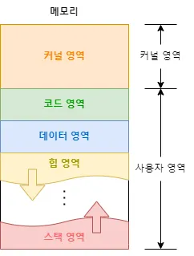
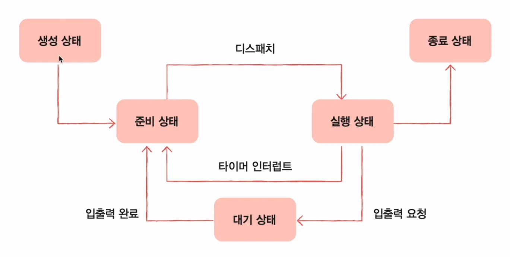
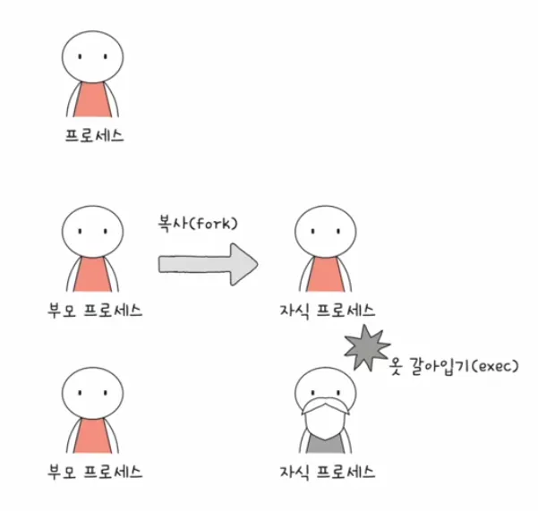
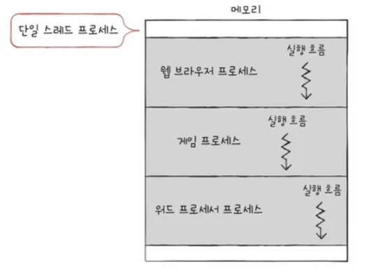
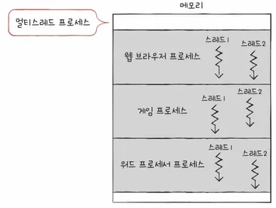
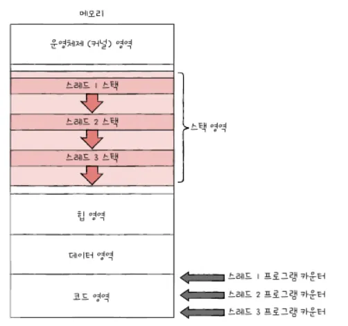

# 10-1 프로세스 개요

**프로세스 관리는 운영체제의 핵심 서비스입니다. 운영체제가 관리하는 프로세스가 무엇인지 알아보고 프로세스가 실행되는 과정들을 살펴봅시다.**

프로그램은 실행되기 전까지는 그저 보조기억장치에 있는 데이터 덩어리일 뿐이지만, **보조기억 장치에 저장된 프로그램을 메모리에 적재하고 실행하는 순간 그 프로그램은 프로세**스가 됩니다.

그리고 이 과정을 ‘프로세스를 생성한다’라고 표현합니다.

## 프로세스 직접 확인하기

사용자가 볼 수 있는 공간에서 실행되는 프로세스는 **포그라운드 프로세스**(foreground process)라고 하고, 사용자가 보지 못하는 뒤편에서 실행되는 프로세스는 **백그라운드 프로세스**(background process)라고 합니다.

사용자와 상호작용하지 않고 그저 묵묵히 정해진 일만 수행하는 백그라운드 프로세스를 유닉스 체계의 운영체제에서는 데몬(daemon)이라 부르고 윈도우 운영체계에서는 서비스(service)라고 부릅니다.

## 프로세스 제어 블록(Process Control Block)

모든 프로세스는 실행을 위해 CPU를 필요로 하지만, CPU 자원은 한정되어 있습니다. 즉 모든 프로세스가 CPU를 동시에 사용할 수는 없지요. 그렇기에 프로세스들은 차례대로 돌아가며 한정된 시간 만큼만 CPU를 이용합니다. 자신의 차례가 되면 정해진 시간만큼 CPU를 이용하고, 타이머 인터럽트가 발생하면 자신의 차례를 양보하고 다음 차례가 올 때까지 기다립니다.

> 타이머 인터럽트는 클럭 신호를 발생시키는 장치에 의해 주기적으로 발생하는 하드웨어 인터럽트입니다.
>

운영체제는 빠르게 번갈아 수행되는 프로세스의 실행 순서를 관리하고, 프로세스에 CPU를 비롯한 자원을 배분합니다. 이를 위해 운영체제는 프로세스 제어 블록(Process Control Block. 이하 PCB)을 이용합니다.

프로세스 제어 블록은 프로세스와 관련된 정보를 저장하는 자료 구조입니다. 이는 마치 상품에 달린 태그와도 같지요. 옷이나 가전제품에 달려 있는 태그에 해당 제품을 식별하기 위한 정보가 있는 것처럼 프로세스 제어 블록에는 해당 프로세스를 식별하기 위해 꼭 필요한 정보들이 저장됩니다.

- PCB의 예시

```c
struct process_control_block {
    int pid;
    int state;
    int pc;
    int registers[32];
    int priority;
    void* page_table_base;
    file_descriptor* fd_table;
};
```

PCB는 메모리의 커널 영역에 생성됩니다.

PCB는 프로세스 생성 시에 만들어지고 실행이 끝나면 폐기됩니다. 다시 말해 ‘새로운 프로세스가 생성되었다’는 말은 ‘운영체제가 PCB를 생성했다’는 말과 같고, ‘프로세스가 종료되었다’는 말은 ‘운영체제가 해당 PCB를 폐기했다’는 말과 같습니다.

이런 PCB에는 어떤 정보들이 담길까요? PCB에 담기는 정보는 운영체제마다 차이가 있지만, 대표적인 정보는 아래와 같습니다.

### 프로세스 ID

프로세스 ID(PID)는 특정 프로세스를 식별하기 위해 부여하는 고유한 번호입니다. 같은 일을 수행하는 프로그램이라 할지라도 두번 실행하면 PID가 다른 두 개 프로세스가 실행됩니다.

### 레지스터 값

프로세스는 자신의 실행 차례가 돌아오면 이전까지 사용했던 레지스터의 중간값들을 모두 복원합니다. 그래야만 이전까지 진행했던 작업들을 그대로 이어 실행할 수 있으니까요. 그래서 PCB 안에는 해당 프로세스가 실행하며 사용했던 프로그램 카운터를 비롯한 레지스터 값들이 담깁니다.

### 프로세스 상태

현재 프로세스가 어떤 상태인지 PCB에 기록되어야 합니다. 현재 프로세스가 입출력장치를 사용하기 위해 기다리고 있는지, CPU를 기다리고 있는지 등.

### CPU 스케줄링 정보

프로세스가 언제, 어떤 순서로 CPU를 할당받을지에 대한 정보도 PCB에 기록됩니다.

### 메모리 관리 정보

프로세스마다 메모리에 저장된 위치가 다릅니다. 그래서 PCB에는 프로세스가 어느 주소에 저장되어 있는지에 대한 정보가 있어야 합니다. 프로세스의 주소를 알기 위한 또 다른 중요 정보 중 하나인 페이지 테이블 정보도 PCB에 담깁니다.

### 사용한 파일과 입출력장치 목록

어떤 입출력장치가 이 프로세스에 할당되었는지, 어떤 파일들을 열었는지에 대한 정보들이 PCB에 저장됩니다.

## 문맥 교환

하나의 프로세스 수행을 재개하기 위해 기억해야할 정보를 문맥(context)이라고 합니다. 하나의 프로세스 문맥은 해당 프로세스의 PCB에 표현되어 있습니다. 프로세스가  CPU를 사용할 수 있는 시간이 다 되거나 예기치 못한 상황이 발생해 인터럽트가 발생하면 운영체제는 해당 프로세스의 PCB에 문맥을 백업합니다. 뒤이어 실행할 프로세스 B의 문맥을 복구합니다. 이렇게 자연스럽게 실행되는 프로세스가 바뀝니다.

이처럼 기존 프로세스의 문맥을 PCB에 백업하고, 새로운 프로세스를 실행하기 위해 문맥을 PCB로부터 복구하여 새로운 프로세스를 실행하는 것을 문맥 교환(Context Switching)이라고 합니다.

문맥 교환은 여러 프로세스가 끊임없이 빠르게 번갈아 가며 실행되는 원리입니다. 문맥 교환이 자주 일어나면 프로세스는 그만큼 빨리 번갈아 가며 수행되기 때문에 여러분의 눈에는 프로세스들이 동시에 실행되는 것처럼 보입니다.

## 프로세스의 메모리 영역

프로세스가 생성되면 커널 영역에 PCB가 생성된다고 했습니다. 하나의 프로세스는 사용자 영역에 크게 코드 영역, 데이터 영역, 힙 영역, 스택 영역으로 나뉘어 저장됩니다.


### 코드 영역

코드 영역(code segment)은 텍스트 영역(text segment)이라고도 부릅니다. 이곳에는 기계어로 이루어진 명령어가 저장됩니다. 코드 영역에는 데이터가 아닌 CPU가 실행할 명령어가 담겨 있기 때문에 쓰기가 금지되어 있습니다. 코드 영역은 읽기 전용(read-only) 공간입니다.

### 데이터 영역

데이터 영역(data segment)은 프로그램이 실행되는 동안 유지할 데이터가 저장되는 공간입니다. 이런 데이터로는 전역 변수(global variable)가 대표적입니다.

코드 영역과 데이터 영역은 그 크기가 변하지 않습니다. 프로그램을 구성하는 명령어들이 갑자기 바뀔 일이 없으니 코드 영역의 크기가 변할 리 없고, 데이터 영역에 저장될 내용은 프로그램이 실행되는 동안에만 유지될 데이터니까요. 그래서 ‘크기가 고정된 영역’이라는 점에서 **정적 할당 영역**이라고 부릅니다.

반면 힙 영역과 스택 영역은 그 크기가 실행과정에서 변할 수 있는 영역이라 **동적 할당 영역**이라고도 부릅니다.

### 힙 영역

힙 영역(heap segment)은 프로그래머가 직접 할당할 수 있는 저장 공간입니다. 프로그래밍 과정에서 힙 영역에 메모리 공간을 할당했다면 언젠가는 해당 공간을 반환해야 합니다.

메모리 공간을 반환하지 않는다면 할당한 공간은 메모리 내에 계속 남아 메모리 낭비를 초래합니다. 이런 문제를 메모리 누수(memory leak)라고 합니다. 많은 개발자가 자주 마주치는 문제 중 하나이지요.

<aside>

LeakSnitizer: detected memory leaks

</aside>

> 메모리 누수의 예시와 어떻게 해결할까?

Spring Bean은 기본적으로 Singleton인데, 여기에 List/Map을 두고 계속 데이터를 추가하면 절대 GC가 되지 않는다.
>

```java
@Service
public class CacheService {
    private final List<Object> cache = new ArrayList<>();
}
```

서버 메모리가 계속 증가하고 OOM 발생.

caffeine cache / redis 등 외부 캐시 사용.

local cache면 반드시 maxSize, TTL 필수 설정

### 스택 영역

스택 영역(stack segment)은 데이터를 일시적으로 저장하는 공간입니다. 데이터 영역에 담기는 값과는 달리 잠깐 쓰다가 말 값들이 저장되는 공간입니다. 이런 데이터로는 함수의 실행이 끝나면 사라지는 매개 변수, 지역 변수가 대표적입니다.

일반적으로 힙 영역은 메모리의 낮은 주소에서 높은 주소로 할당되고, 스택 영역은 높은 주소에서 낮은 주소로 할당됩니다. 그래야만 힙 영역과 스택 영역에 데이터가 쌓여도 새롭게 할당되는 주소가 겹칠 일이 없겠죠.

## 마무리

- 프로세스는 실행 중인 프로그램입니다. 프로세스의 종류에는 포그라운드 프로세스와 백그라운드 프로세스가 있습니다.
- 운영체제는 프로세스 제어 블록을 통해 여러 프로세스를 관리합니다.
- 프로세스 간에 실행을 전환하는 것을 문맥 교환이라고 합니다.
- 프로세스 사용자 영역에 크게 코드 영역, 데이터 영역, 스택 영역, 힙 영역으로 나뉘어 배치됩니다.

1. 프로세스는 반드시 사용자와 상호작용할 수 있어야합니다. X → 데몬, 서비스는 사용자와 상호작용 하지 않는 프로세스의 예시
2. 문맥 교환은 자주 수행될수록 좋습니다. X → 컨텍스트 스위칭이 자주 일어나면 오버헤드가 늘어납니다.

# 10-2 프로세스 상태와 계층 구조

프로세스들은 각자의 상태를 가지고 계층적인 구조를 이루고 있습니다. 프로세스 상태란 무엇인지, 프로세스 계층 구조란 무엇인지 알아보고 코드를 통해 이들을 확인해 보겠습니다.

## 프로세스 상태

컨텍스트 스위칭 과정 중에서 프로세스는 여러 상태를 거치며 실행됩니다. 그리고 운영체제는 이 상태를 PCB를 통해 인식하고 관리합니다. 프로세스의 상태를 표현하는 방식은 운영체제마다 조금씩 차이가 있지만, 프로세스가 가질 수 있는 대표적인 상태는 아래와 같습니다.

### 생성 상태(new)

프로세스를 생성 중인 상태를 생성 상태(new)라고 합니다. 이제 막 메모리에 적재되어 PCB를 할당받은 상태를 말하죠. 생성 상태를 거쳐 실행할 준비가 완료된 프로세스는 곧바로 실행되지 않고 준비 상태가 되어 CPU의 할당을 기다립니다.

### 준비 상태(ready)

준비 상태(ready)는 당장이라도 CPU를 할당받아 실행할 수 있지만, 아직 자신의 차례가 아니기에 기다리고 있는 상태입니다. 준비 상태 프로세스는 차례가 되면 CPU를 할당받아 실행 상태가 됩니다.

> 준비 상태인 프로세스가 실행 상태로 전환되는 것을 디스패치(dispatch)라고 합니다.
>

### 실행 상태(running)

실행 상태(running)는 CPU를 할당받아 실행 중인 상태를 의미합니다. 실행 상태인 프로세스는 할당된 일정 시간 동안만 CPU를 사용할 수 있습니다. 타이머 인터럽트(하드웨어 인터럽트)가 발생하면 다시 준비 상태(ready)가 되고, 실행 도중 입력장치를 사용하여 입출력 장치의 작업이 끝날 때까지 기다려야 한다면 대기 상태(blocked)가 됩니다.

### 대기 상태(blocked)

프로세스는 실행 도중 입출력장치를 사용하는 경우가 있습니다. 입출력 작업은 CPU에 비해 처리 속도가 느리기에, 입출력 작업을 요청한 프로세스는 입출력 완료 인터럽트를 받을 때까지 기다려야 합니다. 입출력 작업이 완료되면 해당 프로세스는 다시 준비 상태로 CPU 할당을 기다립니다.

### 종료 상태(terminated)

종료 상태(terminated)는 프로세스가 종료된 상태입니다. 프로세스가 종료되면 운영체제는 PCB와 프로세스가 사용한 메모리를 정리합니다.



## 프로세스 계층 구조

프로세스는 실행 도중 시스템 호출을 통해 다른 프로세스를 생성할 수 있습니다. 이때 새 프로세스를 생성한 프로세스를 **부모 프로세스(Parent Process),** 부모 프로세스에 의해 생성된 프로세스를 **자식 프로세스**라고 합니다.

부모 프로세스로부터 생성된 자식 프로세스는 엄연히 다른 프로세스이기에 각기 다른 PID를 가집니다. 일부 운영체제에서는 자식 프로세스의 PCB에 부모 프로세스의 PID인 PPID가 기록되기도 합니다.

많은 운영체제에서 프로세스가 프로세스를 낳는 계층적인 구조로써 프로세스들을 관리합니다.

### 최초의 프로세스

모든 프로세스의 가장 위에 있는 최초의 프로세스는 무엇일까요? 최초의 프로세스는 유닉스 운영체제에서 init, 리눅스 운영체제에서는 systemd, macOS에서 launchd라고 합니다. 최초의 프로세스 PID는 항상 1번이며, 모든 프로세스 최상단에 있는 부모 프로세스입니다.

## 프로세스 생성 기법

부모 프로세스를 통해 생성된 자식 프로세스들은 **복제와 옷 갈아입기**를 통해 실행됩니다. 조금 더 정확하게, 부모 프로세스는 fork를 통해 자신의 복사본을 자식 프로세스로 생성해내고, 만들어진 복사본은 exec를 통해 자신의 메모리 공간을 다른 프로그램으로 교체합니다. frok와 exec에 대해 조금 더 자세히 알아봅시다.

fork와 exec는 시스템 호출입니다. 부모 프로세스는 fork 시스템 호출을 통해 자신의 복사본을 자식 프로세스로 생성합니다. 즉, fork는 자기 자신 프로세스의 복사본을 만드는 시스템 호출입니다. 자식 프로세스는 부모 프로세스의 복사본이기 떄문에 부모 프로세스의 자원들, 이를테면 메모리 내의 내용, 열린 파일의 목록 등이 자식 프로세스에 상속됩니다.

fork를 통해 복사본이 만들어진 뒤에 자식 프로세스는 exec 시스템 호출을 통해 새로운 프로그램으로 전환됩니다. exec는 자신의 메모리 공간을 새로운 프로그램으로 덮어쓰는 시스템 호출입니다.

메모리 공간에 새로운 프로그램 내용이 덮어 써진다는 점에서 이는 자식 프로세스가 새로운 옷으로 갈아입었다고도 볼 수 있습니다 exec를 호출하면 코드 영역과 데이터 영역의 내용이 실행할 프로그램의 내용으로 바뀌고, 나머지 영역은 초기화됩니다.

예를 들어, 사용자가 bash 셸에서 ls라는 명령어를 쳤다고 가정해 봅시다. 셸 프로세스는 fork를 통해 자신과 동일한 프로세스를 생성하고, 그로부터 탄생한 자식 프로세스는 exec 명령을 통해 ls명령어를 실행하기 위한 프로세스로 전환되어 실행됩니다. 그렇게 셸의 복사본으로 탄생한 자식 프로세스는 ls 명령어를 실행하기 위한 프로세스로 바뀌고, 메모리 공간에는 ls명령어를 실행하기 위한 내용들이 채워집니다.

정리하면, 부모가 자식 프로세스를 시행하며 프로세스 계층 구조를 이루는 과정은 fork과 exec가 반복되는 과정이라 볼 수 있습니다.



부모 프로세스가 자식 프로세스를 fork한 뒤에 부모 프로세스, 자식 프로세스 누구도 exec를 호출하지 않는 경우도 있습니다. 이 경우 부모 프로세스와 자식 프로세스는 같은 코드를 병행하여 실행하는 프로세스가 됩니다.

## 마무리

- 프로세스 상태에는 생성, 준비, 실행, 대기, 종료가 있습니다.
- 프로세스가 다른 프로세스를 생성한 경우 프로세스를 생성한 프로세스를 부모 프로세스, 생성된 프로세스를 자식 프로세스라고 부릅니다.
- 많은 운영체제는 프로세스가 프로세스를 낳는 프로세스 계층 구조로 프로세스들을 관리합니다.

# 10-3 스레드(thread)

스레드는 프로세스를 구성하는 실행의 흐름 단위입니다. 그리고 하나의 프로세스는 여러 개의 스레드를 가질 수 있습니다. 스레드를 이용하면 하나의 프로세스에서 여러 부분을 동시에 실행할 수 있습니다.

## 프로세스와 스레드

전통적인 관점에서 보면 하나의 프로세스는 한 번에 하나의 일만을 처리했습니다. ‘실행의 흐름 단위가 하나’라는 점에서 한 번에 하나의 부분만 실행되는 프로세스들은 단일 스레드 프로세스라고 볼 수 있습니다.

하지만 **스레드라는 개념이 도입되면서 하나의 프로세스가 한 번에 여러 일을 동시에 처리할 수 있게 되었습니다**. 즉, 프로세스를 구성하는 여러 명령어를 동시에 실행할 수 있게 된 것이지요.



스레드는 프로세스 내에서 각기 다른 스레드 ID, 프로그램 카운터 값을 비롯한 레지스터 값, 스택으로 구성됩니다. 각자 프로그램 카운터 값을 비롯한 레지스터 값, 스택을 가지고 있기 때문에 스레드마다 각기 다른 코드를 실행할 수 있습니다.



여기서 중요한 점은 프로세스의 스레드들은 실행에 필요한 최소한의 정보만을 유지한 채 프로세스 자원을 공유하며 실행된다는 점입니다. 프로세스의 자원을 공유한다는 것이 스레드의 핵심입니다.

실제로 최근 많은 운영체제는 CPU에 처리할 작업을 전달할 때 프로세스가 아닌 스레드 단위로 전달합니다.

### 리눅스 운영체제에서 프로세스 vs 스레드

많은 운영체제가 프로세스와 스레드를 구분하지만, 프로세스와 스레드 간에 명확한 구분을 짓지 않는 운영체제도 있습니다. 대표적으로 리눅스가 그러합니다 리눅스는 프로세스와 스레드 모두 실행의 문맥이라는 점에서 동등하다고 간주하고 이 둘을 크게 구분 짓지 않습니다. 테스크라는 이름으로 통일하여 명명합니다.

> 프로세스와 스레드는 그냥 “실행의 문맥”일 뿐이다.
>

## 멀티프로세스와 멀티스레드

여러 프로세스를 동시에 실행하는 것을 멀티프로세스, 그리고 여러 스레드로 프로세스를 동시에 실행하는 것을 멀티스레드라고 합니다.

동일한 작업을 수행하는 단일 스레드 프로세스 여러 개를 실행하는 것과 하나의 프로세스를 여러 스레드로 실행하는 것은 무엇이 다를까요?

예를 들어 “hello, os”를 화면에 출력하는 간단한 프로그램이 있다고 해 봅시다. 이 프로그램을 세 번 fork하여 실행하면 화면에는 “hello, os”가 세 번 출력됩니다. 이 프로그램 내에 “hello, os”를 출력하는 스레드를 세 개 만들어 실행해도 화면에는 “hello, os”가 세 번 출력됩니다.

여기에는 큰 차이가 있습니다. 프로세스끼리는 기본적으로 자원을 공유하지 않지만 스레드끼리는 같은 프로세스 내의 자원을 공유한다는 점입니다.

여러 프로세스를 병행 실행하는 것보다 메모리를 더 효율적으로 사용할 수 있습니다. 또한 스레드는 프로세스의 자원을 공유하기 때문에 서로 협력과 통신에 유리합니다.

프로세스의 자원을 공유한다는 특성은 때론 단점이 될 수도 있는데, 멀티프로세스 환경에서는 하나의 프로세스에 문제가 생겨도 다른 프로세스에는 지장이 적거나 없지만, 멀티스레드 환경에서는 하나의 스레드에 문제가 생기면 프로세스 전체에 문제가 생길 수 있습니다. 모든 스레드는 프로세스의 자원을 공유하고, 하나의 스레드에 문제가 생기면 다른 스레드도 영향을 받기 때문입니다.

### 프로세스 간 통신

프로세스끼리는 ‘기본적으로’ 자원을 공유하지 않지만, 프로세스끼리도 충분히 자원을 공유하고 데이터를 주고받을 수 있습니다. 프로세스 간의 자원을 공유하고 데이터를 주고받는 것을 프로세스 간 통신이라고 부릅니다. IPC(Inter-Process Communication)이라고 줄여 부르는 경우가 많습니다.

‘통신’이라는 말을 들으면 네트워크를 통해 데이터를 주고 받는 방식만을 떠올리기 쉽지만, 같은 컴퓨터 내의 서로 다른 프로세스나 스레드끼리 데이터를 주고받는 것도 통신으로 간주합니다. (예: 파일을 통한 프로세스 간 통신)

또 프로세스들은 서로 공유하는 메모리 영역을 두어 데이터를 주고받을 수 있습니다. 프로세스들이 공유할 수 있는 메모리 영역을 공유 메모리(shared memory)라고 합니다.

이 외에도 프로세스들은 소켓, 파이프 등을 통해 통신할 수 있습니다. 즉, 프로세스들끼리 데이터를 교환하는 것은 모든 자원을 처음부터 공유하고 있는 스레드에 비하면 다소 까다로운 것이지 불가능한 것은 아닙니다.

## 마무리

- 스레드는 프로세스 내의 실행 흐름 단위입니다.
- 여러 프로세스를 동시에 실행하는 것을 멀티프로세스라고 하고, 여러 스레드로 프로세스를 동시에 실행하는 것을 멀티스레드라고 합니다.

1. 프로세스 내의 스레드들은 공유하는 코드/데이터/힙영역을 갖고 있습니다.
2. 프로세스끼리는 기본적으로 자원을 공유하지 않지만, 프로세스 내의 스레드끼리는 같은 프로세스 내의 자원을 공유합니다.