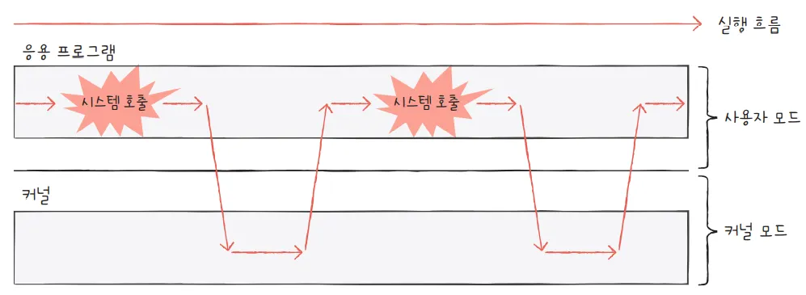

# 09-1 운영체제를 알아야 하는 이유

컴퓨터 부품들은 전기만 공급하면 마치 마법처럼 알아서 작동하는 것이 아닙니다. 운영체제라는 특별한 프로그램의 지휘하에 작동하지요. 운영체제는 컴퓨터 부품들을 관리하고, 여러분이 개발한 프로그램이 올바르게 실행되도록 돕습니다.

이번 절에서는 가벼운 마음으로 운영체제가 무엇인지 알아보고, 개발자들이 운영체제를 알아야 하는 이유에 대해 알아보겠습니다.

## 운영체제란

모든 프로그램은 하드웨어를 필요로 합니다. 예를 들어 1 + 2 를 계산하는 프로그램은 CPU를 필요로 하고, 이미지를 하드 디스크에 저장하는 프로그램은 하드 디스크를 필요로 합니다.

이때 프로그램 실행에 마땅히 필요한 요소들을 가리켜 **시스템 자원,** 혹은 줄여서 **자원**이라고 합니다. 지금까지 여러분이 학습한 CPU, 메모리, 보조기억장치, 입출력장치 등과 같은 컴퓨터 부품들은 모두 자원이라고 할 수 있습니다. 즉, 모든 프로그램은 실행되기 위해 반드시 자원이 필요합니다.

여기서 실행할 프로그램에 필요한 자원을 할당하고, 프로그램이 올바르게 실행되도록 돕는 특별한 프로그램이 바로 운영체제Operating System입니다.

> 운영체제는 실행할 프로그램에 필요한 자원을 할당하고, 프로그램이 올바르게 실행되도록 돕는 특별한 프로그램입니다.
>

**운영체제는 인터넷 브라우저, 게임과 같은 프로그램입니다.**

그래서 운영체제 또한 여느 프로그램과 마찬가지로 메모리에 적재되어야 합니다. 다만 운영체제는 매우 특별한 프로그램이기 때문에 항상 컴퓨터가 부팅될 때 메모리 내 **커널 영역**이라는 공간에 따로 적재되어 실행됩니다. 커널 영역을 제외한 나머지 영역, 사용자가 이용하는 응용 프로그램이 적재되는 영역을 **사용자 영역** 이라고 합니다. 즉, 운영체제는 커널 영역에 적재되어 사용자 영역에 적재된 프로그램들에 자원을 할당하고 이들이 올바르게 실행되도록 돕습니다.


> 운영체제는 커널 영역에 적재되는 프로그램입니다.
>

일반적으로 메모리에는 여러 개의 응용프로그램이 사용자 영역에 적재되어 실행됩니다.

그런데 누가 이 프로그램들을 메모리에 적재했을까요?위 그림에 따르면 워드 프로세서, 인터넷 브라우저, 메모장은 각각 2000번지, 1500번지, 1000번지에 적재되었는데, 메모리 주소가 겹치지 않도록 적당한 공간에 프로그램들을 적재해 준 건 누구였을까요? 바로 운영체제입니다. 운영체제는 운영체제는 실행할 프로그램을 메모리에 적재하고, 더 이상 실행되지 않는 프로그램을 메모리에서 삭제하며 지속적으로 메모리 자원을 관리합니다.(프로세스 종료)

또한, 이 세 개의 응용 프로그램이 실행되려면 반드시 CPU가 필요합니다. 그렇다면 어떤 프로그램부터 CPU를 사용하게 할까요? 그리고 얼마나 오랫동안 CPU를 이용하게 할까요? 이 문제 또한 운영체제가 해결합니다. 어느 한 프로그램이 CPU를 독접하면 다른 프로그램들은 올바르게 실행될 수 없기 떄문에 운영체제는 최대한 공정하게 여러 프로그램에 CPU를 할당합니다.

이번에는 워드 프로세서와 메모장이 동시에 동일한 프린터를 이용하려는 상황을 생각해 봅시다. 운영체제는 동시에 두 개의 프로그램이 프린터를 사용하지 못하도록 막고, 하나의 프로그램이 프린터를 이용하는 동안 다른 프로그램은 기다리게 만들어 프린터 자원을 관리합니다.

> 운영체제: 메모장아, 잠깐 기다려! 워드 프로세서가 먼저 프린트 출력하고 있어.
>

이처럼 운영체제는 응용 프로그램과 하드웨어 사이에서 응용 프로그램에 필요한 자원을 할당하고, 응용 프로그램이 올바르게 실행되도록 관리하는 역할을 맡습니다.


**운영체제는 흔히 정부에 비유**되기도 합니다. 한 나라의 정부는 땅, 인력, 돈 등 국내 자원을 효율적으로 배분하고, 국민들이 지켜야 할 규칙을 만들어 나라 전체를 관리합니다. 운영체제도 마찬가지입니다. 운영체제는 응용 프로그램에 자원을 효율적으로 배분하고, 실행할 프로그램들이 지켜야 할 규칙을 만들어 컴퓨터 시스템 전체를 관리합니다.

또한 정부에 기획재정부, 과학기술정보통신부, 외교부와 같이 역할별로 여러 부서가 나누어져 있는 것처럼 운영체제 또한 관리할 자원별로 기능이 나누어져 있습니다. 예를 들어 운영체제의 어느 한 부분에서는 CPU를, 어느 한 부분에서는 메모리를, 어느 한 부분에서는 하드 디스크를 관리합니다.

> 운영체제가 각 자원들(하드디스크, 입출력 단말, 메모리 등)을 관리하는데 운영체제는 시작 시에 메모리의 커널영역에 그럼 누가 올려주는걸까? 운영체제 스스로 올라가는 걸까?
→ 운영체제를 메모리로 올려주는 것은 운영체제 자신이 아니라 그 전에 이미 돌아가고 있는 부트로더/펌웨어이다. 부트로더가 하드디스크에서 운영체제를 읽어서 올려준다.
*부트로더: 디스크에 있는 운영체제 커널을 메모리에 올려서, 그리로 점프해주는 작은 프로그램


## 운영체제를 알아야 하는 이유

아무리 간단한 프로그램이라도 운영체제가 없다면 하드웨어를 조작하는 코드를 개발자가 모두 직접 작성해야 합니다.

다행히도 이 세상에는 운영체제가 있습니다. 운영체제가 하드웨어를 조작하고 관리하는 기능들을 제공하기 때문에 **개발자는 하드웨어를 조작하는 코드를 직접 작성할 필요 없이 운영체제의 도움을 받아 간편하게 개발**할 수 있습니다.

그렇다면 개발자들이 왜 운영체제를 알아야 할까요? 개발자들은 운영체제의 도움을 받아 프로그램만 개발하면 될 텐데 말이지요.

그 이유는 문제 해결 능력과 관련이 있습니다. 여러분이 만든 프로그램은 결국 하드웨어가 실행하고, 그 하드웨어를 조작하는 프로그램이 운영체제입니다. 그래서 운영체제는 여러분의 프로그램이 하드웨어 상에서 어떻게 작동하는지를 여러분보다 더 먼저, 더 자세히 알고 있습니다.

그리고 운영체제는 딱딱한 하드웨어가 아닌 프로그램이기 때문에 여러분과 대화할 수 있습니다. 운영체제는 현재 하드웨어의 상태는 어떠한지, 여러분의 코드가 어떻게 실행되었는지, 하드웨어 상에 어떤 문제가 있었는지 등을 여러분에게 상세히 알려줄 수 있고, 이를 통해 여러분은 문제 해결의 실마리를 찾을 수 있습니다.

즉, 운영체제를 깊이 이해하면 여러분은 운영체제가 여러분에게 건네는 말을 제대로 이해할 수 있고, 운영체제에 제대로 명령할 수 있게 됩니다. 그리고 결과적으로 하드웨어와 프로그램을 더 깊이 이해할 수 있습니다.

> 운영체제와 대화로 하드웨어와 프로그램을 더 깊이 이해하고 문제 해결의 실마리를 찾을 수 있습니다.
>

대표적인 운영체제와의 대화 예시는 오류 메시지입니다. 여러분이 접하게 될 대다수의 오류 메시지의 근원은 운영체제입니다. 프로그래밍 문법만 학습한 사람들은 운영체제의 메시지를 이해하기 어렵고, 문제를 진단하고 해결하기도 어려울 겁니다.

- 메모리 누수 현상

```c
693848==ERROR: LeakSanitizer: detected memory leaks

Direct leak of 888 byte(s) in 1 object(s) allocated from:
...
```

- 잘못된 주소 참조

The instruction at 0x0000000000025CE42B referenced memory at …

The memory could not be read.

뛰어난 개발자 중 운영체제 지식을 그저 고루한 이론으로 치부하거나 알 필요가 없다고 말하는 사람은 거의 없습니다. 채용과정에서 기술 면접 등을 통해 검증하는 것도 이러한 이유 때문입니다.

## 마무리

- 2가지 키워드로 정리하는 핵심 포인트
    - 운영체제는 실행할 프로그램에 필요한 자원을 할당하고, 프로그램이 올바르게 실행되도록 돕는 특별한 프로그램
    - 운영체제와의 대화를 통해 하드웨어와 프로그램을 더 깊이 이해하고 문제 해결의 실마리를 찾을 수 있습니다.

- 확인문제
    - 빈칸에 알맞은 단어를 채워보세요.
        - 운영체제는 실행할 프로그램에 `필요한 자원`을 할당하고, 프로그램이 올바르게 실행되도록 돕는 프로그램입니다.
    - 운영체제에 대한 설명으로 옳지 않은 것을 고르시오.
        - 2→ 운영체제는 커널 영역에 적재됩니다.(사용자 영역X)


# 09-2 운영체제의 큰 그림

`커널`, `이중 모드`, `시스템 호출`, `운영체제 서비스`

운영체제는 사용자가 실행하는 응용 프로그램이 올바르게 실행되도록 돕고 필요한 자원을 할당해주는 프로그램입니다.(프로그램을 위한 프로그램)

## 운영체제의 심장, 커널

**운영체제는 현존하는 프로그램 중 규모가 가장 큰 프로그램 중 하나**입니다.

자원에 접근하고 조작하는 기능, 프로그램이 올바르고 안전하게 실행되게 하는 기능이 운영체제의 핵심 서비스에 속합니다. 이러한 운영체제의 핵심 서비스를 담당하는 부분을 **커널**이라고 합니다.

필자가 운영체제를 지칭할 때는 언급하지 않는 한 커널을 지칭한다고 봐도 무방합니다.

> 커널은 운영체제의 핵심 기능을 담당합니다.
>

운영체제가 제공하는 서비스 중 커널에 포함되지 않는 서비스도 있는데, 대표적으로 사용자 인터페이스가 있습니다. 사용자 인터페이스는 윈도우의 바탕화면과 같이 사용자가 컴퓨터와 상호작용할 수 있는 통로입니다.

운영체제가 제공하는 사용자 인터페이스의 종류에는 그래픽 유저 인터페이스(GUI)와 커맨드 라인 인터페이스(CLI)가 있습니다.

같은 커널을 사용하더라도 사용자 인터페이스는 다를 수 있습니다.

## 이중 모드와 시스템 호출

운영체제는 사용자가 실행하는 응용 프로그램이 하드웨어 자원에 직접 접근하는 것을 방지하여 자원을 보호합니다. 만약 응용프로그램이 CPU, 메모리, 하드 디스크 등에 마음대로 접근하고 조작할 수 있다면 자원이 무질서하게 관리될 것이고, 응용 프로그램이 조금만 실수해도 컴퓨터 전체에 큰 악영향을 끼칠 수 있습니다.

그래서 운영체제는 응용 프로그램들이 자원에 접근하려고 할 때 오직 자신을 통해서만 접근하도록 하여 자원을 보호합니다. 일종의 문지기 역할을 하는 셈입니다. ‘운영체제에 도움을 요청한다’는 말은 ‘운영체제 코드를 실행하려고 한다’는 말과 같습니다. 응용 프로그램의 요청을 받은 운영체제는 응용 프로그램 대신 자원에 접근하여 요청한 작업을 수행합니다.

예를 들어 응용 프로그램이 실행 과정에서 하드 디스크에 접근하여 데이터를 저장하려면 운영체제에 도움을 요청해야 하고, 운영체제는 커널 영역 내의 하드 디스크에 데이터를 저장하는 코드를 실행하여 응용 프로그램의 작업을 대신 수행해 줍니다.

이러한 운영체제의 문지기 역할은 이중 모드로써 구현됩니다.

**이중 모드(dual mode)**란 CPU가 명령어를 실행하는 모드를 크게 사용자 모드와 커널 모드로 구분하는 방식입니다.

**사용자 모드(user mode)**는 운영체제 서비스를 제공받을 수 없는 실행 모드입니다. 즉, 커널 영역의 코드를 실행할 수 없는 모드입니다. 일반적인 응용 프로그램은 기본적으로 사용자 모드로 실행됩니다. 사용자 모드로 실행 중인 CPU는 입출력 명령어와 같이 하드웨어 자원에 접근하는 명령어를 실행할 수 없습니다.

반면 **커널 모드(kernel mode)**는 운영체제 서비스를 제공받을 수 있는 실행 모드입니다. 즉, 커널 영역의 코드를 실행할 수 있는 모드입니다.  CPU가 커널 모드로 명령어를 실행하면 자원에 접근하는 명령어를 비롯한 모든 명령어를 실행할 수 있습니다. 운영체제는 커널 모드로 실행되기 때문에 자원에 접근할 수 있습니다.

> CPU가 사용자 모드로 실행 중인지, 커널 모드로 실행 중인지는 플래그 래지스터 속 슈퍼바이저 플래그를 보면 알 수 있습니다.
>

요컨대 사용자 모드로 실행되는 프로그램이 자원에 접근하는 운영체제 서비스를 제공받으려면 운영체제에 요청을 보내 커널 모드로 전환되어야 합니다. 이때 운영체제 서비스를 제공받기 위한 요청을 시스템 호출(System call)이라고 합니다. 사용자 모드로 실행되는 프로그램은 시스템 호출을 통해 커널 모드로 전환하여 운영체제 서비스를 제공받을 수 있습니다.

시스템 호출(System call)은 일종의 인터럽트입니다. 인터럽트를 발생시키는 특정 명령에 의해 소프트웨어 인터럽트가 발생하는 것 입니다.

그래서 CPU가 시스템 호출을 처리하는 순서는 인터럽트 처리 순서와 유사합니다. 시스템 호출을 발생시키는 명령어가 실행되면 CPU는 지금까지의 작업을 백업하고, 커널 영역 내에 시스템 호출을 수행하는 코드(인터럽트 서비스 루틴)를 실행한 뒤 다시 기존에 실행하던 응용 프로그램으로 복귀하여 실행을 계속해 나갑니다.

시스템 호출의 작동 예를 들어 보겠습니다. 한 응용 프로그램이 하드 디스크에 데이터를 저장하려 한다고 가정해 보겠습니다. 이를 위해 응용 프로그램은 하드 디스크에 접근해야합니다. 하지만 사용자 모드로 실행되는 동안에는 자원(하드 디스크)에 접근할 수 없기에 커널 모드로 전환해야 합니다. 이를 위해 응용 프로그램은

1. 하드 디스크에 데이터를 저장하는 시스템 호출을 발생시켜 커널 모드로 전환
2. 운영체제 내의 ‘하드 디스크에 데이터를 저장하는 코드’를 실행함으로써 하드 디스크에 접근
3. 그리고 하드 디스크에 접근이 끝났다면 다시 사용자 모드로 복귀하여 실행을 계속해 나갑니다.

일반적으로 응용 프로그램은 실행 과정에서 운영체제 서비스들을 매우 빈번하게 이용합니다. 그 과정에서 빈번하게 시스템 호출을 발생시키고 사용자 모드와 커널 모드를 오가며 실행됩니다.



## 운영체제의 핵심 서비스

이 책에서 다룰 운영체제의 핵심 서비스는 프로세스 관리, 자원 접근 및 할당, 파일 시스템 관리입니다.

### 프로세스 관리

실행 중인 프로그램을 프로세스(process)라고 합니다. 컴퓨터를 사용하는 동안 메모리 안에서는 새로운 프로세스들이 마구 생성되고, 사용되지 않는 프로세스는 메모리에서 삭제됩니다.

일반적으로 하나의 CPU는 한 번에 하나의 프로세스만 실행할 수 있기에 CPU는 이 프로세스들을 조금씩 번갈아 가며 실행합니다. 다시 말해 CPU는 한 프로세스를 실행하다가 다른 프로세스로 실행을 전환하고, 그 프로세스를 실행하다가 또 다른 프로세스로 실행을 전환하는 것을 반복합니다.

여러 프로세스가 동시에 실행되는 환경에서는 ‘프로세스 동기화’가 필수적이고, 프로세스가 꼼짝도 못하고 더 이상 실행되지 못하는 상태인 ‘교착 상태’를 해결해야 합니다.


### 자원 접근 및 할당

모든 프로세스는 실행을 위해 자원을 필요로 합니다. 그리고 운영체제는 프로세스들이 사용할 자원에 접근하고 조작함으로써 프로세스에 필요한 자원을 할당해 줍니다.

- CPU
    - 하나의 CPU는 한 번에 하나의 프로세스만 실행할 수 있습니다. 이에 운영체제는 프로세스들에 공정하게 CPU를 할당하기 위해 어떤 프로세스부터 CPU를 사용하게 할 것인지, 얼마나 오리 CPU를 이용하게 할지를 결정할 수 있어야 합니다. 이를 **CPU 스케줄링**이라고 합니다.
- 메모리
    - 메모리에 적재된 프로세스들은 크기도, 적재되는 주소도 가지각색입니다. 같은 프로세스라 할지라도 실행할 때마다 적재되는 주소가 달라질 수 있습니다. 운영체제는 새로운 프로세스가 적재될 때마다 어느 주소에 적재해야 할지를 결정해야 합니다.
- 입출력장치
    - 인터럽트 서비스 루틴은 운영체제가 제공하는 기능으로 커널 영역에 있습니다. 입출력장치가 발생시키는 하드웨어 인터럽트도 마찬가지입니다. 입출력장치가 CPU에 하드웨어 인터럽트 요청 신호를 보내면 CPU는 하던 일을 잠시 백업한 뒤 커널 영역에 있는 인터럽트 서비스 루틴을 실행합니다.

### 파일 시스템 관리

컴퓨터를 사용할 때 여러 파일을 열고, 생성하고, 삭제하곤 합니다. 이런 파일 시스템도 운영체제가 관리하는 핵심 서비스입니다.

> 정리하자면 커널의 대표적 서비스로 프로세스 관리, 자원 접근 및 할당, 파일 시스템 관리가 있다.
>

## 조금 더 알아보기

### 가상 머신과 이중 모드의 발전

이중 모드는 커널 모드와 사용자 모드. 두 가지 모드를 지원하는 실행 모드지만, 가상 머신을 통한 가상화를 지원하는 현대 CPU는 두 가지 모드 이상을 지원합니다.

가상 머신(virtual machine)이란 이름 그대로 스프트웨어적으로 만들어낸 가상 컴퓨터입니다.

가상 머신에 설치된 운영체제도 사용자 모드로 작동하면 운영체제 서비스를 제공받기 어렵다.

그래서 가상화를 지원하는 CPU는 커널 모드와 사용자 모드 이외에 가상 머신을 위한 모드인 하이퍼바이저 모드를 따로 둡니다. 이로써 가상 머신 상에서 작동하는 응용 프로그램들은 하이퍼바이저 모드로써 가상 머신에 설치된 운영체제로부터 운영체제 서비스를 받을 수 있습니다.

### 시스템 호출의 종류

시스템 호출은 운영체제 서비스를 제공받기 위한 방법이므로 시스템 호출 종류만 잘 파악해도 해당 운영체제를 깊이 이해할 수 있습니다.

- 프로세스 관리
    - fork(): 새 자식 프로세스 생성
    - execve(): 프로세스 실행(메모리 공간을 새로운 프로그램의 내용으로 덮어씌움)
    - exit(): 프로세스 종료
    - waitpid(): 자식 프로세스가 종료할 때까지 대기
- 파일 관리
    - open(): 파일 열기
    - close(): 파일 닫기
    - read(): 파일 읽기
    - write(): 파일 쓰기
    - stat(): 파일 정보 획득
- 디렉터리 관리
    - chdir(): 작업 디렉터리 변경
    - mkdir(): 디렉터리 생성
    - rmdir(): 빈 디렉터리 삭제
- 파일 시스템 관리
    - mount(): 파일 시스템 마운트
    - umount(): 파일 시스템 마운트 해제

## 마무리

- 커널은 운영체제의 핵심 기능을 담당합니다.
- 이중 모드는 CPU가 명령어를 실행하는 모드를 커널 모드와 사용자 모드로 구분하는 방식입니다.
- 시스템 호출은 운영체제의 서비스를 제공받기 위해 커널 모드로 전환하는 방법입니다.
- 대표적인 운영체제 서비스로 프로세스 관리, 자원 접근및 할당, 파일 시스템 관리가 있습니다.

### 확인 문제

1. 커널은 운영체제의 핵심 기능을 담당하는 부분을 의미합니다.
2. 시스템호출은 인터럽트와 아무런 연관이 없습니다
   → 시스템 호출은 소프트웨어 인터럽트이므로 관련이 있다.
3. 운영체제 핵심 서비스가 아닌 것은 → 사용자 인터페이스 제공