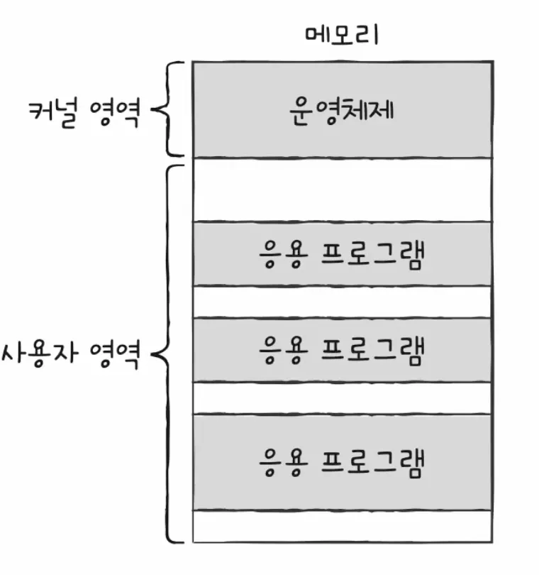
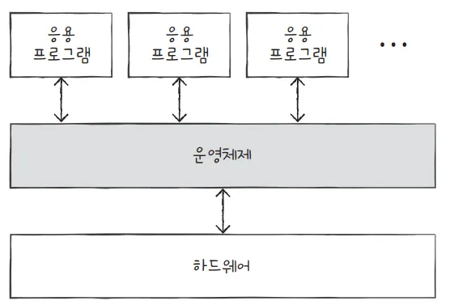
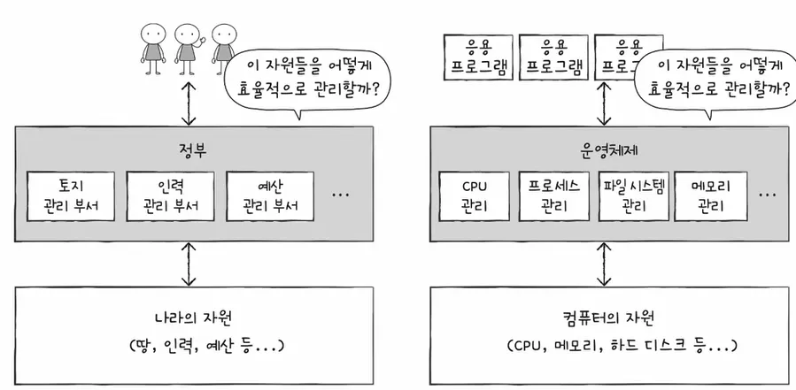

# 09-1 운영체제를 알아야 하는 이유

컴퓨터 부품들은 전기만 공급하면 마치 마법처럼 알아서 작동하는 것이 아닙니다. 운영체제라는 특별한 프로그램의 지휘하에 작동하지요. 운영체제는 컴퓨터 부품들을 관리하고, 여러분이 개발한 프로그램이 올바르게 실행되도록 돕습니다.

이번 절에서는 가벼운 마음으로 운영체제가 무엇인지 알아보고, 개발자들이 운영체제를 알아야 하는 이유에 대해 알아보겠습니다.

## 운영체제란

모든 프로그램은 하드웨어를 필요로 합니다. 예를 들어 1 + 2 를 계산하는 프로그램은 CPU를 필요로 하고, 이미지를 하드 디스크에 저장하는 프로그램은 하드 디스크를 필요로 합니다.

이때 프로그램 실행에 마땅히 필요한 요소들을 가리켜 **시스템 자원,** 혹은 줄여서 **자원**이라고 합니다. 지금까지 여러분이 학습한 CPU, 메모리, 보조기억장치, 입출력장치 등과 같은 컴퓨터 부품들은 모두 자원이라고 할 수 있습니다. 즉, 모든 프로그램은 실행되기 위해 반드시 자원이 필요합니다.

여기서 실행할 프로그램에 필요한 자원을 할당하고, 프로그램이 올바르게 실행되도록 돕는 특별한 프로그램이 바로 운영체제Operating System입니다.

> 운영체제는 실행할 프로그램에 필요한 자원을 할당하고, 프로그램이 올바르게 실행되도록 돕는 특별한 프로그램입니다.
>

**운영체제는 인터넷 브라우저, 게임과 같은 프로그램입니다.**

그래서 운영체제 또한 여느 프로그램과 마찬가지로 메모리에 적재되어야 합니다. 다만 운영체제는 매우 특별한 프로그램이기 때문에 항상 컴퓨터가 부팅될 때 메모리 내 **커널 영역**이라는 공간에 따로 적재되어 실행됩니다. 커널 영역을 제외한 나머지 영역, 사용자가 이용하는 응용 프로그램이 적재되는 영역을 **사용자 영역** 이라고 합니다. 즉, 운영체제는 커널 영역에 적재되어 사용자 영역에 적재된 프로그램들에 자원을 할당하고 이들이 올바르게 실행되도록 돕습니다.



> 운영체제는 커널 영역에 적재되는 프로그램입니다.
>

일반적으로 메모리에는 여러 개의 응용프로그램이 사용자 영역에 적재되어 실행됩니다.

그런데 누가 이 프로그램들을 메모리에 적재했을까요?위 그림에 따르면 워드 프로세서, 인터넷 브라우저, 메모장은 각각 2000번지, 1500번지, 1000번지에 적재되었는데, 메모리 주소가 겹치지 않도록 적당한 공간에 프로그램들을 적재해 준 건 누구였을까요? 바로 운영체제입니다. 운영체제는 운영체제는 실행할 프로그램을 메모리에 적재하고, 더 이상 실행되지 않는 프로그램을 메모리에서 삭제하며 지속적으로 메모리 자원을 관리합니다.(프로세스 종료)

또한, 이 세 개의 응용 프로그램이 실행되려면 반드시 CPU가 필요합니다. 그렇다면 어떤 프로그램부터 CPU를 사용하게 할까요? 그리고 얼마나 오랫동안 CPU를 이용하게 할까요? 이 문제 또한 운영체제가 해결합니다. 어느 한 프로그램이 CPU를 독접하면 다른 프로그램들은 올바르게 실행될 수 없기 떄문에 운영체제는 최대한 공정하게 여러 프로그램에 CPU를 할당합니다.

이번에는 워드 프로세서와 메모장이 동시에 동일한 프린터를 이용하려는 상황을 생각해 봅시다. 운영체제는 동시에 두 개의 프로그램이 프린터를 사용하지 못하도록 막고, 하나의 프로그램이 프린터를 이용하는 동안 다른 프로그램은 기다리게 만들어 프린터 자원을 관리합니다.

> 운영체제: 메모장아, 잠깐 기다려! 워드 프로세서가 먼저 프린트 출력하고 있어.
>

이처럼 운영체제는 응용 프로그램과 하드웨어 사이에서 응용 프로그램에 필요한 자원을 할당하고, 응용 프로그램이 올바르게 실행되도록 관리하는 역할을 맡습니다.



**운영체제는 흔히 정부에 비유**되기도 합니다. 한 나라의 정부는 땅, 인력, 돈 등 국내 자원을 효율적으로 배분하고, 국민들이 지켜야 할 규칙을 만들어 나라 전체를 관리합니다. 운영체제도 마찬가지입니다. 운영체제는 응용 프로그램에 자원을 효율적으로 배분하고, 실행할 프로그램들이 지켜야 할 규칙을 만들어 컴퓨터 시스템 전체를 관리합니다.

또한 정부에 기획재정부, 과학기술정보통신부, 외교부와 같이 역할별로 여러 부서가 나누어져 있는 것처럼 운영체제 또한 관리할 자원별로 기능이 나누어져 있습니다. 예를 들어 운영체제의 어느 한 부분에서는 CPU를, 어느 한 부분에서는 메모리를, 어느 한 부분에서는 하드 디스크를 관리합니다.

> 운영체제가 각 자원들(하드디스크, 입출력 단말, 메모리 등)을 관리하는데 운영체제는 시작 시에 메모리의 커널영역에 그럼 누가 올려주는걸까? 운영체제 스스로 올라가는 걸까?
→ 운영체제를 메모리로 올려주는 것은 운영체제 자신이 아니라 그 전에 이미 돌아가고 있는 부트로더/펌웨어이다. 부트로더가 하드디스크에서 운영체제를 읽어서 올려준다.
*부트로더: 디스크에 있는 운영체제 커널을 메모리에 올려서, 그리로 점프해주는 작은 프로그램




## 운영체제를 알아야 하는 이유

아무리 간단한 프로그램이라도 운영체제가 없다면 하드웨어를 조작하는 코드를 개발자가 모두 직접 작성해야 합니다.

다행히도 이 세상에는 운영체제가 있습니다. 운영체제가 하드웨어를 조작하고 관리하는 기능들을 제공하기 때문에 **개발자는 하드웨어를 조작하는 코드를 직접 작성할 필요 없이 운영체제의 도움을 받아 간편하게 개발**할 수 있습니다.

그렇다면 개발자들이 왜 운영체제를 알아야 할까요? 개발자들은 운영체제의 도움을 받아 프로그램만 개발하면 될 텐데 말이지요.

그 이유는 문제 해결 능력과 관련이 있습니다. 여러분이 만든 프로그램은 결국 하드웨어가 실행하고, 그 하드웨어를 조작하는 프로그램이 운영체제입니다. 그래서 운영체제는 여러분의 프로그램이 하드웨어 상에서 어떻게 작동하는지를 여러분보다 더 먼저, 더 자세히 알고 있습니다.

그리고 운영체제는 딱딱한 하드웨어가 아닌 프로그램이기 때문에 여러분과 대화할 수 있습니다. 운영체제는 현재 하드웨어의 상태는 어떠한지, 여러분의 코드가 어떻게 실행되었는지, 하드웨어 상에 어떤 문제가 있었는지 등을 여러분에게 상세히 알려줄 수 있고, 이를 통해 여러분은 문제 해결의 실마리를 찾을 수 있습니다.

즉, 운영체제를 깊이 이해하면 여러분은 운영체제가 여러분에게 건네는 말을 제대로 이해할 수 있고, 운영체제에 제대로 명령할 수 있게 됩니다. 그리고 결과적으로 하드웨어와 프로그램을 더 깊이 이해할 수 있습니다.

> 운영체제와 대화로 하드웨어와 프로그램을 더 깊이 이해하고 문제 해결의 실마리를 찾을 수 있습니다.
>

대표적인 운영체제와의 대화 예시는 오류 메시지입니다. 여러분이 접하게 될 대다수의 오류 메시지의 근원은 운영체제입니다. 프로그래밍 문법만 학습한 사람들은 운영체제의 메시지를 이해하기 어렵고, 문제를 진단하고 해결하기도 어려울 겁니다.

- 메모리 누수 현상

```c
693848==ERROR: LeakSanitizer: detected memory leaks

Direct leak of 888 byte(s) in 1 object(s) allocated from:
...
```

- 잘못된 주소 참조

The instruction at 0x0000000000025CE42B referenced memory at …

The memory could not be read.

뛰어난 개발자 중 운영체제 지식을 그저 고루한 이론으로 치부하거나 알 필요가 없다고 말하는 사람은 거의 없습니다. 채용과정에서 기술 면접 등을 통해 검증하는 것도 이러한 이유 때문입니다.

## 마무리

- 2가지 키워드로 정리하는 핵심 포인트
    - 운영체제는 실행할 프로그램에 필요한 자원을 할당하고, 프로그램이 올바르게 실행되도록 돕는 특별한 프로그램
    - 운영체제와의 대화를 통해 하드웨어와 프로그램을 더 깊이 이해하고 문제 해결의 실마리를 찾을 수 있습니다.

- 확인문제
    - 빈칸에 알맞은 단어를 채워보세요.
        - 운영체제는 실행할 프로그램에 `필요한 자원`을 할당하고, 프로그램이 올바르게 실행되도록 돕는 프로그램입니다.
    - 운영체제에 대한 설명으로 옳지 않은 것을 고르시오.
        - 2→ 운영체제는 커널 영역에 적재됩니다.(사용자 영역X)