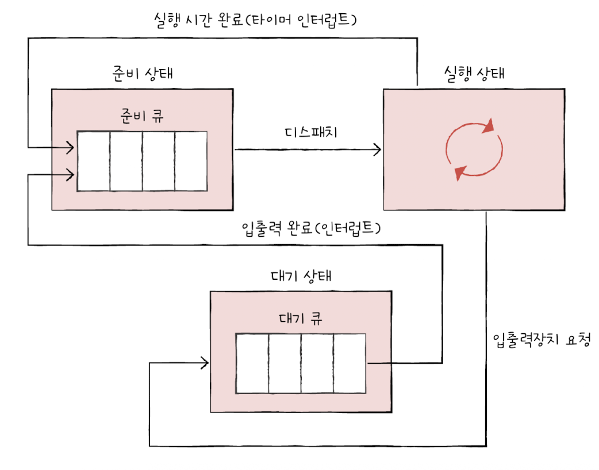
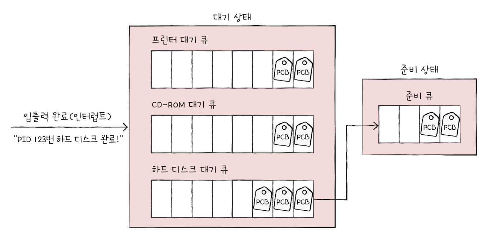
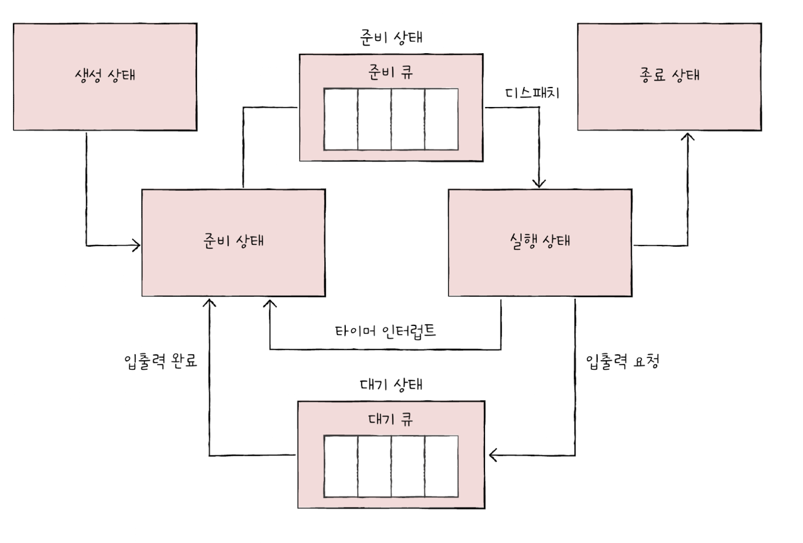
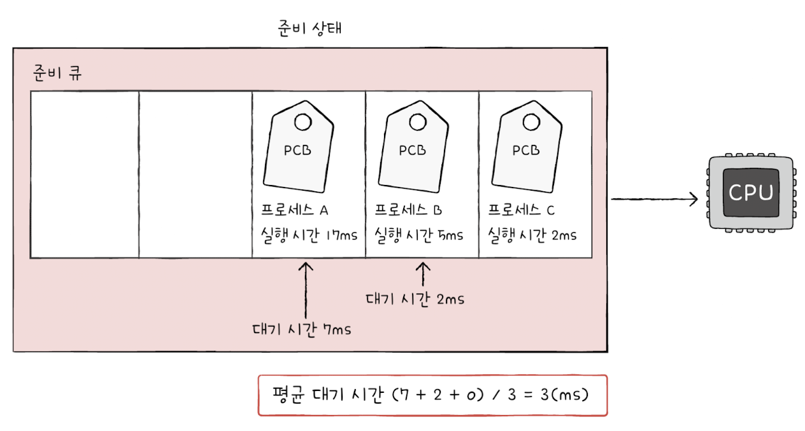
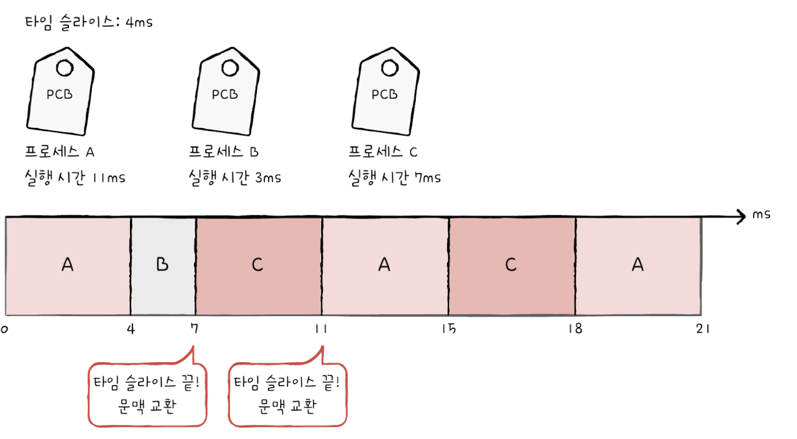
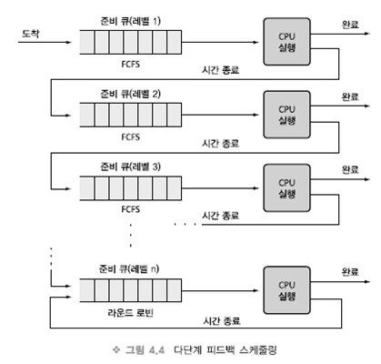
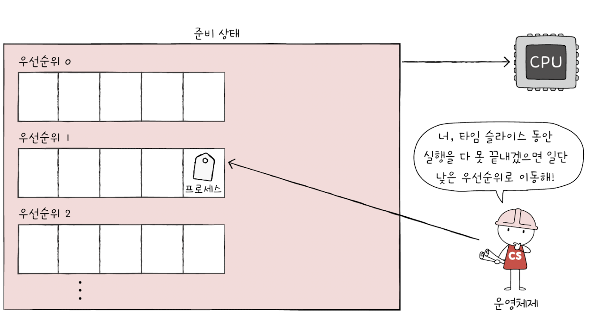
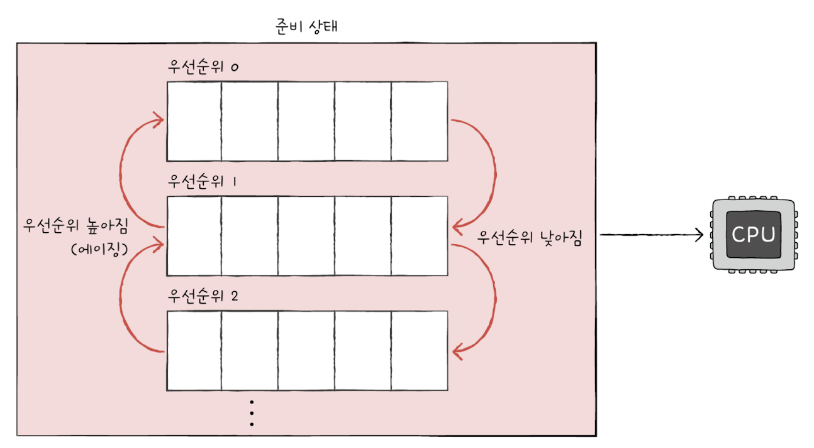

# 11-1 CPU 스케줄링 개요
CPU 스케줄링 : 운영체제가 프로세스들에게 공정하고 합리적으로 CPU 자원을 배분하는 것
## 프로세스 우선순위
우선순위가 높은 프로세스 : 빨리 처리해야 하는 프로세스

프로세스 종류마다 입출력장치를 이용하는 시간과 CPU를 이용하는 시간의 양에 차이 발생
- 입출력 집중 프로세스 : 비디오 재생이나 디스크 백업을 담당하는 프로세스와 같이 입출력 작업이 많은 프로세스
- CPU 집중 프로세스 : 복잡한 수학 연산, 컴파일, 그래픽 처리 작업을 담당하는 프로세스와 같이 CPU 작업이 많은 프로세스

- CPU 버스트 : CPU를 이용하는 작업
- 입출력 버스트 : 입출력장치를 기다리는 작업

모든 프로세스가 CPU를 차례대로 돌아가며 사용하는 것보다 각각의 상황에 맞게 CPU를 배분하는 것이 더 효율적

운영체제는 각 프로세스의 **PCB**에 우선순위를 명시하고, 이를 기준으로 먼저 처리할 프로세스를 결정
## 스케줄링 큐
스케줄링 큐 : 프로세스들을 줄 세워 관리
- 준비 큐 : CPU를 이용하고 싶은 프로세스들이 서는 줄
- 대기 큐 : 입출력장치를 이용하기 위해 대기 상태에 접어든 프로세스들이 서는 줄

준비 큐에 있는 프로세스 중 우선순위가 높은 프로세스를 먼저 실행

같은 장치를 요구한 프로세스들은 같은 대기 큐에서 기다림

운영체제는 대기 큐에서 작업이 완료된 PCB를 찾음 -> 이 PCB를 준비 상태로 변경한 뒤 대기 큐에서 제거 -> 해당 PCB는 준비 큐로 이동

### 프로세스 상태 다이어그램

- 생성 상태 : 프로세스가 생성된 상태
- 대기 상태 : 처음 프로세스가 생성된 이후 메모리 공간이 충분하면 메모리 할당, 아니면 아닌 상태로 준비 큐에 들어가서 대기 중인 상태
- 실행 상태 : CPU 소유권과 메모리를 할당 받고 인스트럭션 수행
- 중단 상태 : 프로세스가 차단된 상태
- 종료 상태 : 프로세스 실행이 완료됨

## 선점형과 비선점형 스케줄링
### 선점형 스케줄링
프로세스가 CPU를 비롯한 자원을 사용하고 있더라도 운영체제가 프로세스로부터 자원을 강제로 빼앗아 다른 프로세스에 할당할 수 있는 스케줄링 방식

- 장점 : 어느 한 프로세스의 자원 독점을 막고 골고루 자원 배분 가능
- 단점 : 문맥 교환 과정에서 오버헤드 발생 가능

우선순위 스케줄링, Round Robin, 다단계 큐, 다단계 피드백 큐

### 비선점형 스케줄링
하나의 프로세스가 자원을 사용하고 있다면 그 프로세스가 종료되거나 스스로 대기 상태에 접어들기 전까진 다른 프로세스가 끼어들 수 없는 스케줄링

- 장점 : 문맥 교환에서 발생하는 오버헤드가 작음
- 단점 : 하나의 프로세스가 자원을 사용 중이라면 기다릴 수 밖에 없다

FCFS, SJF, Highest Response-Ratio Next

# 11-2. CPU 스케줄링 알고리즘
## FCFS : 선입 선처리 스케줄링
단순히 준비 큐에 삽입된 순서대로 프로세스들을 처리하는 비선점형 스케줄링 방식

때때로 프로세스들이 기다리는 시간이 매우 길어질 수 있다는 점에서 부작용 있음

### 호위 효과
- 프로세스 A : 17ms 동안 CPU 이용
- 프로세스 B : 5ms 동안 CPU 이용
- 프로세스 C : 2ms 동안 CPU 이용
차례대로 준비 큐에 삽입된다면 C는 2ms를 실행하기 위해 17ms+5ms = 22ms 동안 기다려야 함

## SJF : 최단 작업 우선 스케줄링
준비 큐에 삽입된 프로세스들 중 CPU 이용 시간의 길이가 가장 짧은 프로세스부터 실행하는 스케줄링 방식

## Round Robin
선입 선처리 스케줄링 + 타임 슬라이스 (각 프로세스가 CPU를 사용할 수 있는 정해진 시간)

큐에 삽입된 프로세스들은 삽입된 순서대로 CPU를 이용하되 정해진 시간만큼만 CPU를 이용하고, 정해진 시간을 모두 사용하였음에도 아직 프로세스가 완료되지 않았다면 다시 큐의 맨 뒤에 삽입됨

타임 슬라이스 크기
- 매우 크면 호위 효과 발생 가능
- 지나치게 작으면 문맥 교환 발생 비용 증가

## 우선순위 스케줄링
프로세스들에 우선순위를 부여하고, 가장 높은 우선순위를 가진 프로세스부터 실행

**기아 현상** 발생 가능 : 우선순위가 낮은 프로세스의 실행은 계속 뒤로 밀리게 됨

## 다단계 큐 스케줄링
우선순위 스케줄링의 발전된 형태, 우선순위별로 준비 큐를 여러 개 사용

우선순위가 가장 높은 큐에 있는 프로세스들을 먼저 처리하고, 우선순위가 가장 높은 큐가 비어 있으면 그다음 우선순위 큐에 있는 프로세스들을 처리

큐별로 타임 슬라이스를 여러 개 지정할 수도 있고, 큐마다 다른 스케줄링 알고리즘 사용 가능

## 다단계 피드백 큐 스케줄링
다단계 큐 스케줄링과 다르게 프로세스들이 큐 사이를 이동할 수 있음

프로세스가 해당 큐에서 실행이 끝나지 않는다면 다음 우선순위 큐에 삽입되어 실행됨

### 에이징
낮은 우선순위 큐에서 너무 오래 기다리고 있는 프로세스가 있다면 점차 우선순위가 높은 큐로 이동시키는 **에이징 기법** 적용하여 기아 현상 예방 가능

