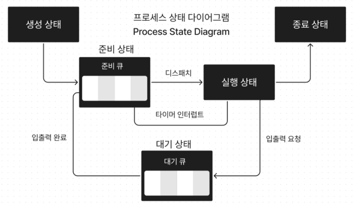

# Chapter 11 CPU 스케줄링
## 11-1) CPU 스케줄링 개요
운영체제가 프로세스들에게 공정하고 합리적으로 CPU 자원을 배분하는 것

### 프로세스 우선순위
상황과 프로세스의 중요도에 맞게 프로세스가 CPU를 이용할 수 있도록 운영체제가 프로세스마다 우선순위(priority)를 부여한다.

프로세스는 CPU 작업과 I/O 작업을 포함할 수 있는데, 이를 동시에 수행할 수는 없다. 만약, 프로세스가 실행 상태가 되어 CPU 작업을 진행하고 있다가 I/O 작업을 요구하면, CPU 작업을 중단하고 I/O 작업을 수행한다. 이처럼 프로세스가 CPU 작업과 I/O 작업을 번갈아가며 수행하는 것을 버스트(burst)라고 한다.

그렇기 때문에 일반적으로 입출력 집중 프로세스를 빨리 실행시켜 입출력 장치를 끊임없이 작동시키고, 그 다음 CPU 집중 프로세스에 집중적으로 CPU를 할당하는 것이 더 효율적일 수 있다.

> - 입출력 집중 프로세스 (I/O bound process): 입출력 작업이 많은 프로세스  ex) 비디오 재생, 디스크 백업 작업 담당 프로세스
> - 입출력 버스트 (I/O burst): 입출력장치를 기다리는 작업
> 
> 
> - CPU 집중 프로세스 (CPU bound process): CPU 작업이 많은 프로세스 ex) 복잡한 수학 연산, 컴파일, 그래픽 처리 작업을 담당하는 프로세스
> - CPU 버스트 (CPU burst): CPU를 이용하는 작업

프로세스는 CPU 작업이 많을 수 있고, 반대로 입출력 작업이 많을 수도 있다. 또한, PCB에 프로세스의 우선순위가 포함되어 있지만, 매번 운영체제가 모든 PCB를 검사하는 것은 비효율적이다. 

따라서, 운영체제는 프로세스들이 줄을 서서 기다리도록 요구한다. CPU를 사용하고 싶다면 준비큐(스케쥴링 큐), 입출력 장치를 사용하고 싶다면 대기큐에 줄을 서도록 한다.

그리고 운영체제는 이 큐를 관리하기 위해 CPU 스케줄링 알고리즘을 활용한다.

### 선점형과 비선점형 스케줄링
선점형 스케줄링 (preemptive scheduling)
- CPU 자원을 할당받고 있는 프로세스의 자원을 빼았아 다른 프로세스에게 할당
- 현재 대부분의 운영체제가 사용 중인 방식
- 한 프로세스의 자원 독점을 막고 프로세스들에 골고루 자원 배분 가능
- 문맥 교환 과정에서 오버헤드 발생 가능

비선점형 스케줄링 (non-preemptive scheduling)
- CPU 자원을 할당받고 있는 프로세스의 자원을 빼았을 수 없음
- 문맥 교환 횟수가 선점형 스케줄링보다 적으므로 문맥 교환에서 발생하는 오버헤드는 선점형 스케줄링보다 적음
- 모든 프로세스가 골고루 자원을 사용할 수 없음

## 11-2) CPU 스케줄링 알고리즘
### 선입 선처리 스케줄링 (FCFS, First Come First Served Scheduling)
- 단순히 준비 큐에 삽입된 순서대로 프로세스들을 처리하는 스케줄링 방식
- 비선점형
- 장점: 구현이 매우 간단함
- 단점: 호위효과 발생(프로세스들이 기다리는 시간이 매우 길어질 수 있다는 점에서 부작용이 있는 방식)

### 최단 작업 우선 스케줄링 (SJF, Shortest Job First Scheduling)
- 준비 큐에 삽입된 프로세스들 중에서 가장 짧은 작업 시간을 가진 프로세스를 먼저 처리하는 스케줄링 방식
- 호위 효과 방지 가능
- 비선점형
- 선점형으로도 구현 가(최소 잔여 시간 우선 스케줄링)
- 장점: 평균 대기 시간이 짧음
- 단점: 작업 시간이 짧은 프로세스가 계속해서 들어오면 작업 시간이 긴 프로세스는 무한정 대기해야 하는 기아 현상 발생 가능

### 라운드 로빈 스케줄링 (RR, Round Robin Scheduling)
- 각 프로세스가 CPU를 사용할 수 있는 시간(타임 슬라이스)을 동일하게 할당하는 스케줄링 방식
- 타임슬라이스가 너무 크면 호위 효과가 발생하고, 너무 작으면 문맥 교환 오버헤드가 커지기 때문에 적절한 타임슬라이스 설정이 중요
- 선점형
- 장점: 모든 프로세스가 골고루 CPU 자원을 사용할 수 있음
- 단점: 문맥 교환이 자주 발생하여 오버헤드가 커질 수 있음

### 최소 잔여 시간 우선 스케줄링 (SRTF, Shortest Remaining Time First Scheduling)
- 최단 작업 우선 스케줄링의 선점형 버전
- 최단 작업 우선 스케줄링 알고리즘과 라운드 로빈 알고리즘을 합친 스케줄링 방식
- SJF에서 비선점 -> 선점으로만 변경된 버전이기 때문에 장단점은 동일

### 우선순위 스케줄링 (Priority Scheduling)
- 각 프로세스에 우선순위를 부여하고, 우선순위가 높은 프로세스를 먼저 처리하는 스케줄링 방식
- 선점형과 비선점형 모두 구현 가능
- SJF, SRTF 알고리즘도 우선순위 스케줄링의 일종으로 볼 수 있음
- 장점: 중요한 프로세스를 우선 처리할 수 있음
- 단점: 우선순위가 낮은 프로세스가 무한정 대기하는 기아 현상 발생 가능
- 이를 해결하기 위해 오래 대기한 프로세스의 우선순위를 점차 높여주는 에이징(aging) 기법 사용

### 다단계 큐 스케줄링 (Multilevel Queue Scheduling)
- 우선순위 스케줄링의 발전된 형태
- 우선순위별로 준비 큐 여러 개 사용하여 우선순위가 가장 높은 큐에 있는 프로세스들을 먼저 처리하고, 우선순위가 가장 높은 큐가 비어 있으면 그 다음 우선순위 큐에 있는 프로세스들 처리한다.
- 장점: 우선순위에 따라 프로세스를 효과적으로 관리 가능, 큐마다 다른 스케줄링 알고리즘와 타임 슬라이스를 적용 가능
- 단점: 우선순위가 낮은 큐에 있는 프로세스가 무한정 대기하는 기아 현상 발생 가능

### 다단계 피드백 큐 스케줄링 (Multilevel Feedback Queue Scheduling)
- 다단계 큐 스케줄링의 단점을 보완한 스케줄링 방식
- 프로세스가 오랫동안 대기하면 우선순위가 높아지는 에이징 기법을 적용
- 프로세스가 CPU를 많이 사용하면 우선순위가 낮아지고, CPU를 적게 사용하면 우선순위가 높아지는 방식으로 동적으로 우선순위를 조정
- 장점: 기아 현상 방지 가능, 프로세스의 특성에 맞게 우선순위 조정 가능
- 단점: 구현이 복잡함
