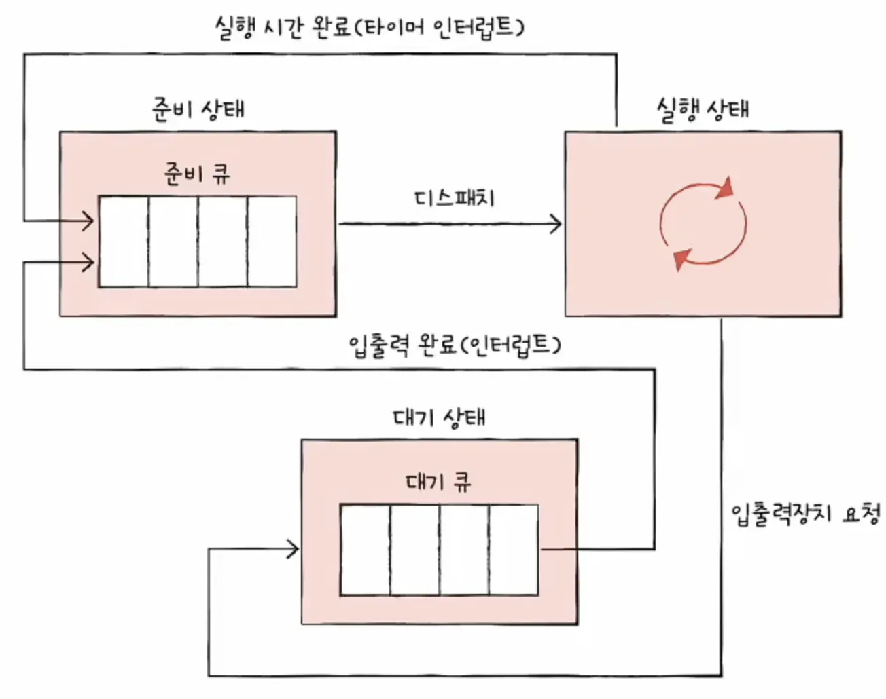
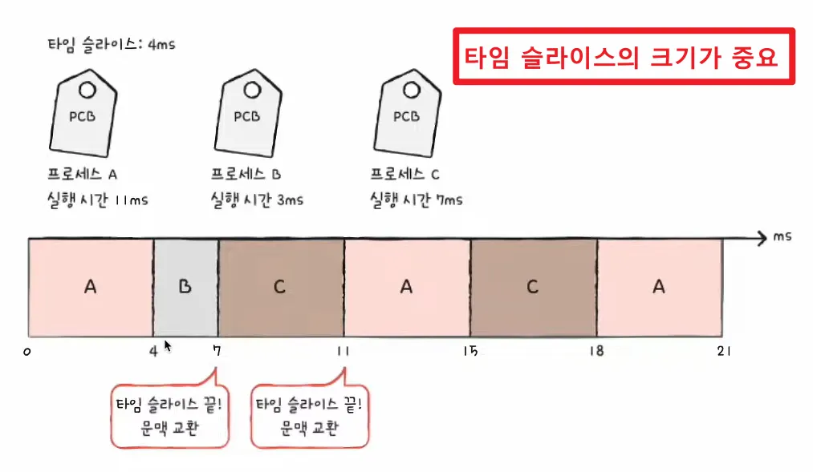

# 11-1 CPU 스케줄링 개요

운영체제는 cpu를 어떻게 프로세스에 배분하는지 알아봅시다. 이번 절은 다음 절을 이해하기 위한 배경 지식을 설명하는 절이라고 생각해도 좋습니다.

모든 프로세스는 CPU를 필요로 하고 모든 프로세스는 먼저 CPU를 사용하고 싶어합니다. 이러한 프로세스들에게 공정하고 합리적으로 CPU 자원을 할당하기 위해 운영체제는 어떤 프로세스에 CPU를 할당할지, 어떤 프로세스를 기다리게 할지를 결정합니다.

이렇게 운영체제가 프로세스들에게 공정하고 합리적으로 CPU 자원을 배분하는 것을 CPU 스케줄링(CPU Scheduling)이라고 합니다. CPU를 현명하게 배분하지 못하면 반드시 실행되어야 할 프로세스들이 실행되지 못하거나, 당장 급하지 않은 프로세스들만 주로 실행되는 등 무질서한 상태가 발생할 수도 있기 때문입니다.

## 프로세스 우선순위

아주 단순하게 생각해 봤을 때 CPU를 사용하고 싶어 하는 프로세스들이 차례로 돌아가며 CPU를 이용하게 하는 방법은 좋은 방법이 아닙니다.

그 이유는 프로세스마다 우선순위가 다르기 때문입니다. 우선순위가 높은 프로세스란 빨리 처리해야 하는 프로세스들을 의미합니다. 우선순위가 높은 프로세스에는 대표적으로 입출력 작업이 많은 프로세스가 있습니다. 입출력 작업이 많은 프로세스를 먼저 실행하는 것이 왜 더 효율적일까요?

프로세스는 실행 상태와 대기 상태를 반복하며 실행됩니다. 예를 들어 워드 프로세서는 CPU를 사용하여 명령어를 실행하고, 사용자로부터 입력받은 내용을 보조기억장치에 저장하고, CPU를 사용하여 명령어를 실행하고, 사용자가 입력한 내용을 화면에 출력하는 과정을 반복하며 실행됩니다.

프로세스 종류마다 입출력 작업이 많은 프로세스를 “입출력 집중 프로세스(I/O bound process)”라고 하고, CPU 작업이 많은 프로세스를 “CPU 집중 프로세스(CPU bound process)”라고 합니다. 입출력 집중 프로세스는 실행 상태보다는 입출력을 위한 대기 상태에 더 많이 머무르게 됩니다. 반대로 CPU 집중 프로세스는 실행 상태에 더 많이 머무르게 됩니다.

> CPU 버스트와 입출력 버스트
CPU를 이용하는 작업을 CPU 버스트(CPU burst)라 하고, 입출력장치를 기다리는 작업을 입출력 버스트(I/O burst)라 부릅니다. 즉, 프로세스는 일반적으로 CPU 버스트와 입출력 버스트를 반복하며 실행된다고 볼 수 있습니다. 그래서 입출력 집중 프로세스는 입출력 버스트가 많은 프로세스, CPU 집중 프로세스는 CPU 버스트가 많은 프로세스라고 정의할 수 있습니다.
>

CPU 집중 프로세스는 CPU를 많이 사용해야 하는 프로세스이고, 입출력 집중 프로세스는 그렇지 않은 프로세스인데, CPU 집중 프로세스와 입출력 집중 프로세스가 모두 동일한 빈도로 CPU를 사용하는 것은 비합리적입니다. (CPU는 입출력 장치를 쓸 때 ‘대기’ 상태가 됨)

CPU 집중 프로세스와 입출력 집중 프로세스가 동시에 CPU 자원을 요구했다고 가정해 봅시다. 이러한 경우 입출력 집중 프로세스를 가능한 한 빨리 실행시켜 입출력장치를 끊임없이 작동시키고, 그 다음 CPU 집중 프로세스에 집중적으로 CPU를 할당하는 것이 더 효율적입니다. 입출력장치가 입출력 작업을 완료하기 전까찌는 입출력 집중 프로세스는 어차피 대기 상태가 될 예정이기 때문에 입출력 집중 프로세스를 얼른 먼저 처리해 버리면 다른 프로세스가 CPU를 사용할 수 있기 때문입니다.

> 대기 상태로 빠진 프로세스는 CPU를 점유하지 않기 때문에 CPU를 놀지 않게 할 수 있다.
>

이렇듯 모든 프로세스가 CPU를 차례대로 돌아가며 사용하는 것보다 각각의 상황에 맞게 CPU를 배분하는 것이 더 효율적입니다.
상황에 맞게, 그리고 프로세스의 중요도에 맞게 프로세스가 CPU를 이용할 수 있도록 하기 위해 운영체제는 프로세스마다 우선순위(priority)를 부여합니다. 운영체제는 각 프로세스의 PCB에 우선순위를 명시하고, PCB에 적힌 우선순위를 기준으로 먼저 처리할 프로세스를 결정합니다. 그렇게 자연스레 우선순위가 높은 프로세스는 더 빨리, 더 자주 실행됩니다.

> 우선순위가 높은 대표적인 프로세스는 입출력 작업이 많은 프로세스이지만, 이외에도 우선순위가 높은 프로세스로는 실시간 프로세스, 일부 백그라운드 프로세스 등 다양합니다.
>

## 스케줄링 큐

PCB에 우선순위가 적혀 있다고는 하지만, CPU를 사용할 다음 프로세스를 찾기 위해 운영체제가 일일이 모든 프로세스의 PCB를 뒤적거리는 것은 비효율적입니다. CPU를 원하는 프로세스들은 한 두 개가 아니고, CPU를 요구하는 새로운 프로세스는 언제든 생길 수 있으니까요.

이는 비단 CPU 자원에만 국한된 상황이 아닙니다. 메모리에 적재되고 싶어 하는 프로세스도 있고, 특정 입출력 장치와 보조기억장치를 사용하길 원하는 프로세스도 있습니다. 운영체제가 매번 일일이 모든 PCB를 검사하여 먼저 자원을 이용할 프로세스를 결정하는 일은 매우 번거롭고 오랜 시간이 걸리는 일입니다.

그래서 운영체제는 프로세스들에 ‘줄을 서서 기다릴 것’을 요구합니다. CPU를 사용하고 싶은 프로세스들, 메모리에 적재되고 싶은 프로세스들, 특정 입출력장치를 사용하고 싶은 프로세스들을 모두 줄세우는 것이죠. 그리고 운영체제는 이 줄을 스케줄링 큐(scheduling queue)로 구현하고 관리합니다.

> 큐는 자료구조 관점에서 보았을 때 선입선출 자료구조이지만, 스케줄링에서 말하는 큐는 반드시 선입선출일 필요는 없습니다.
>

즉, 운영체제는 메모리로 적재되고 싶은 프로세스들을 큐에 삽입하여 줄을 세우고, CPU를 이용하고 싶은 프로세스들 또한 큐에 삽입하여 줄을 세우고, 특정 입출력장치를 이용하고 싶은 프로세스들 역시 큐에 삽입하여 줄을 세웁니다.

운영체제가 관리하는 대부분의 자원은 이렇듯 큐로 관리됩니다. 큐에는 다양한 종류가 있습니다. 대표적인 큐로 준비 큐와 대기 큐가 있습니다. 준비 큐(ready queue)는 CPU를 이용하고 싶은 프로세스들이 서는 줄을 의미하고, 대기 큐(waiting queue)는 입출력장치를 이용하기 위해 대기 상태에 접어든 프로세스들이 서는 줄을 의미합니다.

준비 상태(ready)에 있는 프로세스들의 PCB는 준비 큐의 마지막에 삽입되어 CPU를 사용할 차례를 기다립니다. 운영체제는 PCB들이 큐에 삽입된 순서대로 프로세스를 하나씩 꺼내어 실행하되, 그중 우선순위가 높은 프로세스를 먼저 실행합니다.

우선순위가 낮은 프로세스들이 먼저 큐에 삽입되어 줄을 섰다고 할지라도 우선순위가 높은 프로세스는 그들보다 먼저 처리될 수 있습니다.

> 실제로는 대기 큐나 준비 큐에 PCB의 포인터(주소값)이 들어간다.
>

대기 상태(waiting)에 있는 프로세스도 마찬가지입니다. 같은 장치를 요구한 프로세스들은 같은 대기 큐에서 기다립니다.

입출력이 완료되어 완료 인터럽트가 발생하면 운영체제는 대기 큐에서 작업이 완료된 PCB를 찾고, 이 PCB를 준비 상태로 변경한 뒤 대기 큐에서 제거합니다. 당연히 해당 PCB는 준비 큐로 이동합니다.

## 선점형과 비선점형 스케줄링

선점이란 ‘남보다 앞서서 차지함’을 의미합니다. **선점형 스케줄링(preemptive shceduling)**은 프로세스가 CPU를 비록한 자원을 사용하고 있더라도 운영체제가 프로세스로부터 자원을 강제로 빼앗아 다른 프로세스에 할당할 수 있는 스케줄링 방식을 의미합니다. 다시 말해 어느 하나의 프로세스가 자원 사용을 독접할 수 없는 스케줄링 방식이지요. 프로세스마다 정해진 시간만큼 CPU를 사용하고, 정해진 시간을 모두 소비하여 타이머 인터럽트가 발생하면 운영체제가 해당 프로세스로부터 CPU 자원을 빼앗아 다음 프로세스에 할당하는 방식은 선점형 스케줄링의 일종으로 볼 수 있습니다.

반면 **비선점형 스케줄링**(non-preemptive scheduling)이란 하나의 프로세스가 자원을 사용하고 있다면 그 프로세스가 종료되거나 스스로 대기 상태에 접어들기 전까진 다른 프로세스가 끼어들 수 없는 스케줄링 방식을 의미합니다. 다시 말해 비선점형 스케줄링은 하나의 프로세스가 자원 사용을 독점할 수 있는 스케줄링 방식이라고 할 수 있습니다.

현재 대부분의 운영체제는 선점형 스케줄링 방식을 차용하고 있지만, 선점형 스케줄링과 비선점형 스케줄링은 각기 장단점을 갖고 있습니다.

선점형 스케줄링은 더 급한 프로세스가 언제든 끼어들 수 있는 방식이므로 어느 한 프로세스의 자원 독점을 막고 프로세스들에 골고루 자원을 배분할 수 있다는 장점이 있지만, 그만큼 문맥 교환 과정에서 오버헤드가 발생할 수 있습니다.

비선점형 스케줄링은 문맥 교환의 횟수가 적기 때문에 오버헤드가 적지만, 하나의 프로세스가 자원을 사용 중이라면 당장 자원을 사용해야 하는 상황에서도 무작정 기다리는 수밖에 없습니다. 모든 프로세스가 골고루 자원을 사용 할 수 없다는 단점이 있지요.

# 11-2 CPU 스케줄링 알고리즘

앞선 절에서 배운 개념들을 토대로 스케줄링 알고리즘을 배워 봅시다. 여러 전공서에서 다루는 가장 기본적인 스케줄링 알고리즘을 알아보겠습니다.

각 스케줄링 알고리즘들의 작동 방식과 장단점을 이해하는 데에만 집중하여 학습하자.

## 스케줄링 알고리즘의 종류

스케줄링 알고리즘의 종류는 매우 다양합니다. 운영체제도 저마다 다른 알고리즘을 사용하고 있지요.

### 선입 선처리 스케줄링

선입 선처리 스케줄링은 FCFS 스케줄링(FirstComeFirstServed Scheduling)이라고도 부릅니다. 이는 단순히 준비 큐에 삽입된 순서대로 프로세스들을 처리하는 **비선점형** 스케줄링 방식입니다.

선입 선처리 스케줄링은 언뜻 보기에는 가장 공정해 보이지만, 때때로 프로세스들이 기다리는 시간이 매우 길어질 수 있다는 점에서 부작용이 있는 방식입니다.

*호위 효과(convoy effect): 프로세스 A는 17ms 동안 CPU를 이용하는 프로세스, 프로세스 B는 5ms 동안 CPU를 이용하는 프로세스, 프로세스 C는 고장 2ms를 실행하는데, A-B-C 순서대로 준비 큐에 삽입된다면 프로세스 C는 고작 2ms를 실행하는데 23ms를 기다려야만 함. 이러한 효과를 호위 효과라 한다.

### 최단 작업 우선 스케줄링

convoy effect를 방지하려면 어떻게 해야 할까요? 단순하게 생각해 보면 CPU 사용 시간이 긴 프로세스는 나중에 실행하고, CPU 사용 시간이 짧은 간단한 프로세스를 먼저 실행하면 되겠죠?

이렇게 준비 큐에 삽입된 프로세스들 중 CPU 이용 시간의 길이가 짧은 프로세스부터 실행하는 스케줄링 방식을 **최단 작업 우선 스케줄링 혹은 SJF 스케줄링**(Shortest Job First Scheduling)이라고 합니다. 최단 작업 우선 스케줄링은 기본적으로 비선점형 스케줄링 알고리즘으로 분류되지만, 선점형으로 구현될 수도 있습니다. **선점형 최단 작업 우선 스케줄링**이 뒤에 언급할 최소 잔여 시간 우선 스케줄링입니다.

### 라운드 로빈 스케줄링

라운드 로빈 스케줄링(round robin scheduling)은 선입 선처리 스케줄링에 타임 슬라이스라는 개념이 더해진 스케줄링 방식입니다. **타임 슬라이스**란 각 프로세스가 CPU를 사용할 수 있는 정해진 시간을 의미합니다. 즉, 라운드 로빈 스케줄링은 정해진 타임 슬라이스만큼의 시간 동안 돌아가며 CPU를 이용하는 선점형 스케줄링입니다.

큐에 삽입된 프로세스들은 삽입된 순서대로 CPU를 이용하되 정해진 시간만큼만 CPU를 사용하고, 정해진 시간을 모두 사용하였음에도 아직 프로세스가 완료되지 않은 경우 다시 큐의 맨 뒤로 삽입됩니다.

라운드 로빈 스케줄링에서는 타임 슬라이스 크기가 매우 중요합니다. 타임 슬라이스가 지나치게 크면 사실상 선입 선처리 스케줄링과 다를 바 없어 호위 효과가 생길 여지가 있고, 타임 슬라이스가 지나치게 작으면 문맥 교환에 발생하는 비용이 커 CPU는 프로세스를 처리하는 일보다 전환하는 데에 온 힘을 다 쓸 여지가 있기 때문입니다.

### 최소 잔여 시간 우선 스케줄링

최소 잔여 시간 우선 스케줄링 혹은 SRT(Shortest Remaining Time Scheduling)은 최단 작업 우선 알고리즘과 라운드 로빈 알고리즘을 합친 스케줄링 방식입니다.

최소 잔여 시간 우선 스케줄링(SRT) 하에서 프로세스들은 정해진 타임 슬라이스만큼 CPU를 사용하되, CPU를 사용할 다음 프로세스로는 남아있는 작업 시간이 가장 적은 프로세스가 선택됩니다.

### 우선순위 스케줄링

**우선순위 스케줄링**(priority scheduling)은 프로세스들에게 우선순위를 부여하고, 가장 높은 우선순위를 가진 프로세스부터 실행하는 스케줄링 알고리즘입니다.

> 우선순위가 같은 프로세스들은 선입 선처리로 스케줄링됩니다.
>

앞서 설명한 SJF, SRT 알고리즘은 우선순위 스케줄링의 일종으로 볼 수 있습니다.

다만, 우선순위 스케줄링은 근본적인 문제를 내포하고 있습니다. 우선순위가 높은 프로세스를 우선하여 처리하는 방식이기에 우선순위가 낮은 프로세스는 (준비 큐에 먼저 삽입되었음에도 불구하고) 우선순위가 높은 프로세스들에 의해 실행이 계속해서 연기될 수 있습니다. 이를 **기아**(starvation) 현상이라고 합니다.

이를 방지하기 위한 대표적인 기법으로 **에이징(aging)**이 있습니다. 이는 오랫동안 대기한 프로세스의 우선순위를 점차 높이는 방식입니다. 에이징 기법을 적용하면 우선순위가 낮아 마냥 기다리기만 하는 프로세스가 없어집니다.

### 다단계 큐 스케줄링

다단계 큐 스케줄링은 앞서 설명한 우선순위 스케줄링의 발전된 형태입니다. 다단계 큐 스케줄링(multilevel queue scheduling)은 우선순위별로 준비 큐를 여러 개 사용하는 스케줄링 방식입니다. 다단계 큐 스케줄링 하에서는 우선순위가 가장 높은 큐에 있는 프로세스들을 먼저 처리하고, 우선순위가 가장 높은 큐가 비어 있으면 그 다음 우선순위 큐에 있는 프로세스들을 처리합니다.

이렇게 큐를 여러 개 두면 프로세스 유형별로 우선순위를 구분하여 실행하는 것이 편리해집니다.

또한 큐별로 타임 슬라이스를 여러 개 지정할 수도 있고, 큐마다 다른 스케줄링 알고리즘을 사용할 수도 있습니다. 큐마다 다른 스케줄링 알고리즘을 적용할 수도 있습니다.

### 다단계 피드백 큐 스케줄링

다단계 피드백 큐 스케줄링은 다단계 큐 스케줄링의 발전된 형태입니다.

프로세스들이 큐 사이를 이동할 수 있습니다.

CPU를 비교적 오래 사용해야 하는 CPU 집중 프로세스들은 자연스레 우선순위가 낮아지고, CPU를 비교적 적게 사용하는 입출력 집중 프로세스들은 자연스레 우선순위가 높은 큐에서 실행이 끝납니다.

다단계 피드백 큐 스케줄링은 프로세스들이 큐 사이를 이동할 수 있는 방식이기 때문에 낮은 우선순위 큐에서 너무 오래 기다리고 있는 프로세스가 있다면 점차 우선순위가 높은 큐로 이동시키는 에이징 기법을 적용하여 기아 현상을 예방할 수 있습니다.

즉, 다단계 피드백 큐 스케줄링 알고리즘은 어떤 프로세스의 CPU 이용 시간이 길면 낮은 우선순위 큐로 이동시키고, 어떤 프로세스가 낮은 우선순위 큐에서 너무 오래 기다린다면 높은 우선순위 큐로 이동시킬 수 있는 알고리즘입니다.

> **다단계 피드백 큐 스케줄링 알고리즘은 구현이 복잡하지만, 가장 일반적인 CPU 스케줄링 알고리즘으로 알려져 있습니다.**
>