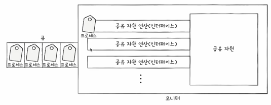

# Chapter 12 프로세스 동기화
## 12-1)  동기화란
동시다발적으로 실행되는 프로세스들은 서로 협력하며 영향을 받는다.
이때 실행 순서와 자원의 일관성을 보장해야 하는데, 이 과정을 동기화라고 한다.

### 동기화의 의미
프로세스들 사이 수행 시기를 맞추는 것
- 실행순서 제어: 프로세스를 올바른 순서로 실행하기
- 상호 배제: 동시에 접근하면 안 되는 자원에 한 프로세스만 접근하게 하기

### 실행 순서 제어를 위한 동기화
> 가정
> - Reader 프로세스: Book.txt를 읽는 프로세스
> - Writer 프로세스: Book.txt에 내용을 쓰는 프로세스

Writer 프로세스가 Book.txt에 값을 저장하기 전에 Reader 프로세스가 읽는 것은 올바른 순서가 아니다.
즉, 두 프로세스는 무작정 아무 순서대로 실행되면 안 됨

### 상호 배제를 위한 동기화
> 가정
> - 10만 원이 저축된 계좌
> - 프로세스 A: 2만 원을 입금
> - 프로세스 B: 5만 원을 입금

두 프로젝트가 동시에 실행 결과 17만원이 계좌에 남아있을 것이라고 기대한다.
하지만, 두 프로세스가 동시에 읽은 시점에 잔액이 10만원이라면, 해당 금액에 각각 2만원과 5만원을 더한 후 다시 쓰게 된다.
결과적으로 계좌에는 마지막에 실행된 프로세스의 입금액만 반영되어 12만원(또는 15만원)이 남게 된다.
즉, 동기화가 제대로 이루어지지 않으면 기대하는 값이 나오지 않을 수 있다.

### 생산자와 소비자 문제
> 가정
> - 생산자와 소비자는 총합이라는 데이터를 공유
> - 생산자 프로세스: 버퍼에 물건을 넣은 후 물건의 총합을 1증가
> - 소비자 프로세스: 버퍼에서 물건을 꺼낸 후 물건의 총합을 1감소

생산자와 소비자가 총합 데이터에 동시 접근하면 어떤 생산자가 얼마나 총합을 증가시킨 지 모른채 소비자가 총 합을 수정할 수 있기 떄문에 예상치 못한 결과를 낳을 수 있다.
즉, 접근해서는 안되는 자원에 동시접근하여 문제가 발생한다.

### 공유 자원, 임계 구역, 레이스 컨디션
- 공유자원
  - 전역 변수, 파일, 입출력 장치, 보조기억장치 등 여러 프로세스가 동시에 접근할 수 있는 자원을 의미
  - 공유 자원에 동시에 접근하면 데이터의 일관성이 깨질 수 있음
- 임계 구역 (Critical Section)
  - 공유 자원에 접근하는 코드 영역 
  - 두 개 이상의 프로세스가 임계 구역에 진입하고자 하면, 둘 중 하나의 프로세느는 대기해야 함
  - 먼저 진입한 프로세스의 작업이 마무리 되면 대기 중인 프로세스가 진입하여 작업을 수행
- 레이스 컨디션 (Race Condition)
  - 여러 프로세스가 임계 구역의 코드를 동시 실행하여 발생하는 문제
  - 예: 은행 계좌 잔액이 예상과 다르게 되는 경우

### 상호 배제를 위한 동기화
상호배제를 위한 동기화는 레이스 컨디션을 방지하기 위한 방법으로, 두 개 이상의 프로세스가 동시에 임계 구역에 진입하지 못하도록 보장하는 것이다.
이를 위해 다음 세 가지 조건이 필요하다.
1. 상호배제: 한 프로세스가 임계구역에 있으면 다른 프로세스는 임계구역에 못 들어감
2. 진행: 임계구역에 아무 프로세스도 없으면 진입하고자 하는 프로세스는 들어가야 한다.
3. 유한대기: 한 프로세스가 임계구역에 진입하고 싶다면 그 프로세스는 언젠가는 임계구역에 들어와야 한다.

## 12-2) 동기화 기법
동기화의 대표적인 도구 세 가지는 뮤텍스 락, 세마포어, 모니터이다.

### 뮤텍스 락
- 임계 구역이 잠겨 있다면 기다리고, 잠겨 있지 않다면 임계 구역에 진입 가능o
- 하나의 전역 변수(락 변수)와 두 개의 함수로 구현 가능
  - 전역 변수: 임계 구역의 상태(잠김/안잠김)를 나타냄 
  - acquire(): 임계 구역을 잠그는 역할
  - release(): 임계 구역의 잠금을 해제하는 역할
- 동작 방식: 임계 구역에 진입 시 acquire() 호출하는데, 만약 잠겨있다면 다른 프로세스가 잠금을 해제할 때까지 반복적으로 확인
    ```
    acquire() {
      while (lock == true) { // 기다림
        ...
      }
      lock = true;
    }
  
    release() {
      lock = false;
    }
    ```
- 한계점: busy waiting 발생 가능
  - busy waiting: 임계 구역에 진입하지 못하고 계속해서 락 상태를 확인하며 CPU 자원을 낭비하는 현상

### 세마포어
- 뮤텍스 락과 비슷하지만 조금 더 일반화된 방식의 동기화 도구
- 공유 자원이 여러 개 있을  경우 여러 개의 프로세스가 각각 공유자원의 접근이 가능해야 함
- 하나의 변수와 두 개의 함수로 구현 가능
  - S 변수: 임계 구역에 진입할 수 있는 프로세스의 개수 (공유 자원의 개수)
  - wait(): 임계 구역에 들어갈 수 있는지 알려줌 (공유 자원의 개수를 감소시킴)
    ```
    wait() {
      while (S <= 0) { // 기다림
        ...
      }
      S = S - 1;
    }
    ```
  - signal(): 임계 구역에서 나올 때 호출 (공유 자원의 개수를 증가시킴)
    ```
    signal() {
      S = S + 1;
    }
    ```
- 사용할 수 없는 공유 자원이 없는 경우 뮤텍스 기법처럼 바쁜 대기라는 단점이 발생한다.
- 이를 해결하기 위해 대기큐 라는 개념을 사용한다.
  - 계속 기다리는 것이 아닌, '대기 상태'를 만들어 실행을 기다리는 프로세스의 PCB를 대기큐에 넣는다
  - 이후 signal()이 호출되면 대기큐에서 PCB를 꺼내어 준비큐에 넣어준다.

### 모니터

- 세마포어 기법에서 매번 임계 구역 앞뒤로 일일이 wait()/signal()을 호출하는 번거로움을 해결하기 위한 동기화 도구
- 프로세스는 반드시 인터페이스를 통해서만 공유 자원에 접근해야 한다
