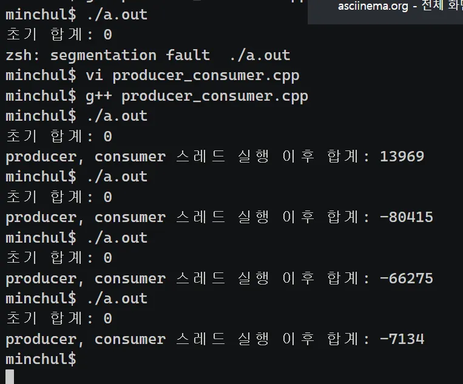
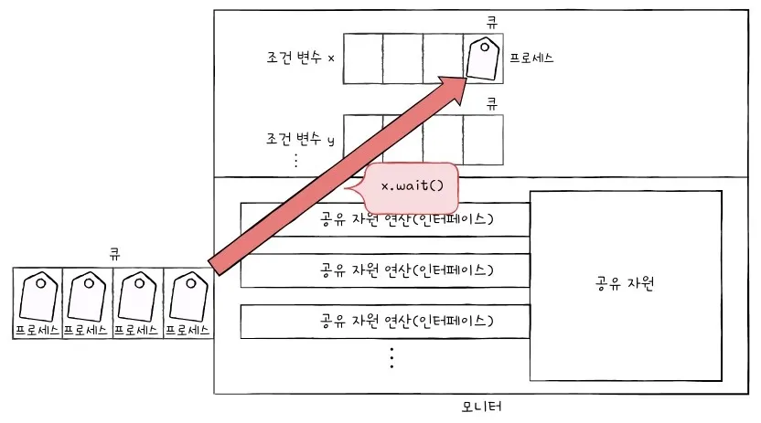

## 12-1 동기화란

운영체제의 프로세스 관리 서비스 중 가장 중요한 두 가지를 꼽자면 스케줄링과 동기화입니다. 지난 장에서 스케줄링을 학습했다면 이번에는 동기화에 대해 알아봅시다.

동시다발적으로 실행되는 프로세스들은 공동의 목적을 올바르게 수행하기 위해 서로 협력하며 영향을 주고 받기도 합니다. 이렇게 협력하여 실행되는 프로세스들은 실행 순서와 자원의 일관성을 보장해야 하기에 반드시 **동기화(synchronization)**되어야 합니다.

이번 절에서 동기화란 무엇인지 개념을 정리하고, 프로세스를 동기화하지 않을 경우 발생 할 수 있는 문제들을 통해 동기화가 왜 필요한지 알아봅니다.

### 동기화의 의미

동시다발적으로 실행되는 많은 프로세스는 서로 데이터를 주고받으며 협력하며 실행될 수 있습니다. 예를 들어 워드 프로세서에는 사용자로부터 입력을 받는 프로세스와 입력한 내용의 맞춤법을 검사하는 프로세스, 입력한 내용을 화면에 출력해 주는 프로세스 등이 있습니다. 이 프로세스들은 각기 다른 독립적인 프로세스이지만 공동의 목표를 위해 서로 협력하는 존재입니다.

이렇게 협력적으로 실행되는 프로세스들은 아무렇게나 마구 동시에 실행해서는 안됩니다. 올바른 실행을 위해서는 **동기화**가 필수입니다.

**프로세스 동기화**란 프로세스들 사이의 수행 시기를 맞추는 것을 의미합니다.

- 실행 순서 제어: 프로세스를 올바른 순서대로 실행하기
- 상호 배제: 동시에 접근해서는 안되는 자원에 하나의 프로세스만 접근하게 하기

> 프로세스뿐만 아니라 스레드도 동기화 대상입니다. 정확히 말하면 실행의 흐름을 갖는 모든 것은 동기화의 대상입니다. 다만 이 책에서는 대부분의 전공서 표현에 따라 ‘프로세스 동기화’라고 칭하겠습니다.
>

**동기화**는 특정 자원에 접근할 때 한 개의 프로세스만 접근하게 하거나, 프로세스를 올바른 순서대로 실행하게 하는 것을 의미합니다.

즉, 동기화에는 1. 실행 순서 제어를 위한 동기화가 있고, 2. 상호 배제를 위한 동기화가 있습니다.

**첫째, 실행 순서 제어를 위한 동기화에 대해 알아봅시다.**

가령 Writer라는 프로세스와  Reader라는 프로세스가 동시에 실행 중이라고 가정해 보겠습니다.

Writer 프로세스는 Book.txt 파일에 값을 저장하는 프로세스이고, Reader 프로세스는 Book.txt 파일에 저장된 값을 읽어 들이는 프로세스라고 가정해 보죠.

이 두 프로세스는 아무 순서대로 실행되어서는 안됩니다. Writer 프로세스가 Book.txt에 값을 저장하기도 전에 Reader 프로세스가 Book.txt를 읽는 것은 올바른 실행 순서가 아닙니다. 동시에 실행되는 프로세스를 올바른 순서대로 실행하는 것이 첫 번째 프로세스 동기화입니다.

**둘째, 상호 배제를 위한 동기화**

**상호 배제(mutual exclusion)**는 공유가 불가능한 자원의 동시 사용을 피하기 위해 사용하는 알고리즘입니다. 이 또한 간단한 예시를 들어 보겠습니다. 가령 계좌에 10만원이 저축되어 있다고 가정해 봅시다.

프로세스A 의 실행 과정은

1. 계좌의 잔액을 읽어 들인다.
2. 읽어 들인 잔액에 2만 원을 더한다.
3. 더한 값을 저장한다.

마찬가지로 프로세스 B가 실행되는 과정은

1. 계좌의 잔액을 읽어 들인다.
2. 읽어 들인 잔액에 5만원을 더한다.
3. 더한 값을 저장한다.

이제 프로세스 A와 B가 동시에 실행됐다고 가정해 봅시다. 실행 결과 16만 원이 계좌에 남을 것을 기대할 것이지만 동기화가 전혀 이루어지지 않은 경우 엉뚱한 결과가 나올 수 있다.

- 동기화가 이루어지지 않은 경우

프로세스 A와 B가 동시에 실행되면 다음과 같은 상황이 발생할 수 있습니다.

| **시간** | **프로세스 A** | **프로세스 B** | **계좌 잔액** |
| --- | --- | --- | --- |
| t1 | 잔액 읽기 (10만원) |  | 10만원 |
| t2 |  | 잔액 읽기 (10만원) | 10만원 |
| t3 | 10만원 + 2만원 = 12만원 |  | 10만원 |
| t4 |  | 10만원 + 5만원 = 15만원 | 10만원 |
| t5 | 12만원 저장 |  | 12만원 |
| t6 |  | 15만원 저장 | 15만원 |

위 표에서 볼 수 있듯이 프로세스 A가 계산한 12만원은 프로세스 B의 15만원에 덮어씌워지면서 사라집니다. 결과적으로 계좌에는 기대했던 17만원이 아닌 15만원만 남게 되는 문제가 발생합니다.


왜 이런 일이 발생했을까요? A와 B는 ‘잔액’이라는 데이터를 동시에 사용하는데, A가 끝나기도 전에 B가 잔액을 읽어 버렸기 때문입니다. A와 B를 올바르게 실행하기 위해서는 한 프로세스가 잔액에 접근했을 때 다른 프로세스는 기다려야 합니다.

- 동기화가 이루어진 경우

프로세스 A와 B가 동기화되어 실행되면 다음과 같이 올바른 결과를 얻을 수 있습니다.

| **시간** | **프로세스 A** | **프로세스 B** | **계좌 잔액** |
| --- | --- | --- | --- |
| t1 | 잔액 읽기 (10만원) | 대기 | 10만원 |
| t2 | 10만원 + 2만원 = 12만원 | 대기 | 10만원 |
| t3 | 12만원 저장 | 대기 | 12만원 |
| t4 | 완료 | 잔액 읽기 (12만원) | 12만원 |
| t5 |  | 12만원 + 5만원 = 17만원 | 12만원 |
| t6 |  | 17만원 저장 | 17만원 |

이렇게 동시에 접근해서는 안되는 자원에 동시에 접근하지 못하게 하는 것이 **상호 배제를 위한 동기화**입니다.

### 생산자와 소비자 문제

상호 배제를 위한 동기화에 고전적이고 유명한 문제로 생산자와 소비자 문제가 있습니다.

생산자와 소비자는 동시에 실행되는 스레드가 될 수도 있습니다.

생산자와 소비자는 ‘총합’이라는 데이터를 공유하고 있습니다. 생산자는 버퍼에 물건을 넣은 후, 물건의 총합에 해당하는 변수를 1 증가시키고, 소비자는 버퍼에 물건을 빼낸 후 물건의 총합에 해당하는 변수를 1 감소시킵니다.

생산자

```c
생산자 () {
				버퍼에 데이터 삽입
				'총합' 변수 1 증가
}
```

소비자

```c
소비자 () {
				버퍼에서 데이터 빼내기
				'총합' 변수 1 감소
}
```

*버퍼: 생산자가 만든 데이터를 임시 저장해 두는 공유 공간

총합 = 10으로 선언해 두고, 생산자를 100000번, 소비자를 100000번 동시에 실행해 보기로 합니다.

생산자는 그저 버퍼에 데이터를 넣고 총합을 1 증가시킬 뿐이고, 소비자는 버퍼에서 데이터를 빼고 총합을 1감소시킬 뿐이니 총합 변수가 10개로 머물로 있을 것으로 기대할 것입니다.

하지만 막상 생산자와 소비자를 동시에 실행해 보면 예상치 못한 결과를 받을 수 있습니다. 총합이 10이 아닌 다른 수가 되거나 오류가 나기도 합니다.

producer_consumer.cpp

```c
#include <iostream>
#include <queue>
#include <thread>

void produce();
void consume();

int sum = 0;

int main() {
		
		std::cout << "초기 합계: " << sum << std::endl;
		std::thread producer(produce);
		std::thread consumer(consume);
		
		producer.join();
		consumer.join();
		
		std::cout << "producer, consumer 스레드 실행 이후 합계: " << sum << std::endl;
		
		return 0;
}

void produce() {
		for(int i = 0; i < 100000; i++) {
				sum++;
		}
}

void consume() {
		for(int i = 0; i < 100000; i++) {
				sum--;
		}
}
```



이는 생산자 프로세스와 소비자 프로세스가 제대로 동기화되지 않았기 때문에 발생한 문제입니다.

앞서의 예제는 소비자가 생산자의 작업이 끝나기도 전에 총합을 수정했고, 생산자가 소비자의 작업이 끝나기도 전에 총합을 수정했기 때문에 엉뚱한 결과가 발생한 것입니다. 동시에 접근해서는 안되는 자원에 동시에 접근했기 때문에 발생한 문제라고 보 수 있습니다.

### 공유 자원과 임계 구역

동시에 접근해서는 안 되는 자원이란 무엇일까요?

계좌 잔액 문제와 생산자 소비자 문제의 예시에서 동시에 실행되는 프로세스들은 전역 변수 ‘잔액’, ‘총합’이라는 공동의 자원을 두고 작업을 했습니다. 이러한 자원을 **공유 자원**(shared resource)라고 합니다. 공유 자원은 전역 변수가 될 수도 있고, 파일이 될 수도 있고, 입출력장치, 보조기억장치가 될 수도 있습니다.

동시에 실행하면 문제가 발생하는 자원에 접근하려는 코드 영역을 **임계 구역**(critical section)이라고 합니다.

*여기서 의미하는 코드 영역: 임계 구역을 구성하는 실제 실행 코드 부분

두 개 이상의 프로세스가 임계 구역에 진입하고자 하면 둘 중 하나는 대기해야 합니다. 임계 구역에 먼저 진입한 프로세스의 작업이 마무리되면 그제서야 비로소 기다렸던 프로세스가 임계 구역에 진입합니다.

임계 구역(critical section)은 두 개 이상의 프로세스가 동시에 실행되면 안 되는 영역이지만, 잘못된 실행으로 인해 여러 프로세스가 동시 다발적으로 임계 구역의 코드를 실행하여 문제가 발생하는 경우가 있습니다. 이를 레이스 컨디션(race condition)이라고 합니다.

계좌 잔액 문제와 생산자와 소비자 문제는 레이스 컨디션(race condition)의 사례로 볼 수 있습니다.

레이스 컨디션이 발생하는 근본적인 원인을 따져봅시다.

컴퓨터 내부에서 대략 고급 언어 한 줄은 여러 줄의 저급 언어로 변환되어 실행됩니다.

예시)

```c
총합++; // 총합 변수를 1 증가시키는 코드 (critical section)
```

→

```c
r1 = 총합; // 총합 변수를 레지스터에 저장
r1 = r1 + 1; // 레지스터 값 1 증가
총합 = r1 // 레지스터 값을 총합 변수에 저장
```

컴퓨터는 고급 언어가 아닌 저급 언어를 실행하기 때문에 여러 줄의 저급 언어로 변환된 고급 언어 한 줄을 실행하는 과정에서 문맥 교환이 일어날 수 있습니다. 저급 언어를 실행하는 과정에서 문맥 교환이 일어난다면 아래와 같은 문제가 발생합니다.

| **시간** | **프로세스 A** | **프로세스 B** | 현재 총합 | 현재 r1 | 현재 r2 |
| --- | --- | --- | --- | --- | --- |
| t1 | r1 = 총합 |  | 10 | 10 |  |
| t2 | r1 = r1 + 1 |  | 10 | 11 |  |
| t3 | 문맥 교환 |  | 10 | 11 |  |
| t4 |  | r2 = 총합 | 10 | 11 | 10 |
| t5 |  | r2 = r2 - 1 | 10 | 11 | 9 |
| t6 |  | 문맥 교환 | 10 | 11 | 9 |
| t7 | 총합 = r1 |  | 11 | 11 | 9 |
| t8 | 문맥 교환 |  | 11 | 11 | 9 |
| t9 |  | 총합 = r2 | **9** | 11 | 9 |

운영체제는 이러한 임계 구역 문제를 아래 세 가지 원칙 하에 해결합니다. 달리 말해 상호배제를 위한 동기화를 위해서는 아래 세 가지 원칙이 반드시 지켜져야 합니다.

- 상호 배제(mutual exclusion): 한 프로세스가 임계 구역(critical section)에 진입했다면 다른 프로세스는 임계 구역에 들어올 수 없다.
- 진행(progress): 임계 구역(critical section)에 어떤 프로세스도 진입하지 않았다면 임계 구역에 진입하고자 하는 프로세스는 들어갈 수 있어야 한다.
- 유한 대기(bounded waiting): 한 프로세스가 임계 구역에 진입하고 싶다면 그 프로세스는 언젠가는 임계 구역에 들어올 수 있어야 한다(무한정 대기해서는 안된다)


## 12-2 동기화 기법

동기화(synchronization)를 위한 대표적 도구 → **뮤텍스 락, 세마포, 모니터**

### 뮤텍스 락

임계 구역 문제와 동기화 해법을 옷 가게에서 탈의실을 이용하는 것에 비유해 봅시다.

옷 가게에서는 마음에 드는 옷이 있으면 손님은 탈의실에 들어가서 옷을 입어볼 수 있습니다. 이때 탈의실에는 한 명의 인원만 들어갈 수 있습니다.

이때, 손님은 ‘프로세스’, 탈의실은 ‘임계 구역’이라고 할 수 있습니다.

일단 탈의실을 열어 보고 자물쇠가 걸려 있다면 탈의실 안에 사람이 있다고 판단하고 기다립니다. 자물쇠가 걸려 있지 않다면 탈의실을 이용하면 되는 것입니다.

이 자물쇠 기능을 코드로 구현한 것이 뮤텍스 락(mutex lock: mutual exclusion lock)입니다. 뮤텍스 락은 동시에 접근해서는 안 되는 자원에 동시에 접근하지 않도록 만드는 도구, 다시 말해 상호 배제를 위한 동기화 도구입니다.

뮤텍스 락의 매우 단순한 형태는 하나의 전역 변수와 두 개의 함수로 구현할 수 있습니다.

- 자물쇠 역할: 프로세스들이 공유하는 전역 변수 lock
- 임계 구역을 잠그는 역할: acquire 함수
- 임계구역의 잠금을 해제하는 역할: release 함수

**acquire함수**는 임계 구역에 진입하기 전에 호출하는 함수입니다. 만일 임계 구역이 잠겨 있다면 임계 구역이 열릴 때까지(lock이 false 될 때까지) 임계 구역을 반복적으로 확인하고, 임계 구역이 열려 있다면 임계 구역을 잠그는(lock을 true로 바꾸는) 함수입니다.

**release함수**는 임계 구역에서의 작업이 끝나고 호출하는 함수입니다. 현재 잠긴 임계 구역을 열어주는(lock을 false로 만드는) 함수라고 보면 됩니다.

```c
acquire() {
		while (lock == true)
				;
		lock = true;
}

release() {
		lock = false;
}
```

앞서 언급한 생산자 소비자 문제를 뮤텍스로 구현할 수 있다.

```c
acquire();
// '총합' 변수 접근
release();
```

이렇게 되면 프로세스는

- 락을 획득할 수 없다면 무작정 기다리고
- 락을 획득할 수 있다면 임계 구역을 잠근 뒤 임계 구역에서의 작업을 진행하고
- 임계 구역에서 빠져나올 때엔 다시 임계 구역의 잠금을 해제

이는 마치 탈의실 문이 잠겨 있는지 쉴 새 없이 반복하며 확인해 보는 것과 같습니다. 이런 대기 방식을 **바쁜 대기**(busy wait)라고 합니다.

(c,c++,python 등 일부 프로그래밍 언어에서는 mutex락 기능을 제공합니다. 소개한 구현보다 훨씬 정교하게 설계되어 있습니다.)

### 세마포

**세마포**(semaphore)는 뮤텍스 락과 비슷 하지만, 조금 더 일반화된 방식의 동기화 도구입니다. 뮤텍스 락은 하나의 공유 자원에 접근하는 프로세스를 상정한 방식입니다. 즉 탈의실이 하나 있는 경우를 가정하고 만든 동기화 도구인 것입니다. 공유 자원이 여러 개 있을 경우 여러 개의 프로세스가 각각 공유자원에 접근이 가능해야 합니다.

세마포는 공유 자원이 여러 개 있는 상황에서도 적용이 가능한 동기화 도구입니다.

> 엄밀히 말하면 세마포의 종류에도 이진 세마포(binary semaphore)와 카운팅 세마포(counting semaphore)가 있지만, 이진 세마포는 뮤텍스 락과 비슷한 개념.
>

세마포는 철도 신호기에서 유래한 단어입니다. 기차는 신호기가 내려가 있을 때는 ‘멈춤’ 신호로 간주하고 잠시 멈춥니다. 반대로 신호기가 올라와 있을 때는 ‘가도 좋다’는 신호로 간주하고 다시 움직이기 시작합니다. 세마포는 ‘멈춤’ 신호와 ‘가도 좋다’는 신호로 임계 구역을 관리합니다. 즉, 프로세스는 임계 구역 앞에서 멈춤 신호를 받으면 잠시 기다리고, 가도 좋다는 신호를 받으면 그제서야 임계 구역에 들어가게 됩니다.

세마포는 뮤텍스 락과 비슷하게 하나의 변수와 두 개의 함수로 구현할 수 있습니다.

- 전역 변수 S: 임계 구역에 진입하 수 있는 프로세스(사용 가능한 공유 자원의 수)의 개수를 나타낸다.
- wait 함수: 임계 구역에 들어가도 좋은지, 기다려야 할지를 알려주는 함수
- signal 함수: 임계 구역 앞에서 기다리는 프로세스에 ‘이제 가도 좋다’고 신호를 주는 함수

> 변수 이름과 함수 이름은 전공서마다 다를 수 있다. 다만, 변수와 함수를 어떻게 지칭하든지 원리와 동작 방식은 모두 동일하다.
>

```c
wait()
// 임계 구역
signal()
```

wait 함수

```c
wait() {
		while (S <= 0)
		;
		S--;
}
```

만일 임계 구역에 진입할 수 있는 프로세스 개수가 0이하라면,

사용할 수 있는 자원이 있는지 반복적으로 확인하고,

임계 구역에 진입할 수 있는 프로세스 개수가 하나 이상이면 S를 1 감소시키고 임계 구역 진입한다.

signal 함수

```c
signal() {
		S++;
}
```

임계 구역에서의 작업을 마친 뒤 S를 1 증가시킨다.

(S: 임계 구역에 진입할 수 있는 프로세스의 개수 혹은 사용 가능한 공유 자원의 개수)

가령 세 개의 프로세스 P1, P2, P3가 두 개의 공유 자원에 P1, P2, P3의 순서로 접근한다고 가정해봅시다.

1. 프로세스 P1 wait 호출, S는 현재 2이므로 S를 1 감소시키고 임계 영역 진입
2. 프로세스 P2 wait 호출, S는 현재 1이므로 S를 1 감소시키고 임계 영역 진입
3. 프로세스 P3 wait 호출, S는 현재 0이므로 무한히 반복하며 S 확인
4. 프로세스 P1 임계 구역 작업 종료, signal() 호출 S 1 증가
5. 프로세스 P3 S가 1이 됨을 확인, S는 현재 1이므로 S를 1감소시키고 임계 영역 진입

여기서 뮤텍스 락과 동일한 문제로, 사용할 수 있는 공유 자원이 없는 경우 프로세스는 무작정 무한히 반복하며 S를 확인해야 합니다. 이렇게 바쁜 대기(busy wait)를 반복하며 확인할 시간에 CPU는 더 생산성 있는 작업을 수행할 수 있을텐데, CPU 주기를 낭비한다는 점에서 손해입니다.

그래서 실제로 세마포는 다른 더 좋은 방법을 사용합니다. wait 함수는 만일 사용할 수 있는 자원이 없을 경우 해당 프로세스 상태를 대기 상태로 만들고, 그 프로세스의 PCB를 세마포를 위한 대기큐에 집어 넣습니다.

그리고 다른 프로세스가 임계 구역에서의 작업이 끝나고 signal 함수를 호출하면 signal 함수는 대기중인 프로세스를 대기 큐에서 제거하고, 프로세스 상태를 준비 상태로 변경한 뒤 준비 큐로 옮겨줍니다.

wait()

```c
wait() {
		S--;
		if ( S < 0) {
				add this process to Queue;
				sleep();
		}
}
```

signal()

```c
signal() {
		S++;
		if ( S <= 0 ) {
				remove process p from Queue;
				wakeup(p);
		}
}
```

대기 큐에 있는 프로세스 p를 제거한다.

프로세스 p를 대기 상태에서 준비 상태로 만든다.

예를 들어, 공유 자원은 2개, 접근하려는 프로세스는 P1, P2, P3 세 개이고, P1, P2, P3 순서로 임계 구역에 접근한다고 가정해 봅시다. 공유 자원이 2개이니 S는 2입니다.

1. 프로세스 P1 wait 호출, S를 1 감소시키면 S는 1이므로 임계 구역 진입
2. 프로세스 P2 wait 호출, S를 1 감소시키면 S는 0이므로 임계 구역 진입
3. 프로세스 P3 wait 호출, S를 1 감소시키면 S는 -1이므로 본인의 PCB를 대기 큐에 넣고 대기 상태로 전환
4. 프로세스 P1 임계 구역 작업 종료, signal() 호출, S를 1 증가하면 0이므로 대기 상태였던 P3를 대기 큐에서 꺼내 준비 큐로 옮겨줌
5. 깨어난 프로세스 P3 임계 구역 진입
6. 프로세스 P2 임계 구역 작업 종료, signal() 호출, S 1증가하면 1
7. 프로세스 P3 임계 구역 작업 종료, signal()호출, S가 1증가하면 2

동기화의 정의 = 상호 배제를 위한 동기화 + 실행 순서 제어를 위한 동기화

중 상호 배제를 위한 동기화를 위 작업에서 진행한 것.

세마포를 이용한 프로세스의 실행 순서 제어 방법은 세마포의 변수 S를 0으로 두고 먼저 실행할 프로세스 뒤에 signal 함수, 다음에 실행할 프로세스 앞에 wait 함수를 붙이면 됩니다.

| P1 | P2 |
| --- | --- |
|  | wait() |
| 임계구역 | 임계구역 |
| signal() |  |

이 경우, P1이 먼저 실행되면 P1이 임계 구역에 먼저 진입하는 것은 자명한 일이고, P2가 먼저 실행되더라도 P2는 wait함수를 만나므로 P1이 임계 구역에 진입합니다. 그리고 P1이 임계 구역의 실행을 끝내고 signal을 호출하면 그제서야 P2가 임계 구역에 진입합니다. 즉, P1이 먼저 실행되든 P2가 먼저 실행되든 반드시 P1, P2 순서대로 실행됩니다.

> 세마포도 뮤텍스 락과 마찬가지로 많은 프로그래밍 언어에서 제공합니다.
>

### 모니터

세마포는 그 자체로 매우 훌륭한 프로세스 동기화 도구이지만, 매번 임계 구역 앞뒤로 signal과 wait 함수를 명시하는 것은 번거로운 일입니다.

코드가 방대해지면 세마포를 누락하거나 wait과 signal의 순서를 헷갈리거나 wait와 signal을 중복해서 사용한 경우 등 미스가 발생할 수 있습니다.

이에 최근 등장한 동기화 도구가 **모니터**(monitor)입니다. 모니터는 세마포에 비하면 사용자가 사용하기에 훨씬 편리한 도구입니다. 모니터는 공유 자원과 공유 자원에 접근하기 위한 인터페이스(통로)를 묶어 관리합니다. 그리고 프로세스는 반드시 인터페이스를 통해서만 공유 자원에 접근 가능합니다.

이를 위해 모니터를 통해 공유 자원에 접근하고자 하는 프로세스를 큐에 삽입하고, 큐에 삽입된 순서대로 하나씩 공유 자원을 이용하도록 합니다.

즉, 모니터는 공유 자원을 다루는 인터페이스에 접근하기 위한 모니터 큐를 만들고, 모니터(공유 자원 + 통로) 안에 항상 하나의 프로세스만 들어오도록 하여 상호 배제를 위한 동기화를 구현합니다.

세마포와 마찬가지로 모니터도 실행 순서 제어를 위한 동기화도 제공합니다. 모니터는 조건 변수(condition variable)을 사용하는데, 조건 변수는 프로세스나 스레드의 실행 순서를 제어하기 위해 사용하는 특별한 변수입니다.

조건 변수로는 wait와 signal 연산을 수행할 수 있습니다.

wait은 호출한 프로세스의 상태를 대기 상태(wait) 전환하고 일시적으로 조건 변수에 대한 대기 큐에 삽입하는 연산입니다. 이 큐는 모니터에 이미 진입한 프로세스의 실행 조건이 만족될 때까지 잠시 중단되어 실행을 기다리기 위해 만들어진 큐입니다.

모니터에 진입한 어떤 프로세스가 x.wait()를 통해 조건 변수 x에 대한 wait를 호출했다고 가정해보겠습니다. 그 프로세스는 조건 변수x에 대한 큐에 삽입되므로 모니터는 다시 비게됩니다. 그렇기에 다른 프로세스가 모니터 안에 들어올 수 있습니다.



wait 연산으로 일시 중지된 프로세스는 다른 프로세스의 signal 연산을 통해 실행이 재개될 수 있습니다. 즉, signal은 wait를 호출하여 큐에 삽입된 프로세스의 시행을 재개하는 연산입니다. 가령 어떤 프로세스가 x.signal()을 통해 조건 변수 x에 대한 signal을 호출했다고 가정합니다.

이를 통해 조건 변수 x에 대해 대기 상태에 있던 프로세스가 깨어나 모니터 안으로 다시 들어올 수 있게 됩니다.

모니터 안에는 하나의 프로세스만 있을 수 있습니다. 따라서 wait를 호출했던 프로세스는 signal을 호출한 프로세스가 모니터를 떠난 뒤에 실행되거나, signal을 호출한 프로세스의 실행을 일시 중단하고 자신이 실행된 뒤 다시 signal을 호출한 프로세스의 수행을 재개합니다.

중요한 점은 모니터는 조건 변수를 이용하여 아래와 같은 프로세스 실행 순서 제어를 위한 동기화를 제공한다는 사실이다.

1. 특정 프로세스가 아직 실행될 조건이 되지 않았을 때에는 wait를 통해 실행 계획을 중단한다.
2. 특정 프로세스가 실행될 조건이 충족되었을 때에는 signal을 통해 실행을 재개한다.
