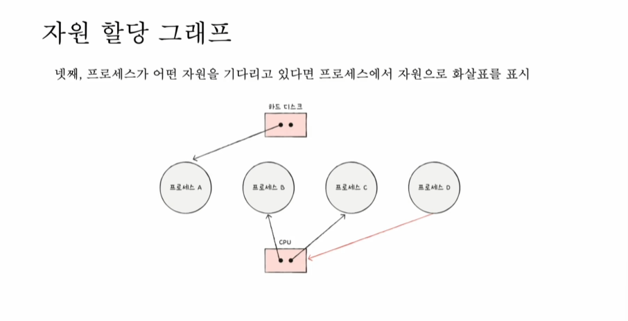
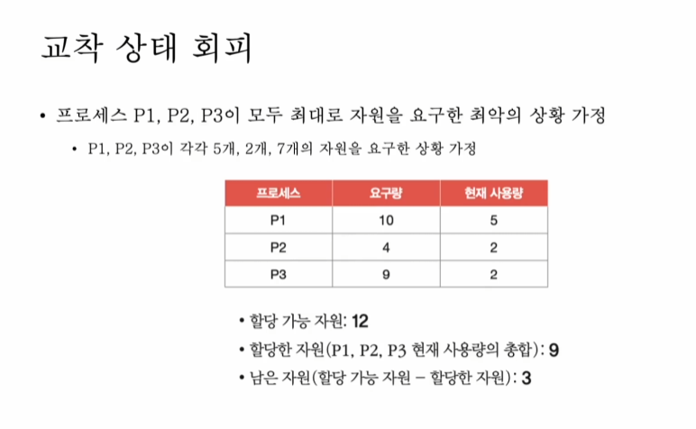

<details>
<summary> 교착 상태란 </summary>

## 교착 상태란?
- 식사하는 철학자 문제 : 일어나지 않을 일들을 기다리며, 진행이 멈춰 버리는 현상
- 자원이 한정되어 있을때, 서로가 자원을 점유하기만 하고 놓아주지 않아 발생하는 문제

## 자원 할당 그래프
- 교착 상태가 발생했을 때의 상황을 그림으로 표현
- 교착 상태 발생 조건 파악 가능


- 어떤 프로세스가 어떤 자원을 할당 받아 사용 중인지 확인 가능
- **프로세스** = 원
- **자원의 종류** = 사각형
- **자원의 갯수** = 사각형 내 점
- **자원 할당** = "자원 => 프로세스" 화살표
- **자원 기다림** = "프로세스 => 자원" 화살표

교착 상태가 일어난 그래프의 특징
- 원의 형태를 띄고 있다.

## 교착 상태가 발생할 조건
아래 4가지 조건 중 하나라도 만족하지 않으면 교착상태 발생 X  
아래 4가지 조건을 모두 만족하면 교착 상태 발생 가능성 O
- **상호 배제**
    - 한 프로세스가 사용하는 자원을 다른 프로세스가 사용할 수 없는 상태
- **점유와 대기**
    - 자원을 할당 받은 상태에서 다른 자원을 할당 받기를 기다리는 상태
- **비선점**
    - 어떤 프로세스도 다른 프로세스의 자원을 강제로 빼앗지 못하는 상태
- **원형 대기**
    - 프로세스들이 원의 형태로 자원을 대기하는 상태

</details>

<br>
<details>
<summary> 교착 상태 해결 방법 </summary>

## 교착 상태 해결 방법 3가지
- 예방
- 회피
- 검출 후 회복

### 예방
- 교착 상태가 발생하지 않도록 사전에 예방
- 상호배제, 점유 대기, 비선점, 원형 대기 중 하나를 없애기
- 교착상태를 피할 순 있으나, 여러 부작용이 함께 따름

### 회피
- 교착 상태를 **무분별한 자원 할당으로 인해 발생**했다고 간주
- 교착 상태가 발생하지 않을 만큼, 조금씩 할당하기
- ex) 은행원 알고리즘
- `안전 순서열`, `안전 상태`, `불안전 상태` 개념 존재
    - **안전 순서열**
        - 교착 상태 없이 안전하게 프로세스들에 자원을 할당할 수 있는 순서
    - **안전 상태**
        - 교착 상태 없이 모든 프로세스가 자원을 할당 받고 종료될 수 있는 상태
        - 안전 순서열이 있는 상태
    - **불안전 상태**
        - 교착 상태가 발생할 수도 있는 상태
        - 안전 순서열이 없는 상태


- 안전 상태 : P2 => P1 => P3 순서로 할당하면 모든 프로세스 실행 가능
- 불안전 상태 : P3 에 우선적으로 1개 이상의 자원을 내어주면 교착상태 발생

### 검출 후 회복
- 교착 상태의 발생을 인정하고 이후에 조치하는 방식
- 프로세스가 자원을 요구하면 일단 할당, 교착 상태가 검출되면 회복
- 선점을 통한 회복 / 프로세스 강제 종룔를 통한 회복

- **선점을 통한 회복**
    - 교착 상태가 해결 될 때 까지 한 프로세스씩 자원을 몰아주는 방식
- **프로세스 강제 종료를 통한 회복**
    - 교착 상태가 놓인 프로세스를 모두 강제 종료 (작업 내역을 잃을 위험이 있음)
    - 교착 상태가 해결될 때까지 한 프로세스씩 강제 종료 (오버헤드 발생)

</details>

<br>
<details>
<summary> 실무/프로젝트에서 교착상태가 언제/왜 나타나는지 </summary>

## 실무/프로젝트에서 교착상태(Deadlock)는 언제, 왜 발생하고 어떻게 대응해야 하는가

---

## 1. 교착상태란 무엇인가 

교착상태(Deadlock)는 **두 개 이상의 트랜잭션(또는 스레드)이 서로가 점유한 자원을 기다리며 영원히 진행하지 못하는 상태**를 말한다.

실무에서는 다음과 같은 형태로 나타난다.

---

## 2. 실무에서 교착상태가 발생하는 대표적인 상황들

### 2-1. 데이터베이스 트랜잭션: 자원 접근 순서 불일치

서로 다른 트랜잭션이 **같은 테이블의 row를 다른 순서로 접근**할 때 발생한다.

```java
// 트랜잭션 A: 주문 생성 및 재고 차감
@Transactional
public void createOrder(Long orderId, Long productId) {
    // 1. orders 테이블 INSERT
    Order order = new Order(orderId, productId);
    orderRepository.save(order); // order row 락 점유
    
    // 2. inventory 테이블 UPDATE
    Inventory inventory = inventoryRepository.findById(productId);
    inventory.decrease(1); // inventory row 락 필요
}

// 트랜잭션 B: 재고 조정 및 주문 취소
@Transactional
public void adjustInventory(Long productId, Long orderId) {
    // 1. inventory 테이블 UPDATE (트랜잭션 A와 순서 반대)
    Inventory inventory = inventoryRepository.findById(productId);
    inventory.increase(1); // inventory row 락 점유
    
    // 2. orders 테이블 UPDATE
    Order order = orderRepository.findById(orderId);
    order.cancel(); // order row 락 필요
}
```

**교착상태 발생 시나리오:**

```
시간 T1: 트랜잭션 A가 orders row에 락 획득
시간 T2: 트랜잭션 B가 inventory row에 락 획득
시간 T3: 트랜잭션 A가 inventory row 락 대기 (B가 점유 중)
시간 T4: 트랜잭션 B가 orders row 락 대기 (A가 점유 중)
→ 원형 대기 발생 → Deadlock 발생
```

* 이와 같이 서비스 로직이 복잡해지면서 접근 순서가 뒤섞이며 데드락 발생 가능

---

### 2-2. 인덱스 누락으로 인한 과도한 락 범위

WHERE 조건 컬럼에 인덱스가 없는 UPDATE/DELETE 쿼리를 실행할 때.

```java
@Transactional
public void updateOrderStatus(Long userId, String status) {
    // user_id에 인덱스가 없을 때
    orderRepository.updateStatusByUserId(userId, status);
}

// 실제 실행되는 SQL
// UPDATE orders SET status = 'PAID' WHERE user_id = 10;
```

* 인덱스가 없으면 InnoDB가 **테이블 풀 스캔** 수행
* 조건에 맞지 않는 row까지 **임시로 락 획득**
* 실제로 수정할 row는 1개인데, 수백~수천 개의 row에 락 시도
* 다른 트랜잭션과 락 경합 → 교착상태 확률 급증

#### 실행 계획 예시

```sql
EXPLAIN UPDATE orders SET status = 'PAID' WHERE user_id = 10;

-- 인덱스 없을 때 -> 풀 스캔
+----+------+--------+------+---------+------+
| type | key  | rows   | Extra                 |
+----+------+--------+------+---------+------+
| ALL  | NULL | 50000  | Using where           |
+----+------+--------+------+---------+------+

-- 인덱스 있을 때 -> 범위 스캔 (혹은 인덱스 스캔)
+-------+--------------+------+-------------+
| type  | key          | rows | Extra       |
+-------+--------------+------+-------------+
| range | idx_user_id  | 5    | Using where |
+-------+--------------+------+-------------+
```

---

### 2-3. 트랜잭션 범위 과다: 불필요하게 오래 락 유지

트랜잭션 안에서 **DB 작업과 무관한 로직**을 수행할 때. (ex : API 호출)

```java
// FIXME : 트랜잭션 범위가 과도하게 넓은 상황
// FIXME : 트랜잭션 내에 외부 트래픽을 사용하는 상황은 지양해야함
@Transactional
public void processPayment(Long orderId) {
    // 1. 주문 조회 및 락 획득
    Order order = orderRepository.findByIdForUpdate(orderId);
    
    // 2. 외부 결제 API 호출 (네트워크 지연 3초)
    PaymentResult result = externalPaymentApi.charge(order.getAmount());
    
    // 3. 알림 발송 (1초)
    notificationService.sendSms(order.getUserPhone());
    
    // 4. 이메일 발송 (2초)
    emailService.sendReceipt(order.getUserEmail());
    
    // 5. 주문 상태 업데이트
    order.updateStatus("PAID");
    // 트랜잭션 종료 시점에 커밋 → 총 6초 이상 락 유지!
}

// 트랜잭션 범위 최소화로 해결
public void processPayment(Long orderId) {
    // 1. 외부 호출은 트랜잭션 밖에서
    PaymentResult result = externalPaymentApi.charge(getOrderAmount(orderId));
    
    if (!result.isSuccess()) {
        throw new PaymentFailedException();
    }
    
    // 2. DB 작업만 트랜잭션으로 묶음
    updateOrderStatusInTransaction(orderId, "PAID");
    
    // 3. 외부 작업 트랜잭션 밖에서
    notificationService.sendSms(getUserPhone(orderId));
    emailService.sendReceipt(getUserEmail(orderId));
}

// DB 작업만 트랜잭션
@Transactional
private void updateOrderStatusInTransaction(Long orderId, String status) {
    Order order = orderRepository.findById(orderId)
        .orElseThrow();
    order.updateStatus(status);
}
```

* 락 점유 시간이 길어질수록 다른 트랜잭션과 충돌 확률 증가
* 네트워크 지연, 외부 API 응답 지연이 DB 락에 직접 영향
* 동시 요청이 많아지면 교착상태 + 타임아웃 동시 발생

---

### 2-4. 명시적 락 사용: 공유락과 배타락의 충돌

여러 트랜잭션이 `SELECT FOR UPDATE(배타락)` 또는 `LOCK IN SHARE MODE(공유락)`를 혼용할 때.

```java
// 트랜잭션 A: 공유 락(S Lock)
@Transactional
public void readProduct(Long productId) {
    // 공유 락: 다른 트랜잭션도 읽기 가능, 쓰기는 불가
    Product product = productRepository.findByIdWithSharedLock(productId);
    
    // ... 비즈니스 로직 ...
}

// JPA Repository
@Lock(LockModeType.PESSIMISTIC_READ) // 명시적 비관 Lock 선언
@Query("SELECT p FROM Product p WHERE p.id = :id")
Product findByIdWithSharedLock(@Param("id") Long id);

// 실제 SQL: SELECT ... FROM product WHERE id = ? LOCK IN SHARE MODE


// 트랜잭션 B: 배타 락(X Lock)
@Transactional
public void updateProduct(Long productId, int quantity) {
    // 배타 락: 다른 트랜잭션은 읽기/쓰기 모두 불가
    Product product = productRepository.findByIdForUpdate(productId);
    product.updateQuantity(quantity);
}

// JPA Repository
@Lock(LockModeType.PESSIMISTIC_WRITE)
@Query("SELECT p FROM Product p WHERE p.id = :id")
Product findByIdForUpdate(@Param("id") Long id);

// 실제 SQL: SELECT ... FROM product WHERE id = ? FOR UPDATE
```

#### 교착상태 시나리오

```
시간 T1: 트랜잭션 A가 Product(1)에 공유 락 획득
시간 T2: 트랜잭션 C가 Product(2)에 공유 락 획득
시간 T3: 트랜잭션 A가 Product(2)에 배타 락 시도 → 대기 (C가 공유 락 보유)
시간 T4: 트랜잭션 C가 Product(1)에 배타 락 시도 → 대기 (A가 공유 락 보유)
→ Deadlock 발생
```

* 공유 락은 여러 트랜잭션이 동시 획득 가능하기 때문에, 쓰기 작업이 수행되는 지점이면 회피 해야함

---

### 2-5. Java 멀티스레드: synchronized 중첩 사용

두 개 이상의 락을 서로 다른 순서로 획득할 때.

```java
public class AccountService {
    private final Object lock1 = new Object();
    private final Object lock2 = new Object();

    // 동시수행
    // 스레드 A: 계좌 A -> B 이체
    // 스레드 B: 계좌 B -> A 이체
    public void transfer(Account from, Account to, int amount) {
        synchronized (from) {  // from 계좌 락 획득
            System.out.println("acquired first Lock " + from.getId());

            // 락 점유 시간 증가
            try {
                Thread.sleep(100);
            } catch (InterruptedException e) {}

            synchronized (to) {  // to 계좌 락 시도
                System.out.println("acquired second Lock " + to.getId());
                from.withdraw(amount);
                to.deposit(amount);
            }
        }
    }
}

// 사용 예시
Account accountA = new Account("A", 1000);
Account accountB = new Account("B", 1000);

// 스레드 1: A → B 이체
new Thread(() -> service.transfer(accountA, accountB, 100)).start();

// 스레드 2: B → A 이체 (락 순서 반대)
new Thread(() -> service.transfer(accountB, accountA, 200)).start();
```

**교착상태 발생 과정:**

```
시간 T1: Thread-1이 accountA 락 획득
시간 T2: Thread-2가 accountB 락 획득
시간 T3: Thread-1이 accountB 락 대기 (Thread-2가 보유)
시간 T4: Thread-2가 accountA 락 대기 (Thread-1이 보유)
→ DeadLock 발생
```

#### 해결 방법: 락 순서 통일

```java
    // 데드락 회피
    public void avoidTransferDeadLock(Account from, Account to, int amount) {
        // 항상 ID가 작은 계좌부터 락 획득 (순서 통일)
        Account first = from.getId().compareTo(to.getId()) < 0 ? from : to;
        Account second = from.getId().compareTo(to.getId()) < 0 ? to : from;

        synchronized (first) {
            System.out.println("acquired first Lock " + from.getId());
            synchronized (second) {
                System.out.println("acquired second Lock " + to.getId());
                from.withdraw(amount);
                to.deposit(amount);
            }
        }
    }
```

---

## 3. 현실적인 데드락 해결 전략

### 핵심 원칙

> **교착상태는 "완전히 제거하는 문제" 보다는 "발생을 전제로 관리하는 문제"다. (재난 대응)**

---

### 3-1. 재난대응 : 자동 롤백 + 재시도 (Recovery 중심)


* DB(InnoDB)가 이미 교착상태를 자동 감지
* 대부분 일시적인 경쟁 상태 (race condition)
* 재시도하면 90% 이상 성공

```java
@Service
public class OrderService {
    
    private static final int MAX_RETRY = 3;
    private static final long RETRY_DELAY_MS = 50;
    
    public void createOrder(OrderRequest request) {
        // retry 전략
        for (int attempt = 1; attempt <= MAX_RETRY; attempt++) {
            try {
                createOrderInternal(request);
                return; // 성공 시 종료
                
            } catch (DeadlockLoserDataAccessException e) {
                if (attempt == MAX_RETRY) {
                    throw new OrderCreationFailedException(
                        "Failed after " + MAX_RETRY + " attempts", e);
                }
                // 적절한 로그를 남기고, retry 수행
            }
        }
    }
    
    @Transactional
    private void createOrderInternal(OrderRequest request) {
        // 실제 비즈니스 로직
        Order order = orderRepository.save(request.toEntity());
        inventoryService.decrease(request.getProductId(), request.getQuantity());
    }
}
```

**Spring Retry로도 채택 가능**

```java
@Retryable(
    value = {DeadlockLoserDataAccessException.class},
    maxAttempts = 3,
    backoff = @Backoff(delay = 50, multiplier = 2)
)
@Transactional
public void createOrder(OrderRequest request) {
    Order order = orderRepository.save(request.toEntity());
    inventoryService.decrease(request.getProductId(), request.getQuantity());
}
```

---

### 3-2. 트랜잭션 범위 최소화 : 외부 호출 구문은 트랜잭션 밖으로 (예방 차원)

```java
// 외부 호출구문은 트랜잭션 외부로 빼기
public void processOrder(Long orderId) {
    // 1. 외부 호출
    Order order = getOrder(orderId);
    PaymentResult payment = paymentGateway.charge(order.getAmount());
    
    if (!payment.isSuccess()) {
        throw new PaymentFailedException();
    }
    
    // 2. 최소한의 DB 작업만 트랜잭션
    completeOrderInTransaction(orderId);
    
    // 3. 외부 호출
    CompletableFuture.runAsync(() -> {
        smsService.send(order.getUserPhone(), "주문 완료");
        emailService.send(order.getUserEmail(), "영수증");
    });
}

@Transactional
private void completeOrderInTransaction(Long orderId) {
    Order order = orderRepository.findById(orderId).orElseThrow();
    order.complete();
}
```

- DB 공유락을 점유하는 상황에선, DB 작업만 하는 것을 목표로 한다.

---

### 3-3. 인덱스 튜닝 : 락을 점유 할 스캔 범위 최소화

```java
// 문제 상황
@Transactional
public void updateOrdersByUser(Long userId, String status) {
    orderRepository.updateStatusByUserId(userId, status);
}

// 실행 계획 확인
/*
EXPLAIN UPDATE orders SET status = ? WHERE user_id = ?;

Without Index:
+------+------+-------+------+
| type | key  | rows  |
+------+------+-------+------+
| ALL  | NULL | 50000 |  ← 전체 스캔!
+------+------+-------+------+

With Index:
+-------+-------------+------+
| type  | key         | rows |
+-------+-------------+------+
| range | idx_user_id | 5    |  ← 5개만 스캔
+-------+-------------+------+
*/
```

- 락을 점유 할 때 스캔할 범위를 최소화 시켜 교착상태의 확률을 낮춘다.

---

## 4. 마무리

### 핵심 정리

1. **교착상태는 실무에서 반드시 발생한다**
    - 이론적 예방으로 마무리 하는 것보다 **현실적인 복구 전략**또한 채택할 것

2. **대응 방법**
    - 재시도 전략 
    - 트랜잭션 범위 최소화
    - 인덱스 최적화
    - 로깅 / 모니터링으로 발생지점 캐치

> **좋은 시스템은 교착상태가 없는 시스템이 아니라, 교착상태가 발생해도 흔들리지 않는 시스템이다.**

</details>
