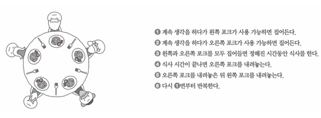
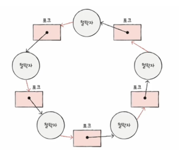

# Chapter 13 교착 상태
## 13-1)  교착 상태란
- 일어나지 않을 사건을 기다리며 진행이 멈춰버린 상태
- 대표적인 예시) 식사하는 철학자 문제
  - 
  - 두 개의 포크를 들기 전까지 철학자는 생각하는 시간을 가지며 기다려야 한다면, 모든 철학자는 동시에 포크를 들어 식사를 할 때 어떤 철학자도 식사를 할 수 없는 교착 상태에 빠지게 된다.
  - 철학자 = 프로세스 or 스레드
  - 포크 = 자원, 임계구역
  - 생각하는 행위 = 자원을 기다리는 것
  - 식사하는 행위 = 자원을 사용하는 것
- 위 문제점을 해결하기 위한 방법
  1. 교착 상태가 발생했을 때의 상황을 정확히 표현하기
  2. 교착 상태가 일어나는 근본적인 원인에 대해 알기

### 자원 할당 그래프(resource-allocation graph)
- 어떤 프로세스가 어떤 자원을 사용하고 있고, 어떤 자원을 기다리고 있는지 표현한 것
  - 
- 규칙
  1. 프로세스는 원, 자원의 종류는 사격형으로 표현
  2. 사용할 수 있는 자원의 개수는 자원 사각형 내에 점으로 표현
  3. 프로세스가 어떤 자원을 할당받아 사용 중이라면 자원에서 프로세스를 향해 화살표를 표시
  4. 프로세스가 어떤 자원을 기다리고 있다면 프로세스에서 자원으로 화살표를 표시
- 교착 상태가 발생한 상황은 자원 할당 그래프가 원의 형태를 띄고 있다.

### 교착 상태 발생 조건
다음 네 가지 조건을 모두 만족할 때 교착 상태가 발생한다.
- 상호 배제(Mutual Exclusion): 한 프로세스가 사용하는 자원을 다른 프로세스가 사용할 수 없는 상태
- 점유와 대기(Hold and Wait): 자원을 할당받은 상태에서 다른 자원을 할당받기를 기다리는 상태
- 비선점(Non-Preemption): 어떤 프로세스도 다른 프로세스의 자원을 강제로 빼앗지 못하는 상태
- 원형 대기(Circular Wait) : 프로세스들이 원의 형태로 자원을 대기하는 상태

## 13-2) 교착 상태 해결 방법
### 교착 상태 예방
교착 상태 발생 필요 조건 네 가지(상호 배제, 점유와 대기, 비선점, 원형 대기) 중 하나의 조건이라도 만족하지 못하게 하는 방법
- 상호 배제
  - 모든 자원을 공유 가능하게 해야함 -> 현실적으로 불가능
- 점유와 대기
  - 자원의 활용률이 낮아짐
- 비선점 조건
  - 범용성이 떨어짐
- 원형 대기 조건
  - 자원에 번호를 붙이고, 오름차순으로 자원 할당
  - 비교적 현실적, 실용적
  - 단점 : 번호를 일일히 붙이기 어렵고, 활용률 떨어짐

### 교착 상태 회피
- 교착 상태가 발생하지 않을 정도로만 자원 할당
- 교착 상태 회피 방식에서는 교착 상태를 무분별한 자원의 할당으로 인해 발생하는 문제로 간주한다.
- 이를 구현한 대표적인 알고리즘으로 은행원 알고리즘(Banker's Algorithm)이 있다.
  - 안전 상태 : 교착 상태가 발생하지 않고 모든 프로세스가 정상적으로 자원을 할당받고 종료될 수 있는 상태
  - 불안전 상태 : 교착 상태가 발생할 수도 있는 상황
  - 안전 순서열 : 교착 상태 없이 안전하게 프로세스들에 자원을 할당할 수 있는 순서

- 예시: 은행원 알고리즘으로 안전/불안전 상태 판단
  - 단일 자원(R)은 총 10개를 보유하고, 초기 상태를 다음과 같이 가정

    | 프로세스 | Allocation | Max | Need |
    |---|---:|---:|---:|
    | P0 | 3 | 7 | 4 |
    | P1 | 2 | 3 | 1 |
    | P2 | 2 | 9 | 7 |

    - Available = 3 (Total R = 10, Allocation 합 = 7)
  - 안전 상태 여부 점검(안전성 알고리즘):

    | 단계 | Available | 실행 가능(Need ≤ Available) | 실행 | 새 Available |
    |---:|---:|---|---|---:|
    | 1 | 3 | P1 | P1 종료 | 5 |
    | 2 | 5 | P0 | P0 종료 | 8 |
    | 3 | 8 | P2 | P2 종료 | 10 |

    - 안전 순서열 ⟨P1, P0, P2⟩가 존재하므로 현재 상태는 "안전 상태"
  - 불안전 상태가 되는 요청 예
    - P0가 추가로 3을 요청(Request0=3)
    - 1차 검증: Request ≤ Need(4) 이고 Request ≤ Available(3) → 형식적으로는 즉시 할당 가능
    - 임시로 할당한다고 가정하면(승인 후 상태):

      | 프로세스 | Allocation(승인 후) | Need(승인 후) |
      |---|---:|---:|
      | P0 | 6 | 1 |
      | P1 | 2 | 1 |
      | P2 | 2 | 7 |

      - Available = 0
    - 안전성 검사:

      | 단계 | Available | 실행 가능(Need ≤ Available) |
      |---:|---:|---|
      | 1 | 0 | 없음 |

    - 안전 순서열을 만들 수 없음 → 이 상태는 "불안전 상태"
    
### 교착 상태 검출 및 회복
교착 상태 예방과 회피는 교착 상태 발생을 막기 위한 노력이었다면, 교착 상태 검출 후 회복은 교착 상태 발생을 인정하고 사후에 조치하는 방식이다.
- 선점을 통한 회복
  - 교착 상태가 해결될 때까지 한 프로세스씩 자원을 강제로 빼앗아 다른 프로세스에게 자원을 몰아주는 방식
- 프로세스 강제 종료를 통한 회복
  - 교착 상태에 놓인 프로세스를 모두 강제 종료
    - 작업 내역을 잃을 위험이 있음
  - 교착 상태가 해결될 때까지 한 프로세스씩 강제 종료
    - 오버헤드 발생
