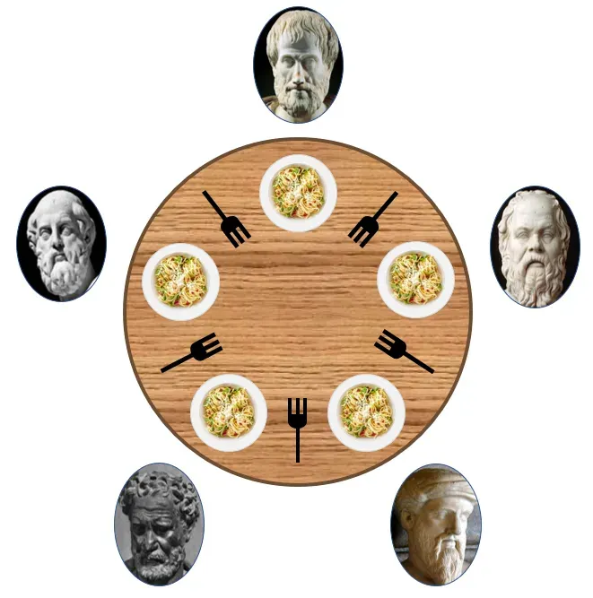
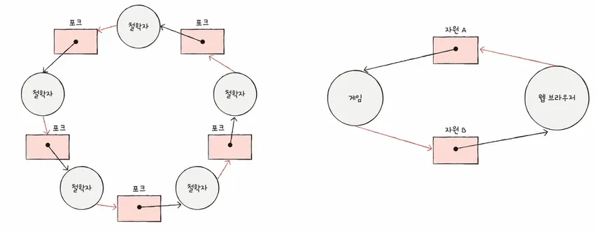

## 13-1 교착 상태란

두 개 이상의 프로세스가 각자 가지고 있는 자원을 무작정 기다린다면 그 어떤 프로세스도 더 이상 진행할 수 없는 교착 상태가 된다.

운영체제가 맡는 중요한 임무 중 하나가 교착 상태를 해결하는 것이다.

### 식사하는 철학자 문제(dining philosophers problem)

교착 상태를 어떻게 해결할 수 있는지를 엿볼 수 있는 가상의 문제 시나리오.

동그란 원탁에 다섯 명의 철학자가 앉아 있습니다. 이 철학자들 앞에는 맛있는 식사가 있고, 철학자들 사이 사이에는 식사에 필요한 포크가 있습니다. 그리고 철학자들 앞에 있는 식사는 두 개의 포크로 먹을 수 있는 음식이라 가정합니다.

철학자들은 아래와 같은 순서대로 식사를 합니다.

1. 계속 생각을 하다가 왼쪽 포크가 사용 가능하면 집어든다.
2. 계속 생각을 하다가 오르쪽 포크가 사용 가능하면 집어든다.
3. 왼쪽과 오른쪽 포크를 모두 집어들면 정해진 시간동안 식사를 한다.
4. 식사 시간이 끝나면 오른쪽 포크를 내려놓는다.
5. 왼쪽 포크를 내려놓는다.
6. 다시 1번부터 반복한다.

모든 철학자가 동시에 포크를 집어 식사를 하면 어떤 철학자도 식사를 할 수 없고 영원히 생각만 하는 상황이 발생할 수 있다. 모두가 왼쪽 포크를 들면 모두의 오른쪽 포크는 영원히 들 수 없다.

이렇게 일어나지 않을 사건을 기다리며 진행이 멈춰버리는 현상을 교착상태(deadlock)이라고 한다.

이러한 교착 상태를 해결하기 위해서는

1. 교착 상태가 발생했을 때의 상황을 정확히 표현
2. 교착 상태가 일어나는 근본적인 이유에 대해 알아야 합니다.

### 자원 할당 그래프(resource-allocation graph)

자원 할당 그래프는 어떤 프로세스가 어떤 자원을 사용하고 있고, 또 어떤 프로세스가 어떤 자원을 기다리고 있는지 표현하는 간단한 그래프

> 같은 자원이라 할지라도 사용 가능한 자원의 개수는 여러 개 있을 수 있다.
예를들어, 하드 디스크가 세 개 있는 경우에는 자원의 종류는 한 가지이지만 사용 가능한 하드 디스크 수는 세 개이다.

식사하는 철학자 문제를 자원 할당 그래프로 표현하면 위와 같다.

### 교착 상태 발생 조건

교착 상태 발생 조건에는 네 가지가 있다.

- 상호 배제
    - 해당 자원을 한 번에 하나만 이용 가능
- 점유와 대기
    - 자원을 할당받은 상태에서 다른 자원을 할당받기를 기다리는 상태
- 비선점
    - 누군가가 다른 철학자의 자원을 뺏을 수 있었다면 교착이 일어나지 않는다,
- 원형 대기
    - 자원 할당 그래프가 원의 형태로 그려지면 교착상태가 발생할 수 있다.(원형 대기) - circular wait
    - 원형 대기가 있다고 교착 상태가 반드시 발생하는 것은 아님

## 13-2 교착 상태 해결 방법

운영체제는 이런 교착 상태를 예방, 회피, 검출 후 회복의 방법으로 해결한다.

### 교착 상태 ‘예방’

교착 상태를 예방하는 방법은 교착 상태 발생 필요 조건 네 가지 중 하나를 충족하지 못하게 하는 방법과 같다.

네 조건 중 하나라도 만족시키지 않게 하면 교착 상태는 발생하지 않는다.

- 상호 배제를 없앤다면?
    - 모든 자원을 공유 가능하게 만든다는 의미.
      교착 상태는 없어져도 현실적으로 동시에 자원을 사용하는게 무리일 수 있다.
- 점유와 대기를 없앤다면?
    - 운영체제는 특정 프로세스에 자원을 모두 할당하거나, 아예 할당하지 않는 방식으로 배분한다.
      → 자원의 활용률이 낮아질 우려가 있다.
    - 많은 자원을 사용하는 프로세스가 무한 대기에 빠질 가능성이 높아진다.
- 비선점 조건을 없앤다면?
    - 프린터기 같은 자원을 선점하게 한다면 문제가 발생할 수 있어 교착 상태를 비선점 조건을 없애는 건범용성이 떨어진다.
- 원형 대기 조건을 없앤다면?
    - 원형 대기를 없앰으로써 교착 상태를 예방하는 방식은 비교적 현실적이고 실용적 방식이지만, 컴퓨터 시스템 내 모든 자원에 번호를 붙이는 것은 쉽지 않은 일이다.

이렇듯 교착 상태의 발생 조건을 원천적으로 제거하여 교착 상태를 예방하는 방식은 여러 부작용이 따른다.

### 교착 상태 회피

교착 상태 회피에서는 교착 상태를 한정된 자원의 무분별한 할당으로 인해 발생하는 문제로 간주한다.

프로세스들에 배분할 수 있는 자원의 양을 고려하여 교착 상태가 발생하지 않을 정도의 양만큼만 자원을 배분하는 방식이 교착 상태 회피다.

- 안전 상태(safe state)
    - 교착 상태가 발생하지 않고 모든 프로세스가 정상적으로 자원을 할당받고 종료될 수 있는 상태
    - 안전 순서열이 있는 상태
- 불안전 상태(unsafe state)
    - 교착 상태가 발생할 수도 있는 상태
    - 안전 순서열이 없는 상황
- 안전 순서열(safe sequence)
    - 교착 상태 없이 안전하게 프로세스들에 자원을 할당할 수 있는 순서를 의미.
    - 안전 순서열이 있는 상태를 안전 상태라고 볼 수 있다.
    - ex) 웹 브라우저 → 메모장 - 게임

| 프로세스 | 요구량 | 현재 사용량 |
| --- | --- | --- |
| P1 | 10 | 5 |
| P2 | 4 | 2 |
| P3 | 9 | 2 |
- 할당 가능 자원: 12
- 할당한 자원: 9
- 남은 자원:3

이 상태는 안전 상태. p2→p1→p3라는 안전 순서열이 있기 때문.

| 프로세스 | 요구량 | 현재 사용량 |
| --- | --- | --- |
| P1 | 10 | 5 |
| P2 | 4 | 2 |
| P3 | 9 | 3 |
- 할당 가능 자원: 12
- 할당한 자원: 10
- 남은 자원: 2

이 상황은 불안전 상태입니다. ⇒ 교착 상태 발생 위험

P2에 자원을 할당하여 자원을 반환받고 P3에 할당하여도 P1에 할당하여도 자원을 무한정 대기할 수 밖에 없다.⇒ 교착 상태 발생.

교착 상태를 회피하기 위해서는 시스템 상태가 안전 상태에서 안전 상태로 움직이는 경우에만 자원을 할당하면 된다.

### 교착 상태 검출 후 회복

상태 발생을 인정하고 사후에 조치하는 방식.

운영체제는 이 방식에서 프로세스들이 자원을 요구할 때마다 그때그때 모두 할당하며, 교착 상태 발생 여부를 주기적으로 검사.

- 선점을 통한 회복
    - 한 프로세스씩 자원을 몰아주는 방식. 교착상태가 해결될 때까지 다른 프로세스로부터 자원을 강제로 빼앗고 할당.
- 프로세스 강제 종료를 통한 회복
    - 프로세스 종료를 통한 회복은 가장 단순하면서 확실한 방식.
        - 교착 상태의 프로세스들을 모두 종료하는 방식
        - 한 프로세스씩 종료하여 확인하는 방식

- 타조 알고리즘
    - 교착 상태를 아예 무시하는 방식

완벽을 추구하는 과학자나 수학자 입장에서는 납득할 수 없는 방식일지 모르나, 문제 발생의 빈도나 심각성에 따라 비용 대비 최대 효율을 추구하는 엔지니어 입장에서는 때때로 이 방식이 적합할 때도 많다.