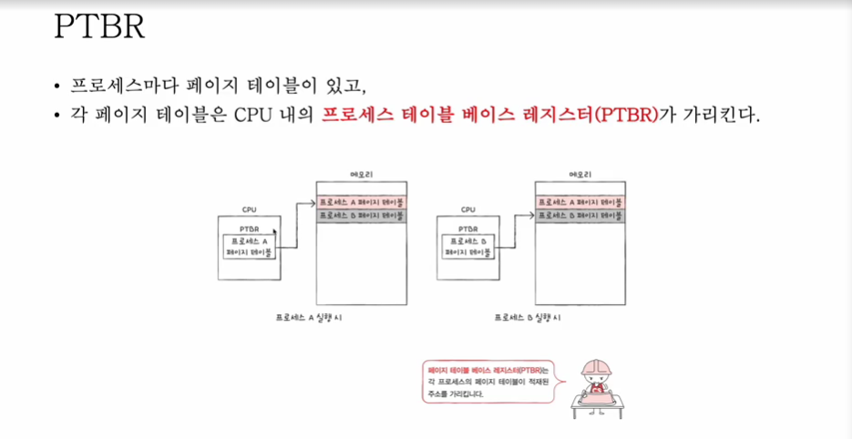
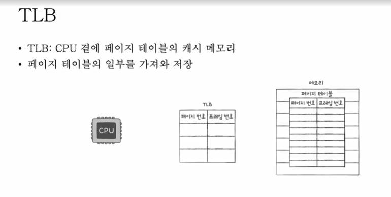
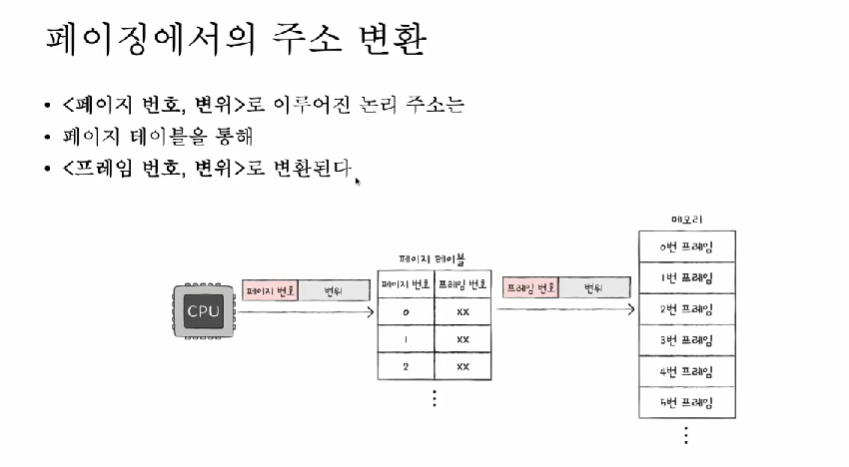
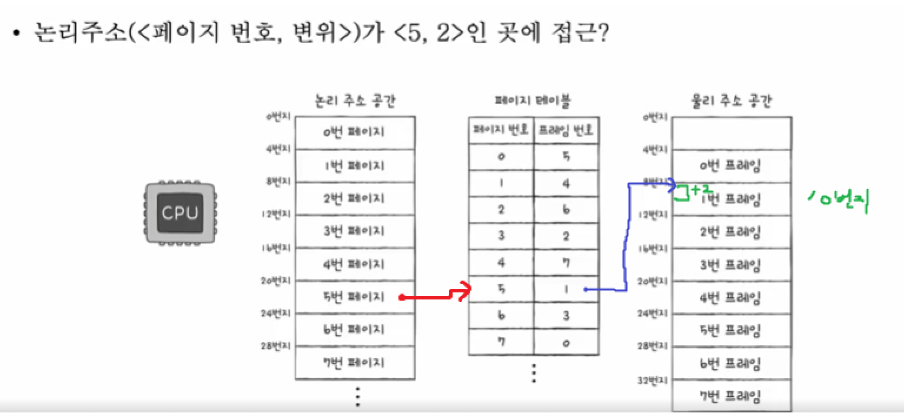
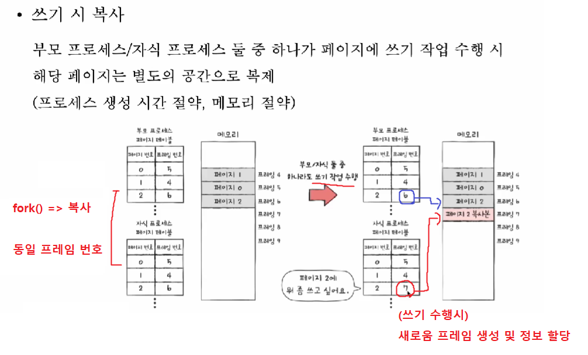
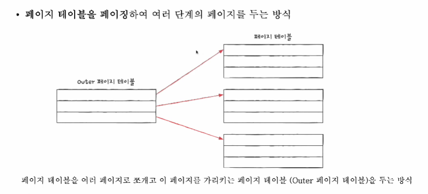
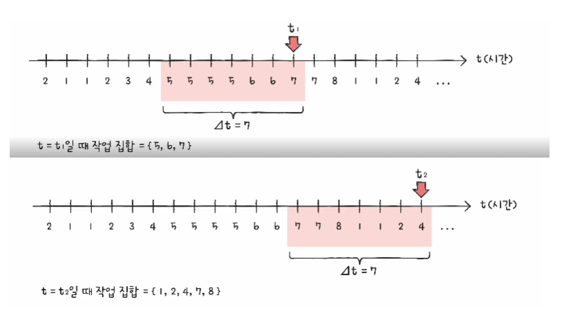
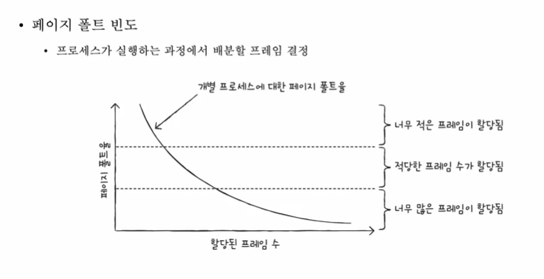

<details>
<summary> 연속 메모리 할당 </summary>

## 연속 메모리 할당
프로세스에 연속적인 메모리 공간을 할당


## 운영체제가 메모리를 관리하는 기법

### 스와핑
- 현재 사용되지 않는 프로세스들을 보조기억장치의 일부 영역(스왑영역)으로 쫒아내고 == 스왑 아웃
- 그렇게 생긴 빈 공간에 새 프로세스 적재 == 스왑 인
  

- 장점 : 프로세스들이 요구하는 메모리 공간의 크기 > 실제 메모리 크기 : 가능
    - 당장 사용되지 않는 프로세스를 스왑아웃 후 필요한 프로세스를 스왑인 하면 되기 때문
- `free -h` , `top` 등의 명령어로 활용가능

## 연속 메모리 할당 방식
- 프로세스는 메모리의 빈 공간에 할당되어야 한다. **Q) 이때 빈 공간이 여러개 있다면?**
- `최초 적합`, `최적 적합`, `최악 적합`

### 최초 적합(first-fit)
- 운영체제가 메모리 내의 빈 공간을 순서대로 검색하다가 적재할 수 있는 공간을 발견하면, 그 공간에 프로세스를 배치하는 방식
- 장점) 검색 최소화, 빠른 할당

### 최적 적합(best-fit)
- 운영체제가 메모리 내의 빈 공간을 모두 검색하고, 적재 가능한 가장 작은 공간에 할당

### 최악 적합(worst-fit)
- 운영체제가 메모리 내의 빈 공간을 모두 검색하고, 적재 가능한 가장 큰 공간에 할당

- 프로세스를 연속적으로 메모리에 할당하는 방식은, 메모리를 효율적으로 사용하는 방법이 아님.
- 외부 단편화(external fragmentation) 문제가 발생하기 때문

## 외부 단편화
- 프로세스들이 실행되고 종료되길 반복하며, 메모리 사이 사이에 빈 공간이 발생
- 프로세스를 할당하기 어려울 만큼 작은 메모리 공간들로 인해 메모리가 낭비되는 현상

## 외부 단편화 해결 방법
1. 메모리 압축
- 이곳저곳 흩어져 있는 빈 공간들을 하나로 압축
- 단점) 메모리 압축 과정에서 오버헤드 발생
  

2. 가상 메모리 기법, 페이징

</details>

<br>
<details>
<summary> 페이징을 통한 가상 메모리 관리 </summary>

## 연속 메모리 할당의 두 가지 문제점
- 외부 단편화
- 물리 메모리보다 큰 프로세스 실행 불가

## 가상 메모리
- 실행하고자 하는 프로그램을 일부만 메모리에 적재하여
- 실제 물리 메모리 크기보다 더 큰 프로세스를 실행할 수 있게 하는 기술
- `페이징` / `세그멘테이션`

## 페이징을 통한 가상 메모리 관리
- 외부 단편화가 발생한 이유 -> 각기 다른 크기의 프로세스가 메모리에 연속적으로 할당되었기 때문

### 페이징(paging)
- 프로세스의 논리 주소 공간을 페이지(page)라는 일정 단위로 자르고,
- 메모리의 물리 주소 공간을 프레임(frame)이라는 페이지와 동일하고 일정한 단위로 자른 뒤
- 페이지를 프레임에 할당하는 가상 메모리 관리 기법
  

### 페이징 스와핑
- 프로세스 단위의 스왑인 / 스왑 아웃이 아닌 페이지 단위로 스왑인(페이지인) / 스왑 아웃(페이지 아웃) 가능
- 메모리에 적재될 필요가 없는 페이지들은 보조기억 장치로 스왑 아웃
- 실행에 필요한 페이지들은 메모리로 스왑인


Q) 메모리에 적재될 필요가 없는 페이지란 뭘까?

좋은 질문이에요. 이걸 **프로세스의 실행 흐름 관점**에서 보면 명확해집니다.

---

## Q1) 메모리에 적재될 필요가 없는 페이지란?
**지금 당장 CPU가 접근하지 않는 페이지들**이다.

ex)
### 1. 아직 실행되지 않은 코드 페이지
```c
if (조건) {
    함수A();   // 아직 호출 안 됨
}
```

* `함수A`의 코드가 들어 있는 페이지
* 조건이 참이 되기 전까지는 **절대 실행되지 않음**
* → 메모리에 있을 필요 ❌ → 페이지 아웃 가능

### 2. 현재 사용하지 않는 데이터 페이지
* 큰 배열, 구조체 중 일부만 사용하는 경우
* 아직 접근하지 않은 배열 영역이 들어 있는 페이지

```c
int arr[1000000];
arr[0] = 1;   // 앞부분만 사용
```

* `arr[500000]` 이후가 들어 있는 페이지
* → 접근 전까지는 메모리에 있을 필요 ❌


### 3. 이미 사용이 끝난 페이지
* 한 번 쓰고 더 이상 참조하지 않는 데이터
* 과거에 호출되었지만 다시 호출되지 않는 함수의 스택 프레임

### 4. 장시간 접근되지 않은 페이지 (지역성 원리)
* 최근 접근 이력이 없는 페이지
* LRU 같은 페이지 교체 알고리즘에 의해 선택됨

Q) 불연속적으로 페이지가 흩어져 있으면 다음 실행할 페이지(코드) 가 어딨는지 어떻게 알 수 있을까?

## 페이지 테이블
- (실제 메모리 내의 주소인) 물리 주소에 불연속적으로 배치되더라도
- (CPU가 바라보는 주소인) 논리 주소에는 연속적으로 배치되도록 하는 방법
- 페이지 번호화 프레임 번호를 짝지어 주는 일종의 이정표
- 프로세스마다 페이지 테이블이 존재한다.
  


- 즉, 물리적으로는 분산되어 저장되어 있더라도, CPU 입장에서 바라본 논리 주소는 연속적으로 보임
- CPU는 그저, 논리 주소를 순차적으로 실행하면 될 뿐

## 내부 단편화
- 페이징은 내부 단편화가 발생한다.
- 프로세스 크기 108KB , 페이지 크기가 10KB 라고 하면, 2KB 의 내부단편화가 발생.

## PTBR
- **프로세스마다 페이지 테이블**이 있고,
- 각 페이지 테이블은 CPU 내의 **프로세스 테이블 베이스 레지스터(PTBR)**가 가리킨다.



### Q) 페이지 테이블이 메모리에 있으면?
- 메모리 접근 시간이 두 배로 증가한다.
- 1) 페이지 테이블을 접근하기 위해 1번 (프레임 정보를 얻기 위해)
- 2) 페이지 테이블을 접근 후 얻은 프레임을 접근하기 위해 1번 (실제 물리 주소 접근을 위해)

## TLB
- CPU 곁에 페이지 테이블의 **캐시 메모리**
- 페이지 테이블의 일부를 가져와 저장



- CPU가 접근하려는 논리 주소가 TLB 에 있다면 -> TLB 히트
    - 메모리 접근 한 번 발생 (바로 프레임 참조)
- CPU가 접근하려는 논리 주소가 TLB에 없다면 -> TLB 미스
    - 메모리 접근 두 번 발생 (페이지 정보 참조, 프레임 정보 참조)

## 페이징에서의 주소 변환

### Q) 특정 주소에 접근하고자 한다면 어떤 정보가 필요할까?
- 어떤 페이지/프레임에 접근하고 싶은지  => 페이지, 프레임 번호
- 접근하려는 주소가 그 페이지 / 프레임 으로부터 얼마나 떨어져 있는지 => OFFSET

### 페이징 시스템에서의 논리 주소
- 페이지 번호(page number) 와 변위(offset)





## PTE : 페이지 테이블 엔트리
- 실제 페이지 테이블에는 단순 페이지 번호 / 프레임 번호만 담기는게 아니라, 엔트리 형태로 내부에 많은 정보가 들어가있다.
- 페이지 번호 : (프레임을 찾아가기 위한) 논리적인 페이지 번호
- 프레임 번호 : (메모리에 적재된) 물리적인 프레임 번호
- 유효 비트: 현재 해당 페이지에 접근 가능한지 여부 (스왑 인 / 스왑 아웃 여부)
    - Q) 만일 유효비트가 0(false) 인 페이지에 접근하려고 하면?
        - 페이지 폴트(page fault) 인터럽트 발생
        - 1. CPU는 가존의 작업 내역을 백업한다.
        - 2. 페이지 폴트 처리 루틴을 실행한다.
        - 3. 페이지 처리 루틴은 원하는 페이지를 메모리로 가져온 뒤 **유효비트를 1로 변경한다.**
        - 4. 페이지 폴트를 처리했다면, CPU는 해당 페이지에 접근 가능한 상태가 된다.
- 보호 비트 : 페이지 보호 기능을 위해 존재하는 비트(읽기 전용 영역 관리)
    - rwx 로 관리 되기도 한다.
- 참조 비트 : CPU가 이 페이지에 접근한 적이 있는지 여부
- 수정 비트(=dirty bit) : CPU 가 이 페이지에 데이터를 쓴 적이 있는지 여부
    - 스와핑과 관련이 있다. 메모리와 보조기억장치에 수정 내역을 동기화 시키기 위한 내역
        - 스왑 아웃 될떄 메모리 -> 보조기억장치와 내용을 동기화 한다.

</details>

<br>
<details>
<summary> 페이징의 추가 이점 + 계층적 페이징 </summary>

## 쓰기 시 복사



## 계층적 페이징
페이지 테이블을 페이징하여 여러 단계의 페이지 페이지를 두는 방식
- 프로세스 테이블의 크기는 생각보다 작지 않다.
- 따라서 프로세스를 이루는 모든 페이지 테이블 엔트리를 메모리에 두는 것은 큰 낭비
- 프로세스를 이루는 모든 테이블 엔트티를 항상 메모리에 유지하지 않는 기법


- 모든 페이지 테이블을 항상 메모리에 올릴 필요가 없어짐
    - CPU와 가장 가까이 위치한 페이지 테이블(outer 페이지 테이블)은 항상 메모리에 유지

### 계층적 페이징을 이용하는 환경에서의 논리 주소
- 바깥 페이지 번호
- 안쪽 페이지 번호
- 변위

1. 바깥 페이지 번호를 통해 (안쪽)페이지 테이블 페이지 참조
2. 페이지 테이블 페이지를 통해 프레임 번호 참조
3. 프레임 번호 위치의 변위를 더해서 실제 물리 주소 찾기

계층이 너무 깊으면, page fault가 발생 시 오버헤드가 크다.

</details>

<br>
<details>
<summary> 페이지 교체와 프레임 할당 </summary>

## 요구 페이징
- 처음부터 모든 페이지를 적재하지 않고, 필요한 페이지만을 메모리에 적재하는 기법
- 요구되는 페이지만 적재하는 기법
```aidl
1. CPU가 특정 페이지에 접근하는 명령어를 실행한다.
2. 해당 페이지가 현재 메모리에 있을 경우(유효 비트가 1일 경우) CPU는 페이지가 적재된 프레임에 접근한다.
3. 해당 페이지가 현재 메모리에 없을 경우(유효 비트가 0일 경우) 페이지 폴트가 발생한다.
4. 페이지 폴트 처리 루틴은 해당 페이지를 메모리로 적재하고 유효 비트를 1로 설정한다.
5. 다시 1번을 수행한다.
```

## 물리메모리 공간보다 큰 프로세스들을 해결하기 위한 숙제는?
- 기존에 적재된 불필요한 페이지를 선별해 보조기억 장치로 내보내고 (== 페이지 교체 알고리즘)
- 프로세스들에게 적절한 수의 프레임을 할당해야 (== 프레임 할당)

## 페이지 교체 알고리즘
- 메모리가 가득 차게 됐을때, 어떤 페이지를 보조기억장치로 내보내야 할 지 결정하는 알고리즘
- 좋은 알고리즘의 기준 : 페이지 폴트가 적은 알고리즘

## 페이지 참조열
- 페이지 폴트 횟수를 알 수 있는 방법
- CPU가 참조하는 페이지들 중 **연속된 페이지를 생략**한 페이지 열

```aidl
2 2 2 3 5 5 5 3 3 7
->
2 3 5 3 7
```

## 교체 알고리즘 종류

### FIFO
- 가장 단순한 방식
- 메모리에 가장 먼저 올라온 페이지부터 제거

### FIFO 2차 기회 (SECOND CHANCE)
- 참조 비트 1, 0 으로 1번의 기회를 더 줌
- 참조 비트 1 : 한 번 더 기회를 주기 (참조 비트 0으로 초기화 적재 시가을 현재 시간으로 설정)
- 참조 비트 0 : 내쫒기

### 최적 페이지 교체 (이론용)
- CPU에 의해 참조되는 횟수를 고려
- **앞으로의 사용 빈도**가 가장 낮은 페이지를 교체하는 알고리즘
- 구현 어려움 : 앞으로의 사용되지 않을 페이지는 예측이 힘듬
- 다른 알고리즘들과 A/B 테스트 비교 분석 하기 위한 용도

### LRU(Least-Recently-Used)
- **최근 사용 빈도**가 가장 낮은 페이지를 교체하는 알고리즘

---

## 스래싱과 프레임 할당

### Q) 페이지 폴트가 발생하는 이유는?
- 성능이 안좋은 페이지 교체 알고리즘이라서
- 프로세스가 사용할 수 있는 프레임 자체가 적어서 (작은 메모리 공간) => 큰 메모리가 성능이 좋은 이유 중 하나

## 스래싱

- 프로세스가 실행되는 시간보다, 페이징에 더 많은 시간을 소요하여 성능(CPU 이용률) 이 저해되는 문제
    - 페이징 == 스왑 인, 스왑 아웃
- 즉, 동시 실행되는 프로세스 수를 늘린다고 해서 CPU 이용률이 높아지는 것이 아니다.

- 각 프로세스가 필요로 하는 최소한의 프레임 수를 파악하고, 프로세스들에게 적절한 프레임을 할당해주어야 한다.

## 프레임 할당

## 고정된 크기 할당 방법 - 정적 할당 방법
### 1.균등 할당
- 가장 단순
- 모든 프로세스들에게 균등하게 프레임을 할당하는 방법
- 문제 : 크기가 큰 프로세스, 작은 프로세스 둘다 동일하면 불균형 + 메모리 낭비

### 2. 비례 할당
- 프로세스의 크기를 고려
- 프로세스 크기에 비례하여 프레임 할당
- 문제점 : 크기가 큰 프로세스가 프레임을 덜 필요로하고, 작은 프로세스가 프레임을 많이 필요로 할 경우

## 실행 과정중 크기 할당 방법 - 동적 할당 방법

### 1. 작업 집합 모델 활용
- 프로세스가 실행하는 과정에서 배분할 프레임 결정
- CPU 가 **특정 시간 동안 주로 참조한 페이지 개수만큼의 프레임을 할당**해주는 방법
    - 참조 지역성의 원리
- **프로세스가 일정 기간 동안 참조한 페이지 집합**을 기억하며, 빈번한 페이지 교체를 방지
- 즉, `작업 집합`이란 **실행중인 프로세스가 일정 시간 동안 참조한 페이지의 집합** 을 의미

#### 작업 집합을 구하기 위해서
```aidl
1. 프로세스가 참조한 페이지
2. 시간 간격이 필요
```




## 2.페이지 폴트 빈도 활용
- 프로세스가 실행하는 과정에서 배분할 프레임 결정
- 두 개의 가정에서 생겨난 아이디어
    - 1.페이지 폴트율이 너무 높으면, 그 프로세스는 너무 적은 프레임을 갖고 있다.
    - 2.페이지 폴트율이 너무 낮으면, 그 프로세스가 너무 많은 프레임을 갖고 있다.



-> 상한선과 하한선을 정하고, 상한성 위에 있으면, 프레임 할당을 너무 많이 반환했다고 판단하여, 제거
-> 하한선 아래에 있으면, 프레임 할당이 너무 작게 된 것이라 판단

</details>