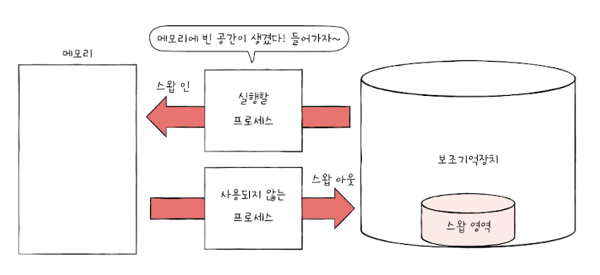
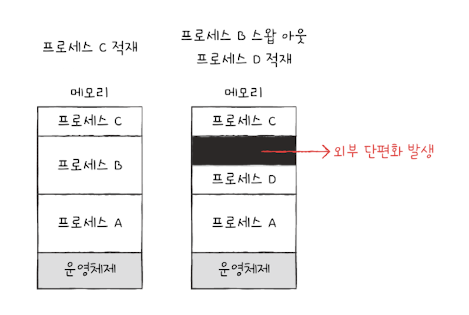
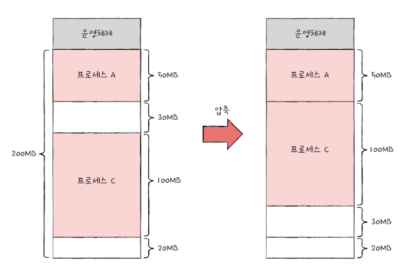
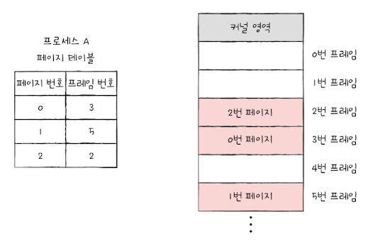
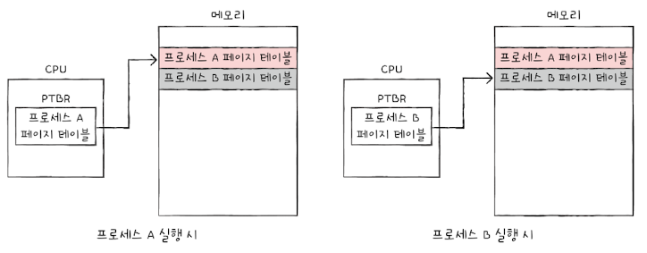
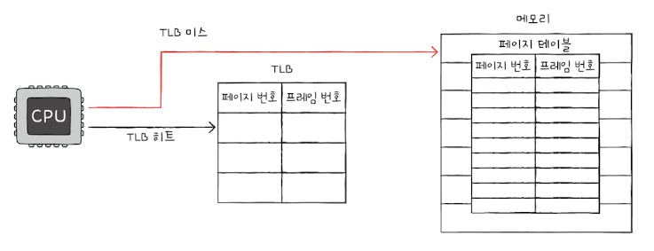
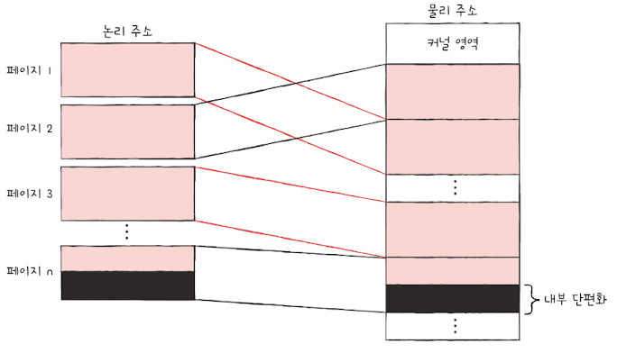
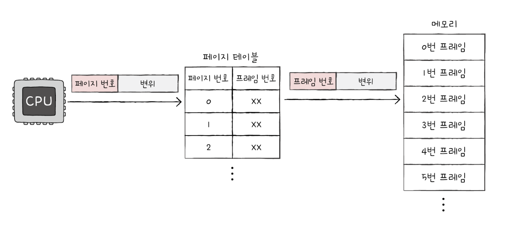
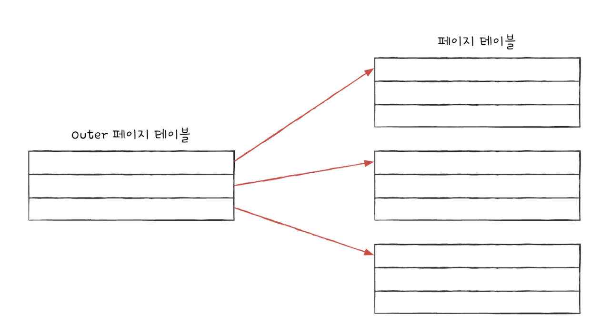
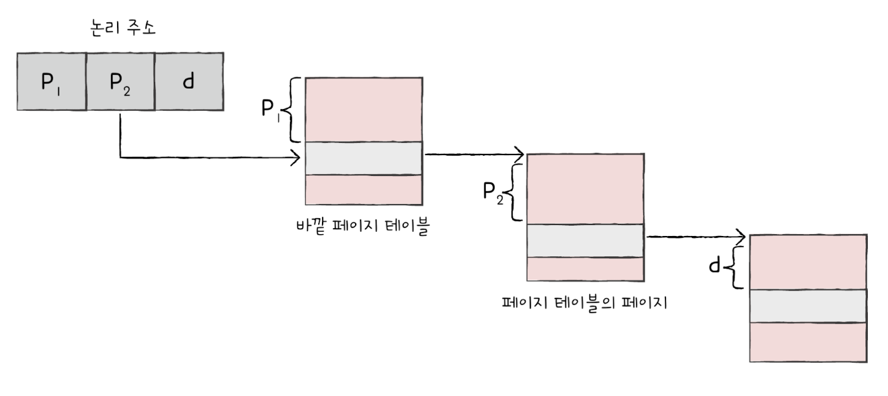

# 14-1 연속 메모리 할당
프로세스에 연속적인 메모리 공간을 할당하는 방식
## 스와핑
메모리상의 빈 공간에 또 다른 프로세스를 적재하여 실행하는 방식

스왑 영역 : 프로세스들이 쫓겨나는 보조기억장치의 일부 영역

스왑 아웃 : 현재 실행되지 않는 프로세스가 메모리에서 스왑 영역으로 옮겨지는 것

스왑 인 : 스왑 영역에 있던 프로세스가 다시 메모리로 옮겨오는 것



### 스왑 영역 확인하기
```
free -h
```
유닉스와 리눅스, macOS에서 free, top 명령어 등을 통해 스왑 영역의 크기를 확인할 수 있음

## 메모리 할당
비어 있는 메모리 공간에 프로세스를 연속적으로 할당하는 방식

### 최초 적합 first fit
운영체제가 메모리 내의 빈 공간을 순서대로 검색하다가 적재할 수 있는 공간을 발견하면 그 공간에 프로세스를 배치하는 방식

장점 : 검색 최소화, 빠른 할당이 가능

### 최적 적합 best fit
빈 공간을 모두 검색해 본 후, 프로세스가 적재될 수 있는 공간 중 **가장 작은 공간**에 프로세스 배치

### 최악 적합 worst fit
빈 공간을 모두 검색해본 후, 프로세스가 적재될 수 있는 공간 중 **가장 큰 공간**에 프로세스 배치

## 외부 단편화
프로세스들이 메모리에 연속적으로 할당하는 환경에서는 프로세스들이 실행되고 종료되며 메모리 사이 사이에 빈 공간이 발생

이 빈 공간들에 더 큰 프로세스를 어려운 상황을 초래하고, 결국 메모리 낭비로 이어짐



### 해결 방법 : 압축
여기저기 흩어져 있는 빈 공간들을 하나로 모으는 방식

메모리 내에 저장된 프로세스를 적당히 재배치시켜 여기저기 흩여져 있는 작은 빈 공간들을 하나의 큰 빈 공간으로 만드는 방식



단점
- 작은 빈 공간들을 하나로 모으는 동안 시스템 중지
- 많은 오버헤드 야기
- 오버헤드 최소화에 대한 명확한 방법 결정 어려움

# 14-2 페이징을 통한 가상 메모리 관리
가상 메모리 (virtual memory) : 실행하고자 하는 프로그램을 일부만 메모리에 적재하여 실제 물리 메모리 크기보다 더 큰 프로세스를 실행할 수 있게 하는 기술

## 페이징
프로세스의 논리 주소 공간을 **페이지**라는 일정한 단위로 자르고, 메모리 물리 주소 공간을 **프레임**이라는 페이지와 동일한 크기의 일정한 단위로 자른 뒤 페이지를 프레임에 할당하는 **가상 메모리 관리 기법**

페이징에서 스와핑 사용 방법
- 페이지 단위로 스왑 아웃/스왑 인
- 페이지 아웃 : 메모리에 적재될 필요가 없는 페이지들은 보조기억장치로 스왑 아웃
- 페이지 인 : 실행에 필요한 페이지들은 메모리로 스왑 인


## 페이지 테이블
프로세스가 메모리에 불연속적으로 배치되면 CPU 입장에서 순차적으로 실행할 수 없음

프로세스가 비록 물리 주소에 불연속적으로 배치되더라도 논리 주소에는 연속적으로 배치되도록 **페이지 테이블** 이용

어떤 페이지가 어떤 프레임에 할당되었는지 알려줌



프로세스마다 각자의 프로세스 테이블을 가지고 있고 각 프로세스의 페이지 테이블들은 메모리에 적재되어 있음

### PTBR

CPU 내의 **페이지 테이블 베이스 레지스터 : PTBR** 는 각 프로세스의 페이지 테이블이 적재된 주소를 가리키고 있음



하지만 메모리에 있는 페이지 테이블을 보기 위해 한번, 그렇게 알게 된 프레임에 접근하기 위해 한번, 총 두번의 메모리 접근이 생긴다.

### TLB
이를 해결하기 위해 TLB : Translation Lookaside Buffer 라는 페이지 테이블의 **캐시 메모리**를 둠

참조 지역성에 근거해 주로 최근에 사용된 페이지 위주로 저장



TLB 히트 : CPU가 발생한 논리 주소에 대한 페이지 번호가 TLB에 있을 경우

TLB 미스 : 만일 페이지 번호가 TLB에 없을 경우, 메모리 내의 페이지 테이블에 접근

## 내부 단편화
페이징은 프로세스의 논리 주소 공간을 페이지 단위로 자르지만, 모든 프로세스가 페이지 크기에 딱 맞게 잘리지 않는다.

마지막 페이지는 메모리 낭비 발생 => 내부 단편화



페이지 크기가 작다면 발생하는 내부 단편화의 크기는 작아질 수 있지만, 그만큼 페이지 테이블의 크기가 커져 페이지 테이블이 차지하는 공간이 낭비됨

내부 단편화를 적당히 방지하면서 너무 크지 않은 페이지 테이블이 만들어지도록 페이지의 크기를 조정하는 것이 중요함

## 페이징에서의 주소 변환
특정 주소에 접근하려면 다음과 같은 두 가지 정보가 필요함
- 어떤 페이지 혹은 프레임에 접근하고 싶은지
- 접근하려는 주소가 그 페이지 혹은 프레임으로부터 얼마나 떨어져 있는지

페이징 시스템의 논리 주소 : <페이지 번호, 변위>



## 페이지 테이블 엔트리
페이지 테이블 엔트리 : 페이지 테이블들의 각가의 행

### 유효 비트
현재 페이지가 메모리에 적재되어 있는지 아니면 보조기억장치에 있는지를 알려주는 비트
- 페이지가 메모리에 적재되어 있다면 : 1
- 페이지가 메모리에 적재되어 있지 않다면 : 0
만약 CPU가 유효 비트가 0인 페이지에 접근하면 **페이지 폴트** 발생

### 보호 비트
페이지 보호 기능을 위해 존재하는 비트
- 읽기, 쓰기가 모두 가능한 페이지일 경우 : 1
- 읽기만 가능한 페이지일 경우 : 0
r(읽기), w(쓰기), x(실행) 으로 표현 가능

### 참조 비트
CPU가 이 페이지에 접근한 적이 있는지 여부를 나타냄
- 적재 이후 CPU가 읽거나 쓴 페이지 : 1
- 적재 이후 한 번도 읽거나 쓴 적이 없는 페이지 : 0

### 수정 비트
해당 페이지에 데이터를 쓴 적이 있는지 없는지 수정 여부
- 변경된 적이 있는 페이지 : 1
- 변경된 적이 없는 페이지 : 0

## 페이징의 이점 - 쓰기 시 복사
부모 프로세스와 동일한 자식 프로세스가 생성되면 자식 프로세스가 부모 프로세스와 동å일한 프레임을 가리킴

부모 프로세스의 메모리 공간을 복사하지 않고도 동일한 코드 및 데이터 영역을 가리킬 수 있다

부모 프로세스 혹은 자식 프로세스 둘 중 하나가 페이지에 쓰기 작업을 하면 그 순간 해당 페이지가 별도의 공간으로 복사됨

쓰기 시 복사를 통해 프로세스 생성 시간을 줄이고, 메모리 공간 절약 가능

## 계층적 페이징
프로세스의 크기가 커지면 프로세스 테이블의 크기도 커지기 때문에 프로세스를 이루는 모든 페이지 테이블 엔트리를 메모리에 두는 것은 큰 메모리 낭비

계층적 페이징 : 프로세스를 이루는 모든 페이지 테이블 엔트리를 항상 메모리에 유지하지 않는 방법

프로세스의 페이지 테이블을 여러 개의 페이지로 자르고, 바깥쪽에 페이지 테이블을 하나 더 두어 잘린 페이지 테이블의 페이지들을 가리키게 하는 방식



<바깥 페이지 번호, 안쪽 페이지 번호, 변위> 형태의 논리 주소를 갖게 됨
- 바깥 페이지 번호 : CPU와 근접한 곳에 위치한 페이지 테이블 엔트리를 가리킴
- 안쪽 페이지 번호 : 첫 번째 페이지 바깥에 위치한 두 번째 페이지 테이블



주소 변환 과정
1. 바깥 페이지 번호를 통해 페이지 테이블의 페이지를 찾기
2. 페이지 테이블의 페이지를 통해 프레임 번호를 찾고 변위를 더함으로써 물리 주소 얻기

