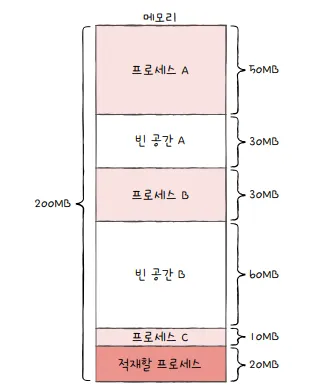

## 14-1 연속 메모리 할당

지금까지는 메모리 내에 프로세스들이 연속적으로 배치되는 상황을 가정했습니다.

프로세스에 연속적인 메모리 공간을 할당하는 방식을 **연속 메모리 할당** 방식이라고 합니다.이번 절에서는 이와 같이 프로세스들을 메모리에 연속적으로 할당할 때 무엇을 고려해야 하는지, 그리고 어떤 잠재적인 문제가 있는지 알아보겠습니다.

### 스와핑(swapping)

메모리에 적재된 프로세스들 중에는 현재 실행되지 않는 프로세스가 있을 수 있습니다. 입출력 작업의 요구로 대기 상태가 된 프로세스라던지, 오랫동안 사용되지 않은 프로세스가 이런 프로세스들에 속합니다. 이러한 프로세스들을 임시로 보조기억장치 일부 영역으로 쫓아내고, 그렇게 해서 생긴 메모리상의 빈 공간에 또 다른 프로세스를 적재하여 실행하는 방식을 스와핑이라고 합니다.

이때 프로세스들이 쫓겨나는 보조기억장치의 일부 영역을 스왑 영역(swap space)라고 합니다. 그리고 현재 실행되지 않는 프로세스가 메모리에서 스왑 영역으로 옮겨지는 것을 스왑 아웃(swap-out), 반대로 스왑 영역에 있던 프로세스가 다시 메모리로 옮겨오는 것을 스왑 인(swap-in)이라고 합니다. 스왑 아웃되었던 프로세스가 다시 스왑 인될 때는 스왑 아웃되기 전의 물리 주소와는 다른 주소에 적재될 수 있습니다.

*스와핑은 메모리에서 사용되지 않는 일부 프로세스를 보조기억장치로 내보내고 실행할 프로세스를 메모리로 들여보내는 메모리 관리 기법입니다.

스와핑을 이용하면 프로세스들이 요구하는 메모리 주소 공간의 크기가 실제 메모리 크기보다 큰 경우에도 프로세스들을 동시 실행할 수 있습니다.

<aside>

스왑 영역 확인하기

free -h

</aside>

### 메모리 할당

프로세스는 메모리 내의 빈 공간에 적재되어야 합니다. → 어디에 적재해야 할까?

여기에는 대표적으로 최초 적합, 최적 적합, 최악 적합의 세 가지 방식이 있습니다.

- 최초 적합(first fit)

최초 적합은 운영체제가 메모리 내의 빈 공간을 순서대로 검색하다가 적재할 수 있는 공간을 발견하면 그 공간에 프로세스를 배치하는 방식입니다. 이 방식은 검색을 최소화할 수 있고 결과적으로 빠른 할당이 가능합니다.

- 최적 적합(best fit)

최적 적합은 운영체제가 빈 공간을 모두 검색해 본 후, **프로세스가 적재될 수 있는 공간 중 가장 작은 공간에 프로세스를 배치**하는 방식입니다.

- 최악 적합(worst fit)

최악 적합은 운영체제가 빈 공간을 모두 검색해 본 후, **프로세스가 적재될 수 있는 공간 중 가장 큰 공간에 프로세스를 배치**하는 방식입니다.

### 외부 단편화(external fragmentation)

프로세스를 메모리에 연속적으로 배치하는 연속 메모리 할당은 언뜻 들으면 당연하게 느껴질 수 있지만, 사실 이는 메모리를 효율적으로 사용하는 방법이 아닙니다. 왜냐하면 연속 메모리 할당은 외부 단편화(external fragmentation)라는 문제를 내포하고 있기 때문입니다.

프로세스들이 메모리에 연속적으로 할당되는 환경에서는 메모리 사이 사이에 빈 공간들이 생깁니다. 프로세스 바깥에 생기는 이러한 빈 공간들은 분명 빈 공간이지만 그 공간보다 큰 프로세스를 적재하기 어려운 상황을 초래하고, 결국 메모리 낭비로 이어집니다. 이러한 현상을 외부 단편화라고 합니다.

*외부 단편화: 프로세스를 할당하기 어려울 만큼 작은 메모리 공간들로 인해 메모리가 낭비되는 현상을 의미.

실제로는 메모리 용량도 크고 적재되는 프로세스도 많기 때문에 외부 단편화로 인해 낭비되는 공간은 더욱 큽니다. 그렇기에 외부 단편화 문제는 반드시 해결해야 할 문제입니다.

외부 단편화를 해결할 수 있는 대표적인 방안으로 메모리를 압축(compaction)하는 방법이 있습니다. 압축은 여기저기 흩어져 있는 빈 공간들을 하나로 모으는 방식으로 메모리 내에 저장된 프로세스를 적당히 재배치시켜 여기저기 흩어져 있는 작은 빈 공간들을 하나의 큰 빈 공간으로 만드는 방법입니다.

다만 압축 방식은 여러 단점이 있습니다. 작은 빈 공간들을 하나로 모으는 동안 시스템은 하던 일을 중지해야 하고, 메모리에 있는 내용을 옮기는 작업은 많은 오버헤드를 야기하며, 어떤 프로세스를 어떻게 움직여야 오버헤드를 최소화하며 압축할 수 있는지에 대한 명확한 방법을 결정하기 어렵습니다. 이에 외부 단편화를 없앨 수 있는 또 다른 해결 방법이 등장했는데, 이것이 오늘날까지도 사용되는 가상 메모리 기법, 그 중에서도 페이징 기법입니다.

## 14-2 페이징을 통한 가상 메모리 관리

프로세스를 반드시 메모리에 연속적으로 할당해야 한다면 메모리보다 큰 프로그램은 적재할 수 없습니다.

가상 메모리(virtual memory)는 실행하고자 하는 프로그램을 일부만 메모리에 적재하여 실제 물리 메모리 크기보다 더 큰 프로세스를 실행할 수 있게 하는 기술입니다. (페이징, 세그먼테이션)

페이징 기법을 이용하면 물리 메모리보다 큰 프로세스를 실행할 수 있을 뿐만 아니라 앞선 절에서 배운 외부 단편화 문제도 해결할 수 있습니다.

### 페이징이란

연속 메모리 할당 방식에서 외부 단편화가 생긴 근본적인 이유는 각기 다른 크기의 프로세스가 메모리에 연속적으로 할당되었기 때문입니다.

만일 메모리와 프로세스를 일정한 단위로 자르고, 이를 메모리에 불연속적으로도 할당할 수만 있다면 외부 단편화는 발생하지 않습니다.

이것이 페이징(paging)입니다. 페이징은 프로세스의 논리 주소 공간을 페이지(page)라는 일정한 단위로 자르고, 메모리 물리 주소 공간을 프레임(frame)이라는 페이지와 동일한 크기의 일정한 단위로 자른 뒤 페이지를 프레임에 할당하는 가상 메모리 관리 기법입니다.

> 페이징은 메모리의 주소 공간을 프레임 단위로 자르고 프로세스의 논리 주소 공간을 페이지 단위로 자른 뒤 각 페이지를 프레임에 할당하는 가상 메모리 관리 기법입니다.
>

페이징에서도 스와핑(swapping)을 사용할 수 있습니다. 페이징을 사용하는 시스템에서는 프로세스 전체가 스왑 아웃/스왑 인 되는 것이 아닌 페이지 단위로 스왑 아웃/스왑 인됩니다. 즉, 메모리에 적재될 필요가 없는 페이지들은 보조기억장치로 스왑 아웃되고, 실행에 필요한 페이지들은 스왑 인 되는 것이지요. 페이징 시스템에서의 스왑 아웃은 페이지 아웃, 스왑 인은 페이지 인이라고 부르기도 합니다.

### 페이지 테이블

그런데 여기서 문제가 있습니다. 프로세스가 메모리에 불연속적으로 배치되어 있다면 CPU 입장에서 이를 순차적으로 실행할 수가 없습니다. 프로세스를 이루는 페이지가 어느 프레임에 적재되어 있는지 CPU가 모두 알고 있기란 어렵기 때문입니다. 즉, 프로세스가 메모리에 불연속적으로 배치되면 CPU 입장에서 ‘다음에 실행할 명령어 위치’를 찾기가 어려워집니다.

이를 해결하기 위해 페이징 시스템은 프로세스가 비록 물리 주소에 불연속적으로 배치되더라도 논리 주소에는 연속적으로 배치되도록 페이지 테이블을 이용합니다.

CPU로 하여금 페이지 번호만 보고 해당 페이지가 적재된 프레임을 찾을 수 있게합니다.

위와 같은 방식으로 비록 물리 주소상에서는 프로세스들이 분산되어 저장되어 있더라도 CPU 입장에서 바라본 논리 주소는 연속적으로 보일 수 있습니다. 즉 프로세스들이 메모리에 분산되어 저장되어 있더라도 CPU는 논리 주소를 그저 순차적으로 실행하면 됩니다.

> 내부 단편화
페이징은 외부 단편화 문제를 해결할 수 있지만, 내부 단편화(Internal fragmentation)라는 문제를 야기할 수 있습니다. 페이징은 프로세스의 논리 주소 공간을 페이지라는 일정한 크기 단위로 자른다고 했습니다. 그런데 모든 프로세스가 페이지 크기에 맞게 잘리는 것은 아닙니다. 다시 말해 모든 프로세스 크기가 페이지의 배수는 아닙니다. 가령 페이지 크기가 10KB인데, 프로세스의 크기가 108KB라고 할 때 마지막 페이지는 8KB만큼 남습니다. 이러한 메모리 낭비를 내부 단편화라고 합니다.

내부 단편화는 하나의 페이지 크기보다 작은 크기로 발생합니다. 그렇기에 하나의 페이지 크기가 작다면 발생하는 내부 단편화의 크기는 작아질 것으로 기대할 수 있습니다. 그러나 하나의 페이지 크기를 너무 작게 설정하면 그만큼 페이지 테이블의 크기가 커지기 때문에 페이지 테이브이 차지하는 공간이 낭비됩니다. 그래서 페이지 크기를 조정하는 것이 중요합니다.
>

프로세스마다 각자의 페이지 테이블을 가지고 있고 각 프로세스의 페이지 테이블들은 메모리에 적재되어 있습니다. 그리고 CPU 내의 페이지 테이블 베이스 레지스터는 각 프로세스의 페이지 테이블이 적재된 주소를 가리키고 있습니다.

예를 들어 프로세스 A가 실행될 때 PTBR(Page Table Base Register)은 프로세스 A의 페이지 테이블을 가리키고, CPU는 프로세스 A의 페이지 테이블을 통해 프로세스 A의 페이지가 적재된 프레임을 알 수 있습니다.

(이러한 각 프로세스들의 페이지 테이블 정보들은 각 프로세스의 PCB에 기록됩니다. 그리고 프로세스의 문맥 교환이 일어날 때 다른 레지스터와 마찬가지로 함께 변경됩니다.)

그런데 이렇게 페이지 테이블을 메모리에 두면 문제가 있습니다. 메모리 접근 시간이 두 배로 늘어난다는 점입니다. 메모리에 있는 페이지 테이블을 보기 위해 한 번, 그렇게 알게 된 프레임에 접근하기 위해 한 번, 이렇게 총 두 번의 메모리 접근이 필요하기 때문이죠.

이 같은 문제를 해결하기 위해 CPU 곁에 TLB(Translation Lookaside Buffer)라는 페이지 테이블의 캐시 메모리를 둡니다. 여러분이 사용하는 PC의 CPU 곁에는 TLB가 있습니다.

CPU가 발생한 논리 주소에 대한 페이지 번호가 TLB에 있을 경우 TLB 히트라고 합니다. TLB에 찾는 페이지 번호가 없을 경우 TLB 미스라고 합니다.

### 페이징에서의 주소 변환

하나의 페이지 혹은 프레임은 여러 주소를 포함하고 있습니다. 그렇기에 특정 주소에 접근하려면 아래와 같은 두 가지 정보가 필요합니다.

- 어떤 페이지 혹은 프레임에 접근하고 싶은지
- 접근하려는 주소가 그 페이지 혹은 프레임으로부터 얼마나 떨어져 있는지

그렇기에 페이징 시스템에서는 모든 논리 주소가 기본적으로 페이지 번호(page number)와 변위(offset)로 이루어져 있습니다.

페이지 번호는 말 그대로 접근하고자 하는 페이지 번호입니다. 페이지 테이블에서 해당 페이지 번호를 찾으면 페이지가 어떤 프레임에 할당되었는지를 알 수 있습니다. 변위는 접근하려는 주소가 프레임의 시작 번지로부터 얼만큼 떨어져 있는지를 알기 위한 정보입니다. 즉, 논리 주소 <페이지 번호, 변위>는 페이지 테이블을 통해 물리 주소 <프레임 번호, 변위>로 변환됩니다.

### 페이지 테이블 엔트리

페이지 테이블을 조금 자세히 들여다봅시다. 페이지 테이블의 각 엔트리, 다시 말해 페이지 테이블의 각각의 행들을 페이지 테이블 엔트리라고 합니다.

페이지테이블 엔트리에 담기는 정보로 페이지 번호, 프레임 번호뿐만 아니라 유효비트, 보호비트, 참조 비트, 수정 비트 등 중요한 다른 것들이 들어 있습니다.

- 유효 비트(valid bit)

유효 비트는 현재 해당 페이지에 접근 가능한지 여부를 알려줍니다. 페이지 테이블 엔트리에서 프레임 번호 다음으로 중요한 정보라고도 볼 수 있습니다.

만일 CPU가 유효 비트가 0(적재X)인 메모리에 접근하려고 하면 페이지 폴트(Page Fault)라는 예외가 발생합니다.

- 보호 비트(protection bit)

보호 비트는 페이지 보호 기능을 위해 존재하는 비트입니다. 보호 비트를 통해 해당 페이지가 읽고 쓰기가 모두 가능한 페이지인지, 혹은 읽기만 가능한 페이지인지를 나타낼 수 있습니다.

- 참조 비트(reference bit)

참조 비트는 CPU가 이 페이지에 접근한 적이 있는지 여부를 나타냅니다. 메모리에 적재 이후 접근한 적이 있는지를 표기.

- 수정 비트(modified bit)

수정 비트는 해당 페이지에 데이터를 쓴 적이 있는지 없는지 수정 여부를 알려줍니다. 더티 비트라고도 부릅니다.

수정 비트는 페이지가 메모리에서 사라질 때 보조기억장치에 쓰기 작업을 해야 하는지, 할 필요가 없는지를 판단하기 위해 존재합니다.

## 14-3 페이지 교체와 프레임 할당

### 요구 페이징(demand paging)

프로세스를 메모리에 적재할 때 처음부터 모든 페이지를 적재하지 않고 필요한 페이지만을 메모리에 적재하는 기법을 요구 페이징이라고 합니다.

요구 페이징 시스템이 안정적으로 작동하려면 필연적으로 다음 두 가지를 해결해야 합니다. 하나는 페이지 교체이고, 다른 하나는 프레임 할당입니다.

메모리에 적재된 많고 많은 페이지 중 어떤 페이지를 내보내는 것이 최선일까요? 이를 결정하는 방법이 페이지 교체 알고리즘이라 합니다.

### 페이지 교체 알고리즘

좋은 페이지 교체 알고리즘은 일반적으로 페이지 폴트를 가장 적게 일으키는 알고리즘을 좋은 알고리즘이라 평가합니다. 페이지 폴트가 일어나면 보조기억장치로부터 필요한 페이지를 가져와야 하기 때문에 메모리에 적재된 페이지를 가져오는 것보다 느려지기 때문이지요.

가령 한 알고리즘을 통해 고른 페이지를 스왑 아웃시켰을 때 페이지 폴트가 자주발생하면 이는 좋은 알고리즘이 아닙니다. 이 말은 보조기억장치로 내쫓을 페이지를 잘못 골랐다는 뜻으로, 내보내면 안되는 페이지를 보조기억장치로 내보냈다는 의미와 같기 때문이죠. 반면 어떤 알고리즘을 통해 고른 페이지를 스왑 아웃시켜도 페이지 폴트가 자주 발생하지 않는다면 이는 컴퓨터의 성능 저하를 방지하는 좋은 알고리즘으로 평가할 수 있습니다.

그렇기에 페이지 교체 알고리즘을 제대로 이해하려면 페이지 폴트 횟수를 알 수 있어야 합니다. 그리고 페이지 폴트 횟수는 페이지 참조열(page reference string)을 통해 알 수 있습니다.

- FIFO 페이지 교체 알고리즘

이는 가장 단순한 방법입니다. 이름 그대로 메모리에 가장 먼저 올라온 페이지부터 내쫓는 방식으로, 오래 머물렀다면 나가라는 알고리즘입니다.

- 최적 페이지 교체 알고리즘

cpu에 의해 참조되는 횟수를 고려하는 페이지 교체 알고리즘입니다.

앞으로의 사용 빈도가 가장 낮은 페이지를 교체하는 알고리즘을 의미합니다.

이 알고리즘은 이름 그대로 가장 낮은 페이지 폴트율을 보장하는 알고리즘입니다.

다만, 최적 페이지 교체 알고리즘은 실제 구현이 어렵습니다. 최적 페이지 교체 알고리즘은 앞으로 오랫동안 사용되지 않을 페이지를 내보내는 알고리즘입니다. 프로세스가 앞으로 메모리 어느 부분을 어떻게 참조할지 미리 아는 것은 현실적으로 불가능에 가깝습니다.

- LRU 페이지 교체 알고리즘

최적 페이지 교체 알고리즘은 구현하기 어려워도 이와 비슷한 알고리즘은 만들 수 있습니다. 가장 오랫동안 사용되지 ‘않을’ 페이지를 교체하는 알고리즘 구현이 어렵다면, 가장 오랫동안 사용되지 ‘않은’ 페이지를 교체하는 것입니다. 이 알고리즘이 LRU페이지 교체 알고리즘입니다.(Least Recently Used)

### 스래싱과 프레임 할당

페이지 폴트가 자주 발생하는 이유에 나쁜 페이지 교체 알고리즘만 있는 것은 아닙니다. 프로세스가 사용할 수 있는 프레임 수가 적어도 페이지 폴트는 자주 발생합니다. 반대로 프로세스가 사용할 수 있는 프레임 수가 많으면 일반적으로 페이지 폴트 빈도는 감소합니다.

프로세스가 실제 실행되는 시간보다 페이징에 더 많은 시간을 쏟아 성능이 저해되는 문제를 스래싱(jthrashing)이라고 합니다.