

 파일과 디렉터리 

## 파일 시스템
- 파일과 디렉터리를 관리하는 운영체제 내의 프로그램
- 파일과 디렉터리를 다루어 주는 프로그램

## 파일과 디렉터리
- 보조기억장치의 데이터 덩어리

## 파일이란?
- 보조기억장치에 저장된 관련 정보의 집합
- 의미 있고 관련 있는 정보를 모은 논리적 단위
    - 파일의 정보
    - 파일을 실행하기 위한 정보 + 부가정보 (속성,메타데이터 등)

## 디렉터리란?
- 윈도우에서는 폴더라고 지칭
- 여러 계층으로 파일 및 폴더를 관리하는 **트리 구조 디렉터리**
- 최상위 디렉터리(=루트 디렉터리, "/"), 서브 디렉터리

## 경로
- 디렉터리를 이용해 파일.디렉터리의 위치, 이름까지 특정 지을 수 있는 정보
- 절대 경로 / 상대 경로 존재

### 절대 경로
- 루트 디렉터리부터 자기 자신까지 이르는 고유한 경로

### 상대 경로
- 현재 디렉터리부터 자기 자신까지 이르는 경로

## 디렉터리 엔트리
각 엔트리(행)에 담기는 정보 (참고:운영체제는 디렉터리를 파일과 따로 간주하지 않고, 테이블 형태의 파일로 간주)
- 디렉터리에 포함된 대상의 이름
- 그 대상이 보조기억장치 내에 저장된 위치(를 유추할 수 있는 정보)
- 그 외 다수

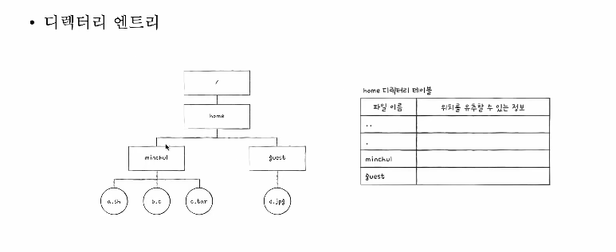

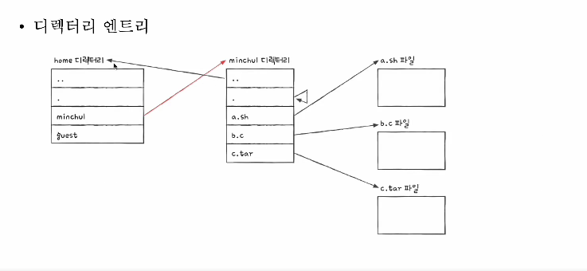

 

 파일 시스템 

## 파티셔닝과 포매팅
- 이제 막 공장에서 생산되어 한 번도 사용된 적 없는 새 HDD/SSD 라면?
- 파티셔닝 포매팅을 하기 전까지는 사용할 수 없다.

### 파티셔닝
- 저장 장치의 논리적인 영역을 구획하는 작업
- ex) 새 서랍장을 샀을 때 내부에 칸막이, 용도를 지정하듯이 영역을 나누는 작업

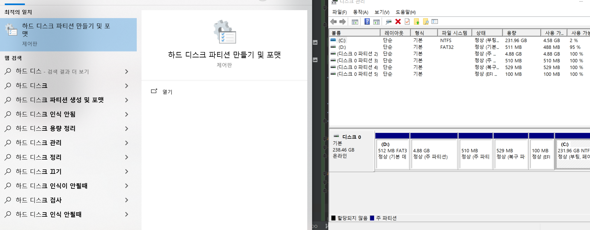

### 포매팅
- 파일 시스템을 설정
- 어떤 방식을 파일을 관리할 지 결정, 새로운 데이터를 쓸 준비하는 작업
- 파일 시스템에는 여러 종류가 있고, 파티션마다 다른 파일 시스템을 설정할 수도 있다.

파티셔닝과 포매팅까지 완료하여 파일 시스템을 설정했다면, 이제 파일과 디렉터리 생성이 가능해진다.

## 파일 할당 방법
- 포매팅까지 끝난 하드 디스크에 파일을 저장하기
- 운영체제는 파일/디렉터리를 블록 단위로 읽고 쓴다.
    - 즉, 하나의 파일이 보조기억장치에 저장될 떄에는 여러 블록에 걸쳐 저장된다

파일을 블록단위로 디스크에 할당 한다고 했을 때, 어떻게 할당하는 걸까?
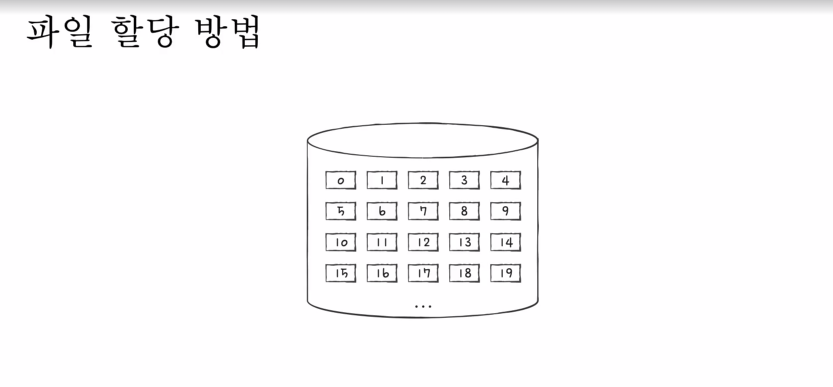

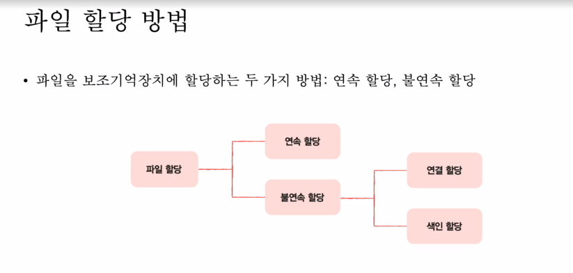

오늘날 주요로 사용되는 할당 방법은 `불연속 할당` 방법이다.

### 연속 할당
- 이름 그대로 보조기억 장치 내 연속적인 블록에 파일 할당
- 연속된 파일에 접근하기 위해 파일의 첫 번쨰 블록 주소와 블록 단위의 길이만 알면 된다.
- 디렉터리 엔트리: 파일 이름 & **첫 번째 블록 주소 & 블록 단위 길이 명시**
- 단점 :
    - 외부 단편화 (이로 인해 현대에서 잘 안쓰임)

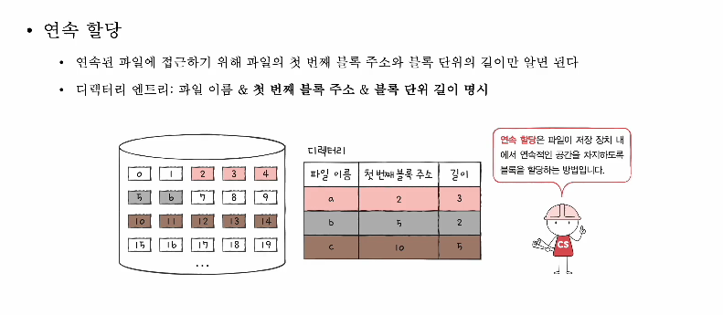

### 불연속 할당 - 연결 할당
- 각 블록의 일부에 다음 블록의 주소를 저장하여 각 블록이 다음 블록을 가리키는 형태로 할당
- 파일을 이루는 데이터 블록을 `연결 리스트`로 관리
- 불연속 할당의 일종: 파일이 여러 블록에 흩어져 저장되어도 무방
- 디렉터리 엔트리 : 파일 이름 & 첫번쨰 블록 주소 & 블록 단위의 길이
- 단점 :
    - 반드시 첫 번째 블록부터 하나씩 읽어들여야 한다.
    - 오류 발생시 해당 블록 이후 블록은 접근이 어렵다.

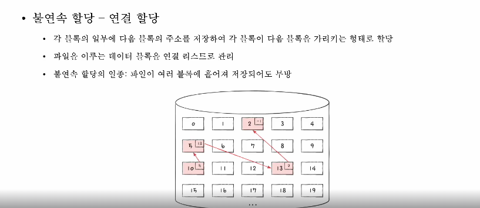

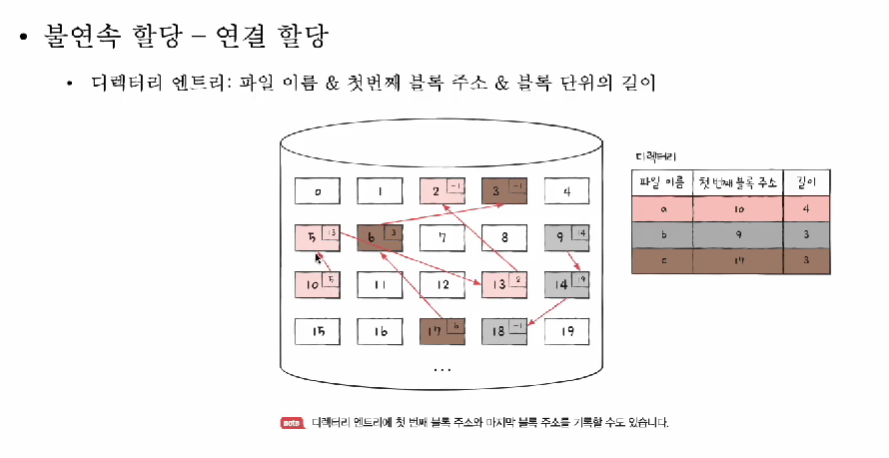

### 불연속 할당 - 색인 할당
- 파일의 모든 블록 주소를 색인 블록이라는 하나의 블록에 모아 관리하는 방식
- 파일 내 임의의 위치에 접근하기 용이
- 디렉터리 엔트리 : 파일 이름 & 색인 블록 주소

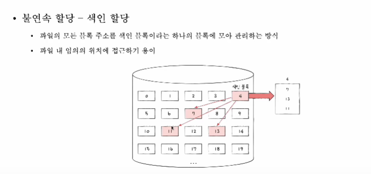

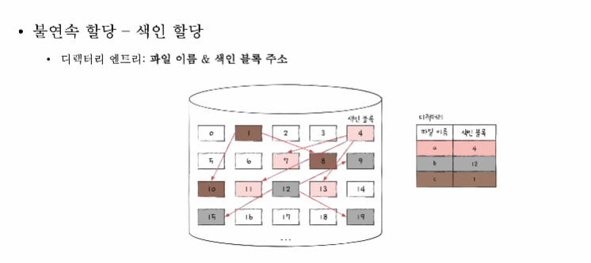

## FAT 파일 시스템
- 연결 할당 기반 파일 시스템
- 연결 할당의 단점을 보완
    - LinkedList 기반 특성상, 일부가 고장나도 전체에게 영향
    - 각 블록에 포함된 다음 블록 주소를 한데 모아 테이블(FAT:File Allocation Table)로 관리
- 메모리에 캐시가 가능해서 접근 속도 개선 가능

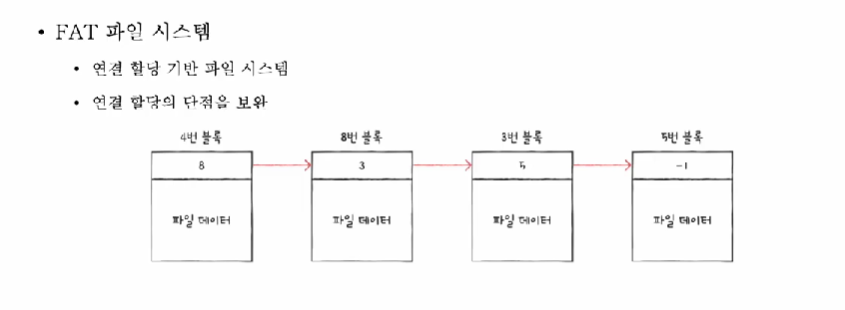

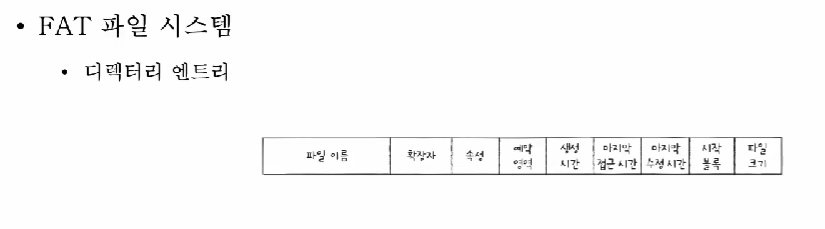

- /home/minchul/a.sh 를 읽는 과정
  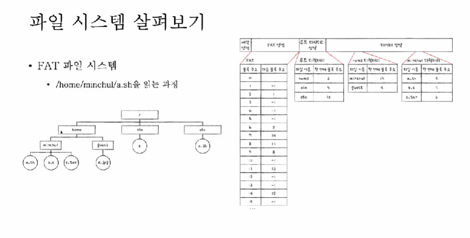

1) 루트 디렉터리 접근 -> 3번에 있다는 정보 추출
2) home 디렉터리 접근 -> 15번에 있다는 정보 추출
3) minchul 디렉터리 접근 -> a.sh 이 9번에 있다는 정보 추출
4) FAT 영역의 인덱스별 접근 -> 9 -> 8 -> 11 -> 13 -> -1 순으로 블록 탐색

## 유닉스 파일 시스템
- 색인 할당 기반 파일 시스템
- 색인 블록 == i-node
    - 파일의 속성 정보와 15개의 블록 주소 저장 가능

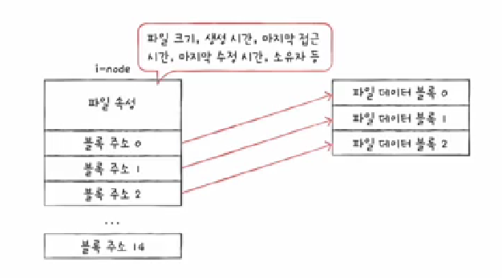

- Q) 파일 크기가 15개의 블록보다 많으면?
    - 1) 블록 주소 중 12개에는 직접 블록 주소 저장
        - 직접 블록 : 파일 데이터가 저장 블록
    - 2) (1)번으로 충분하지 않다면, 13번째 주소에 단일 간접 블록 주소 저장
        - 단일 간접 블록 : 파일 데이터를 저장한 블록 주소가 저장된 블록
    - 3) (2)번으로 충분하지 않다면, 14번째 주소에 이중 간접 블록 주소 저장
        - 이중 간접 블록 : 단일 간접 블록들의 주소를 저장하는 블록
    - 4) (3)번으로 충분하지 않다면, 15번째 주소에 삼중 간접 블록 주소 저장
        - 삼중 간접 블록 : 이중 간접 블록들의 주소를 저장하는 블록

웬만한 현대사회에서는 삼중 간접 블록까지 가면 모두 커버링이 된다.

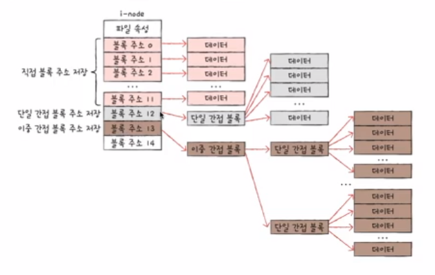

