# 15-1 파일과 디렉터리
## 파일
파일 : 하드 디스크나 SSD와 같은 보조기억장치에 저장된 관련 정보의 집합

메타데이터 : 파일을 이루는 부가 정보

### 파일 속성과 유형
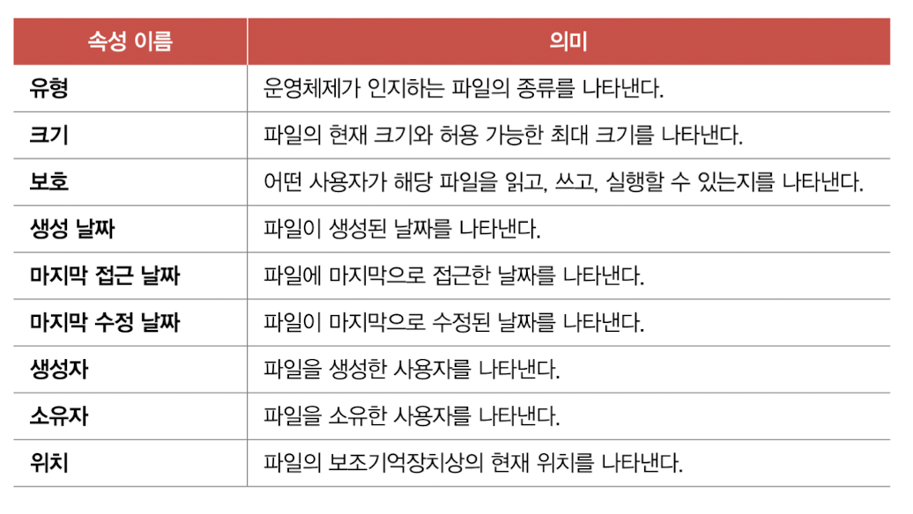
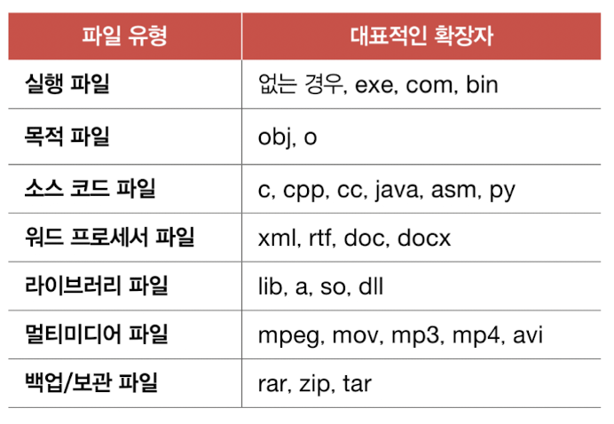

### 파일 연산을 위한 시스템 호출
파일을 다루는 모든 작업은 운영체제에 의해 이뤄짐, 파일 연산을 위한 시스템 호출 제공

## 디렉터리
1단계 디렉터리 : 옛날 운영체제에는 모든 파일이 하나의 디렉터리 안에 존재

트리 구조 디렉터리 : 최상위 디렉터리 아래에 여러 서브 디렉터리 존재

최상위 디렉터리 : 루트 디렉터리 , "/"

### 절대 경로와 상대 경로
절대 경로 : 루트 디렉터리에서 자기 자신까지 이르는 고유한 경로

상대 경로 : 현재 디렉터리부터 시작하는 경로

### 디렉터리 엔트리
디렉터리는 보조기억장치에 테이블 형태의 정보로 저장됨

디렉터리 엔트리를 통해 보조기억장치에 저장된 위취를 찾고 이동 가능

# 15-2 파일 시스템
## 파티셔닝과 포매팅
보조기억장치에 곧바로 파일을 생성하거나 저장할 수 없음, 파티셔닝과 포매팅을 거쳐야 함

**파티셔닝** : 저장 장치의 논리적인 영역을 구획하는 작업

**포매팅** : 파일 시스템을 설정하여 어떤 방식으로 파일을 저장하고 관리할 것인지를 결정하고, 새로운 데이터를 쓸 준비를 하는 작업

## 파일 할당 방법
운영체제는 파일과 디렉터리를 **블록** 단위로 읽고 씀

파일 할당 방법에는 연속 할당, 불연속 할당 (연결 할당, 색인 할당) 방법 존재

### 연속 할당
보조기억장치 내 연속적인 블록에 파일을 할당하는 방식

디렉터리 엔트리에 파일 이름, 첫 번째 블록 주소, 블록 단위의 길이 명시

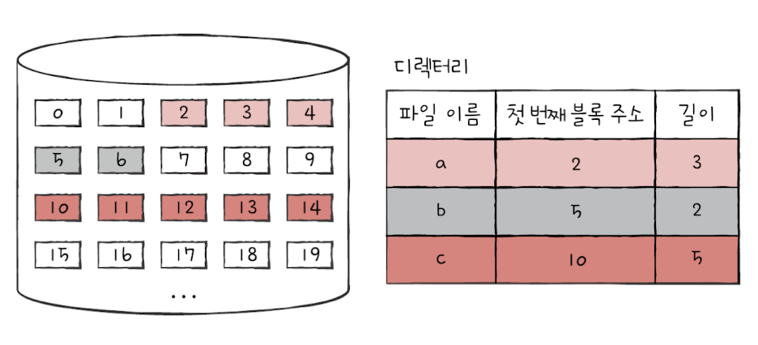

단점 : **외부 단편화** 야기

### 연결 할당
연속 할당의 문제 해결

각 블록 일부에 다음 블록의 주소를 저장하여 각 블록이 다음 블록을 가리키는 형태로 할당

문제점
1. 반드시 첫 번째 블록부터 하나씩 차례대로 읽어야 함
- 임의 접근 속도가 매우 느림
2. 하드웨어 고장이나 오류 발생 시 해당 블록 이후 블록 접근 불가

### 색인 할당
파일의 모든 블록 주소를 **색인 블록**이라는 하나의 블록에 모아 관리하는 방식
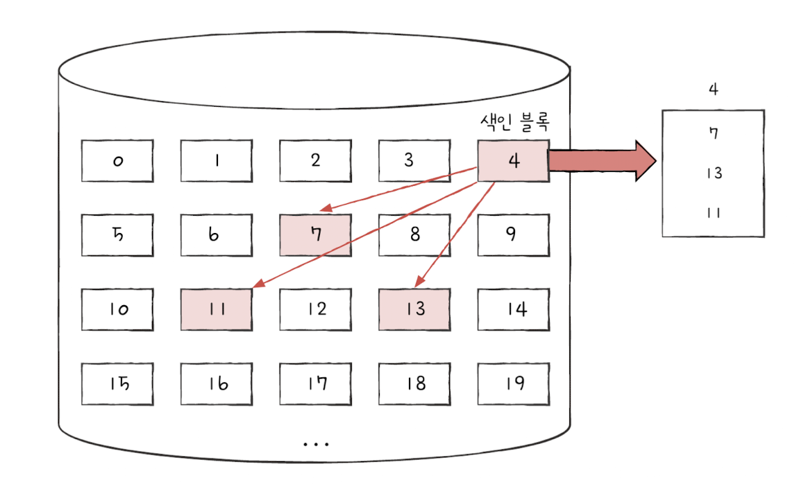

파일 내 임의의 위치 접근 편리 : 파일의 i번째 데이터 블록에 접근하고 싶다면 색인 블록의 i번째 항목이 가리키는 블록에 접근하면 됨

디렉터리 엔트리에 파일 이름, **색인 블록 주소** 명시

유닉스 파일 시스템 : 색인 할당을 기반으로 만든 파일 시스템

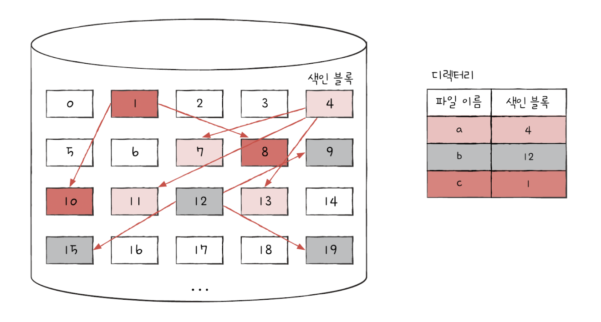

## 파일 시스템 살펴보기
### FAT 파일 시스템
USB 메모리, SD 카드 등의 저용량 저장 장치에서 사용

연결 할당의 단점을 보완

#### 파일 할당 테이블 (FAT : File Allocation Table)
각 블록에 포함된 다음 블록의 주소들을 한데 모아 테이블 형태로 관리

하드 디스크의 한 파티션을 FAT 파일 시스템으로 포맷했을때의 구성

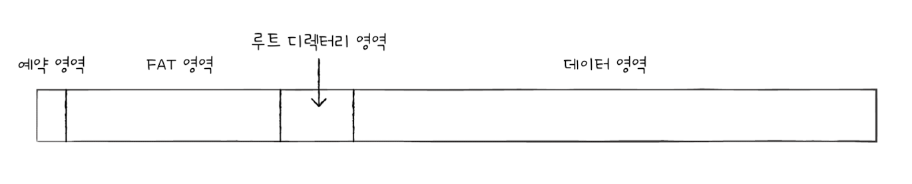

FAT가 메모리에 적재된 채 실행되면 기존 연결 할당보다 다음 블록을 찾는 속도가 매우 빨라지고, 임의 접근에도 유리함

**디렉터리 구성**

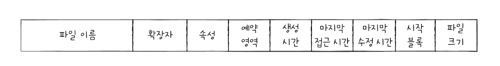

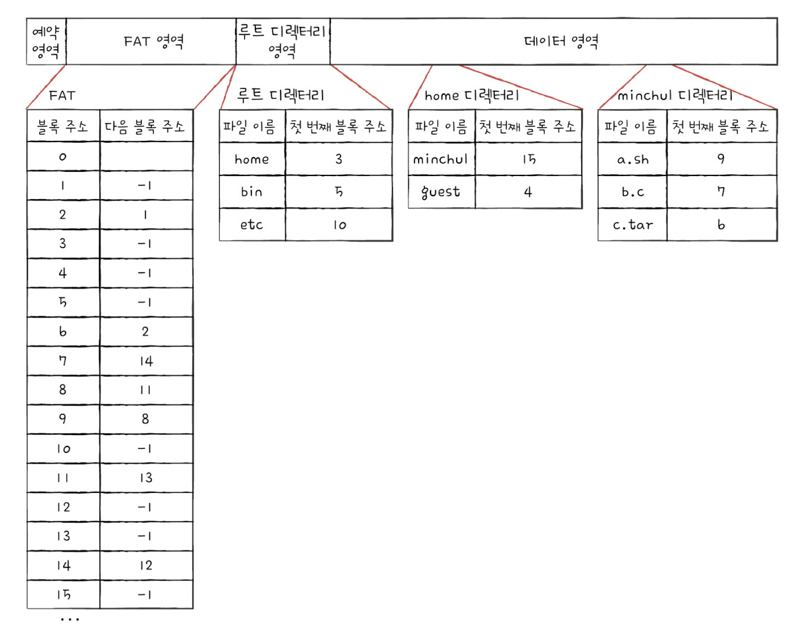

/home/minchul/a.sh에 접근하는 방법
1. 루트 디렉터리에서 home 디렉터리 블록 찾기
2. 3번 블록을 읽어 home 디렉터리 읽기, minchul 디렉터리 블록 찾기
3. 15번 블록을 읽어 minchul 디렉터리 읽기, a.sh 파일의 첫 번째 블록 주소 찾기
4. FAT 확인, 9->8->11->13 접근

### 유닉스 파일 시스템
색인 블록 : i-node
- 파일 속성 정보와 열다섯 개의 블록 주소 저장
- 파일마다 i-node 존재, i-node마다 번호가 부여되어 있음

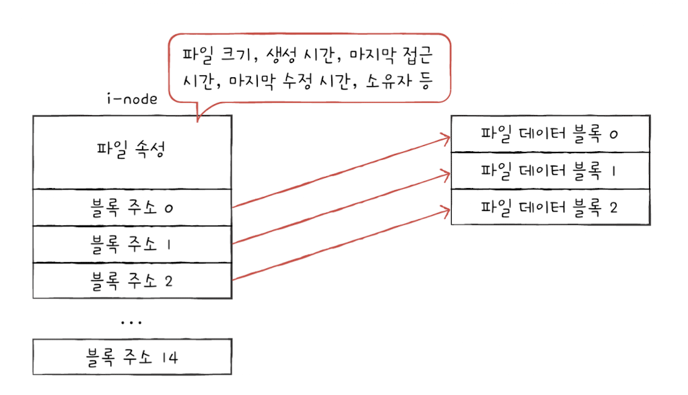

문제점 : i-node 크기는 유한함, i-node 하나는 열다섯 개의 블록을 차지하는 파일까지 가리킬 수 있음

해결 방법
1. 블록 주소 중 열두 개에는 직접 블록 주소 저장
- **직접 블록** : 파일 데이터가 저장된 블록
2. 열세 번째 주소에 단일 간접 블록 주소 저장
- **단일 간접 블록** : 파일 데이터를 저장한 블록 주소가 저장된 블록

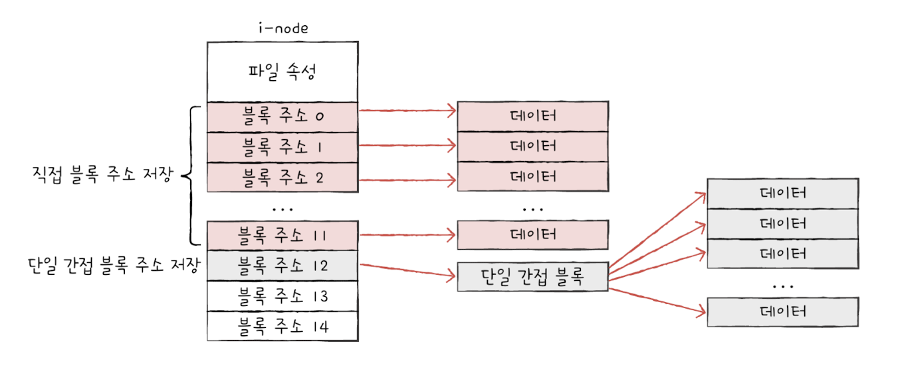

3. 열네 번째 주소에 이중 간접 블록 주소 저장
- **이중 간접 블록** : 단일 간접 블록들의 주소를 저장하는 블록
4. 열다섯 번째 주소에 삼중 간접 블록 주소 저장
- **삼중 간접 블록** : 이중 간접 블록 주소가 저장된 블록
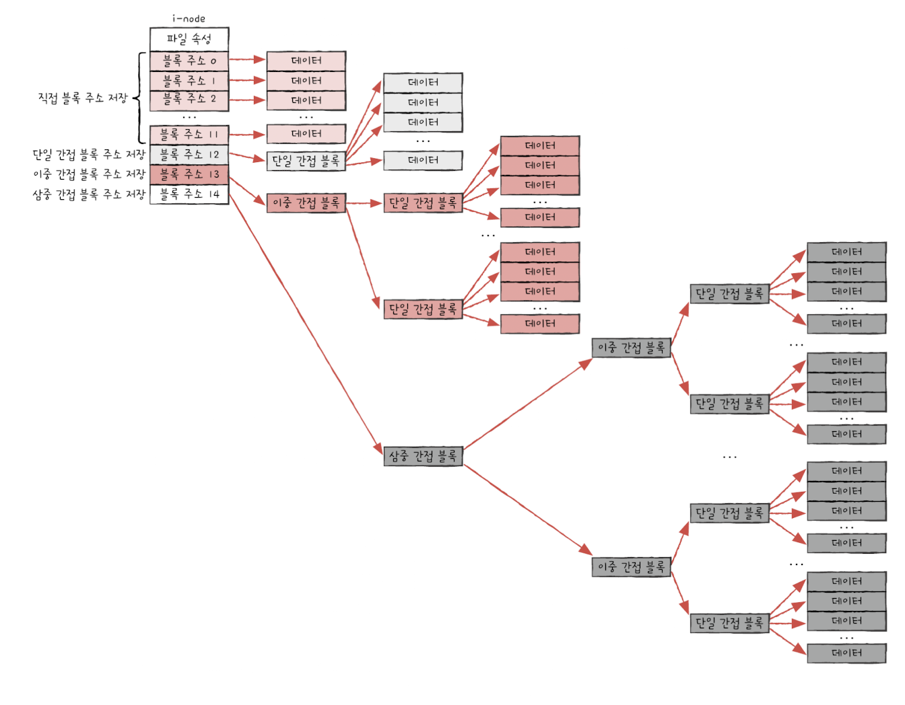

대표적으로 윈도우 운영체제에서는 **NT 파일 시스템**, 리눅스 운영체제에서는 **ext 파일 시스템** 사용