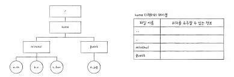
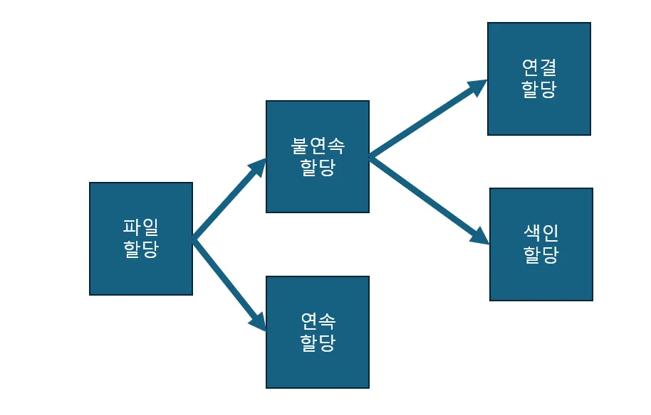
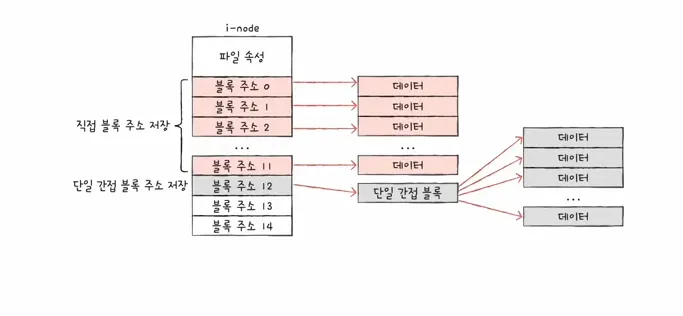

## **15-1 파일과 디렉터리**

파일 시스템은 파일과 디렉터리를 관리합니다. 파일 시스템에 관해 본격적인 학습에 앞서 파일 시스템이 관리하는 파일과 디렉터리에 대해 학습해 보겠습니다.

여러분이 당연하게 사용해 왔던 파일과 디렉터리는 모두 운영체제 내부 파일 시스템이 관리하는 존재입니다. 파일과 디렉터리는 보조기억장치에 있는 데이터 덩어리일 뿐인데, 운영체제는 이를 어떻게 파일과 디렉터리로 관리하는 것일까요?

### 파일

여러분이 일상적으로 컴퓨터를 이용할 때는 파일 단위로 이용합니다. 파일(file)이란 하드 디스크나 SSD와 같은 보조기억장치에 저장된 관련 정보의 집합을 의미합니다. 달리 표현하면 파일은 의미 있고 관련 있는 정보를 모은 논리적 단위를 의미합니다.

그렇다면 파일을 이루는 정보에는 어떤 것들이 있을까요? 모든 파일에는 이름과 파일을 실행하기 위한 정보, 그리고 파일 관련 부가 정보가 있습니다. 이 부가 정보를 속성(attribute) 또는 메타데이터(metadata)라고 부릅니다.

윈도우 운영체제를 사용한다면 파일 속성을 한 번쯤 접해 본 경험이 있을 것입니다. 임의의 파일에서 마우스 오른쪽 버튼을 클릭한 후 [속성]을 선택해 보세요. 다음과 같은 대화상자가 나타납니다. 파일 형식, 위치, 크기 등 파일과 관련된 다양한 정보가 나타나지요? 이러한 정보가 바로 **파일 속성**입니다.

- 파일 속성과 유형

운영체제마다 유지하는 파일 속성은 조금씩 차이가 있지만, 대표적인 속성의 종류는 다음과 같습니다. 운영체제, 그중에서 파일 시스템은 파일별로 다음과 같은 속성을 유지하고 관리합니다.

| 속성 이름 | 의미 |
| --- | --- |
| 유형 | 운영체제가 인지하는 파일의 종류를 나타낸다. |
| 크기 | 파일의 현재 크기와 허용 가능한 최대 크기를 나타낸다 |
| 보호 | 어떤 사용자가 해당 파일을 읽고, 쓰고, 실행할 수 있는지를 나타낸다. |
| 생성 날짜 | 파일이 생성된 날짜를 나타낸다. |
| 마지막 접근 날짜 | 파일에 마지막으로 접근한 날짜를 나타낸다. |
| 마지막 수정 날짜 | 파일이 마지막으로 수정된 날짜를 나타낸다. |
| 생성자 | 파일을 생성한 사용자를 나타낸다. |
| 소유자 | 파일을 소유한 사용자를 나타낸다. |
| 위치 | 파일의 보조기억장치 상의 현재 위치를 나타낸다. |

파일 속성 중 파일 유형은 운영체제가 인식하는 파일 종류를 나타냅니다. 같은 이름의 파일일지라도 텍스트 파일, 실행 파일, 음악 파일 등 유형이 다르면 실행 양상도 달라집니다. 그래서 파일을 실행할 운영체제에 파일 유형을 알려주어야 합니다. 파일 유형을 알리기 위해 가장 흔히 사용하는 방식은 파일 이름 뒤에 붙는 확장자(extension)를 이용하는 것입니다. 확장자는 파일 종류가 무엇인지 운영체제에 알려주는 힌트와도 같습니다.

- 파일 연산을 위한 시스템 호출

**파일을 다루는 모든 작업은 운영체제에 의해 이뤄집니다.** 어떤 응용 프로그램도 임의로 파일을 조작할 수 없으며 파일을 다루려면 운영체제에 부탁해야 합니다. 이를 위해 운영체제는 다음과 같은 파일 연산을 위한 시스템 호출을 제공합니다.

1. 파일 생성
2. 파일 삭제
3. 파일 열기
4. 파일 닫기
5. 파일 읽기
6. 파일 쓰기

### 디렉터리

파일들을 일목요연하게 관리하기 위해 디렉터리(directory)를 이용할 수 있습니다. 윈도우 운영체제에서는 디렉터리를 폴더(folder)라고 부릅니다.

옛날 운영체제에서는 하나의 디렉터리만 존재했습니다. 모든 파일이 하나의 디렉터리 아래에 있는 구조를 1단계 디렉터리(single-level directory)라고 부릅니다.

하나의 계층으로는 많은 파일을 관리하기 어렵기 때문에 여러 계층을 가진 트리 구조 디렉터리(tree-structured directory)가 생겨났습니다.

트리구조 디렉터리는 최상위 디렉터리가 있고 그 아래에 여러 서브 디렉터리(자식 디렉터리)가 있을 수 있습니다. 최상위 디렉터리는 흔히 루트 디렉터리(root directory)라고 부르고 슬래시(/)로 표현합니다.

그러다 보니 자연스레 생긴 개념이 바로 경로(path)입니다. 경로는 디렉터리를 이용해 파일 위치, 나아가 파일 이름을 특정 짓는 정보입니다.

- 절대 경로와 상대 경로

절대 경로는 루트 디렉터리부터 시작하는 경로이고,

상대 경로는 현재 디렉터리부터 시작하는 경로입니다.

- 디렉터리 연산을 위한 시스템 호출

운영체제가 파일 연산을 위한 시스템 호출을 제공하는 것처럼 **운영체제는 디렉터리 연산을 위한 시스템 호출도 제공**합니다.

- 디렉터리 엔트리

많은 운영체제에서는 디렉터리를 그저 ‘특별한 형태의 파일’로 간주합니다. 즉, 디렉터리도 파일입니다. 단지 포함된 정보가 조금 특별할 뿐이지요.

파일이 내부에 해당 파일과 관련된 정보를 담고 있다면, 디렉터리는 내부에 해당 디렉터리에 담겨 있는 대상과 관련된 정보를 테이블(표) 형태로 구성하고 있습니다. 즉, 디렉터리는 보조기억장치에 테이블 형태의 정보로 저장됩니다.

각각의 행에 담기는 정보는 파일 시스템마다 차이가 있으며, 파일 시스템별 디렉터리 엔트리는 다음 절에서 학습할 예정입니다. 다만 파일 시스템을 막론하고 디렉터리 엔트리가 공통으로 포함하는 정보가 있다면 그것은 디렉터리에 포함된 대상의 이름과 그 대상이 보조기억장치 내에 저장된 위치를 유추할 수 있는 정보가 담긴다는 점입니다. 다시 말해 디렉터리 엔트리만 보아도 해당 디렉터리에 무엇이 담겨 있는지, 그리고 그것들은 보조기억장치의 어디에 있는지를 직간접적으로 알 수 있습니다.

디렉터리 테이블

| 파일 이름 | 위치를 유추할 수 있는 정보 |
| --- | --- |
|  |  |
|  |  |

> 보조기억장치 내의 파일/디렉터리 위치를 나타내는 방법에는 파일 시스템마다 차이가 있습니다. 이 또한 다음 절에서 학습할 예정이니 지금은 디렉터리 테이블에는 위치를 유추할 수 있는 정보가 담긴다고만 이해.

파일 시스템에 따라 디렉터리 엔트리에 다음과 같이 파일 속성을 명시하는 경우도 있습니다.

디렉터리 엔트리를 통해 보조기억장치에 저장된 위치를 알 수 있기 때문에 home 디렉터리에서 하위 디렉터리가 저장된 곳으 알 수 있고 따라서 그곳으로 이동할 수도 있습니다. 마찬가지로 하위 디렉터리 엔트리에는 디렉터리에 속한 파일들의 이름과 이들의 위치를 알 수 있는 정보 등이 포함되어 있기 때문에 이 파일들이 보조기억장치 내에 저장된 위치를 알 수 있고 실행할 수 있는 것입니다.

## 15-2 파일 시스템

앞서 학습한 파일과 디렉터리가 보조기억장치에 어떻게 저장되며, 파일 시스템(운영체제 내부에 있음)은 이들에 어떻게 접근하는지?

**파일 시스템**은 파일과 디렉터리를 보조기억장치에 일목요연하게 저장하고 접근할 수 있게 하는 운영체제 내부 프로그램입니다. 이러한 파일 시스템에는 다양한 종류가 있고, 하나의 컴퓨터에서 여러 파일 시스템을 사용할 수 있습니다.

### 파티셔닝과 포매팅

보조기억 장치를 사용하려면 파티션을 나누는 작업(파티셔닝)과 포맷 작업(포매팅)을 거쳐야 하기 때문입니다.

파티셔닝(partitioning)은 저장 장치의 논리적인 영역을 구획하는 작업을 의미합니다.

파티셔닝 작업을 통해 나누어진 영역 하나하나를 파티션(partition)이라고 합니다.

포맷하는 작업, 즉 포매팅(formatting)은 저장 장치를 완전히 삭제하는 것으로 알고 있는 사람들이 많지만, 사실 이는 완벽하게 정확한 표현이라고 보기는 어렵습니다. 포매팅이란 파일 시스템을 설정하여 어떤 방식으로 파일을 저장하고 관리할 것인지를 결정하고, 새로운 데이터를 쓸 준비를 하는 작업을 의미합니다. 즉, 어떤 종류의 파일 시스템을 사용할지는 바로 이때 결정납니다.

(파일 시스템은 포매팅 시 결정)

파일 시스템에는 여러 종류가 있고, 파티션마다 다른 파일 시스템을 설정할 수도 있습니다.

포매팅까지 완료하여 파일 시스템을 설정했다면 이제 여러분은 파일과 디렉터리를 생성할 수 있습니다.

### 파일 할당 방법

운영체제는 파일과 디렉터리를 블록(block) 단위로 읽고 씁니다. 즉, 하나의 파일이 보조기억장치에 저장될 때는 하나 이상의 블록에 걸쳐 저장됩니다. 운영체제는 하나 이상의 섹터(하드 디스크의 가장 작은 저장 단위)를 블록이라는 단위로 묶은 뒤 블록 단위로 파일과 디렉터리를 관리합니다.

(OS가 섹터를 블록단위로 묶는다. 이 블록 단위로 OS는 읽고 쓴다.)

이런 상황에서 파일을 보조기억장치에 할당하는 방법에는 크게 두 가지가 있습니다. 연속 할당과 불연속 할당입니다. 불연속 할당에는 크게 연결 할당, 색인 할당이 있습니다.

> 연속 할당과 불연속 할당 중 오늘날까지 사용되는 방식은 불연속 할당입니다.
>

- 연속 할당

연속 할당(contiguous allocation)은 가장 단순한 방식입니다. 이름 그대로 보조기억장치 내 연속적인 블록에 파일을 할당하는 방식입니다.

**연속 할당 방식은 외부 단편화를 야기**한다는 치명적인 단점이 있습니다.

- 연결 할당

연속 할당의 문제를 해결할 수 있는 방식이 연결 할당(linked allocation)입니다. 연결 할당은 각 블록 일부에 다음 블록의 주소를 저장하여 각 블록이 다음 블록을 가리키는 형태로 할당하는 방식입니다. 즉, 파일을 이루는 데이터를 연결 리스트로 관리합니다. 연결 할당은 불연속 할당의 일종이기에 파일이 여러 블록에 흩어져 저장되어도 무방합니다.

연결 할당의 단점

1. 반드시 첫 번째 블록부터 하나씩 차례대로 읽어야 합니다.
   파일 내 임의의 위치에 접근하는 속도, 즉 임의 접근(random access) 속도가 매우 느립니다. 이는 성능면에서 상당히 비효율적입니다. 예시) 영화 파일
2. 하드웨어 고장이나 오류 발생 시 해당 블록 이후 블록은 접근할 수 없다.

그래서 오늘날에는 위 내용을 그대로 구현하기보다는 이를 조금 변형하여 사용합니다. 연결 할당을 변형한 대표적인 파일 시스템이 FAT 파일 시스템입니다.

- 색인 할당

색인 할당(indexed allocation)은 파일의 모든 블록 주소를 색인 블록(indexed block)이라는 하나의 블록에 모아 관리하는 방식입니다. 예를 들어 파일 a의 색인 블록은 4번 블록이고, 파일 a의 데이터는 7번, 13번, 11번 블록에 저장되어 있습니다. 파일 a에 접근하고 싶다면 색인 블록에 저장된 주소에 차례대로 접근하면 됩니다.

색인 블록 안에 파일을 구성하는 데이터 블록 주소가 있으므로 색인 블록만 알면 해당 파일 데이터에 접근할 수 있습니다. 색인 할당에서는 디렉터리 엔트리에 파일 이름과 더불어 색인 블록 주소를 명시합니다.

색인 할당 기반 파일 시스템이 유닉스 파일 시스템.

### 파일 시스템 살펴보기

- FAT 파일 시스템

연결 할당에서 각 블록에 포함된 다음 블록의 주소들을 한데 모아 테이블 형태로 관리하면 앞서 언급한 단점들을 상당 부분 해소할 수 있습니다. 이러한 테이블을 파일 할당 테이블(File Allocation Table: FAT)이라 부릅니다.

| 블록 주소 | 다음 블록 주소 |
| --- | --- |
| 0 |  |
| 1 |  |
| 2 |  |
| 3 | 5 |
| 4 | 8 |
| 5 | -1 |
| 6 |  |
| 7 |  |
| 8 | 3 |
| 9 |  |

FAT 파일 시스템에서 FAT는 파티션의 앞부분에 만들어집니다. 하드 디스크의 한 파티션을 FAT 파일 시스템으로 포맷하면 해당 파티션이 다음과 같이 구성됩니다. FAT 영역에 FAT가 저장되고 뒤이어 루트 디렉토리가 저장되는 영역이 있으며, 그 뒤에 그 뒤에 서브 디렉터리와 파일들을 위한 영역이 있습니다.

FAT는 하드 디스크의 파티션의 시작 부분에 있지만, 실행하는 도중 FAT가 메모리에 캐시될 수 있습니다. FAT가 메모리에 적재된 채 실행되면 기존 연결 할당보다 다음 블록을 찾는 속도가 매우 빨라집니다. 결과적으로 앞서 설명한 연결 할당 방식보다 임의 접근에 유리해집니다. 즉, FAT가 메모리에 적재된 채 실행되면 임의 접근의 성능이 개선됩니다.

`/home/minchul/a.sh`에 접근해 봅시다.

1. 루트 디렉토리 영역을 봅니다. home 디렉터리는 몇 번 블록에 있는지 살펴봅니다.
2. 3번에 있는 첫 번째 주소 블록을 읽어 home 디렉터리 내용을 살펴봅니다. 이번에는 michul이 몇 번 블록에 있는지 살펴봅니다.
3. 15번 블록에 존재하는 michul 디렉터리 내용을 이전과 같은 방식으로 살펴봅니다. 접근하려는 a.sh의 블록 번호를 알 수 있습니다.

- 유닉스 파일 시스템

유닉스 파일 시스템은 색인 할당 기반입니다. 색인 할당은 색인 블록을 기반으로 파일의 데이터 블록들을 찾는 방식입니다. 유닉스 파일 시스템에서는 이 색인 블록을 i-node라고 부릅니다.

유닉스 파일 시스템에는 파일마다 이러한 i-node가 있고, i-node마다 번호가 부여되어 있습니다. 그리고 i-node들은 파티션 내 특정 영역에 모여 있습니다.

i-node의 크기는 유한합니다. i-node 하나는 열다섯 개의 블록을 차지하는 파일까지 가르킬 수 있습니다. 하지만 블록을 그 이상 차지하는 블록을 가르킬 수 없습니다.

유닉스 파일 시스템은 이러한 문제를 다음과 같이 해결합니다.

1. 블록 주소 중 열두 개에는 직접 블록 주소를 저장합니다.
2. ‘첫째’ 내용으로 충분하지 않다면 열세 번째 주소에 단일 간접 블록 주소를 저장합니다.
   열세 번째 블록 주소는 단일 간접 블록의 주소를 저장합니다. 단일 간접 블록(signle indirect block)이란 파일 데이터가 저장된 블록이 아닌 파일 데이터를 저장한 블록 주소가 저장된 블록을 의미합니다.

3. ‘둘째’ 내용으로 충분하지 않다면 열네 번째 블록 주소는 이중 간접 블록 주소를 저장합니다. 이중 간접 블록이란 단일 간접 블록들의 주소를 저장하는 이중 간접 블록입니다.
4. ‘셋째’ 내용으로 충분하지 않다면 열다섯 번째 주소에 삼중 간접 블록 주소를 저장합니다.
   삼중 간접 블록이란 이중 간접 블록 주소가 저장된 블록입니다. 삼중 간접 블록까지 이용하면 웬만한 크기의 파일은 모두 표현할 수 있습니다.

   

파일 시스템을 아우르는 개념은 방대합니다.

윈도우 - NT 파일 시스템

리눅스 - ext 파일 시스템

### 저널링 파일 시스템

저널링(jornaling)기법이란 작업 로그를 통해 시스템 크래시가 발생했을 때 빠르게 복구하기 위한 방법입니다. 저널링 기법을 사용하는 파일 시스템에서 파일 시스템을 변경하는 작업은 다음과 같은 순서로 수행됩니다.

1. 작업 직전 파티션의 로그 영역에 수행하는 작업에 대한 로그를 남긴다.
2. 로그를 남긴 후 작업을 수행한다.
3. 작업이 끝났다면 로그를 삭제한다.

### 마운트

한 저장 장치의 파일 시스템에서 다른 저장 장치의 파일 시스템에 접근할 수 있도록 파일 시스템을 편입시키는 작업을 의미합니다.

USB 메모리의 파일 시스템을 컴퓨터의 /mnt 경로에 마운트하면 /mnt 경로에 USB 메모리의 파일 시스템이 연결됩니다.

유닉스, 리눅스와 같은 운영체제에서 다양한 저장 장치를 컴퓨터에 연결할 때 mount 명령어로 빈번하게 마운트합니다.